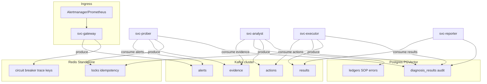

# Master Plan V3.0 — Event-Driven Agentic SRE (Kafka core) + Redis Standalone

**Slogan:** Học từ quá khứ (RAG), Sống cho hiện tại (Kafka/Probe), Lập kế hoạch cho tương lai (Roadmap).

**Gộp theo yêu cầu:** (1) toàn bộ V3.0 dưới đây; (2) **Redis Standalone** (thay Redis Cluster 6-node lab hiện tại); (3) **luồng stream nghiệp vụ chính chuyển sang Kafka cluster** (không còn phụ thuộc Redis Streams cho pipeline alerts → xử lý).

**Ghi chú đối chiếu tài liệu V3:** Bản gốc nêu "Redis Sentinel". Trong repo/lab, kế hoạch triển khai **Redis Standalone** một Service `redis:6379` cho lock/CB/trace; Sentinel có thể là **bước HA sau** nếu cần, không chặn G0.

---

## A. Hiện trạng codebase (neo để refactor)

| Thành phần | Vị trí | Vai trò hôm nay |
|------------|--------|-----------------|
| Ingress alert | [`src/gateway/api.py`](src/gateway/api.py) | `XADD` vào `OMNI_STREAM_INBOUND` (mặc định `events:inbound`), đọc CB từ Redis |
| Worker consumer | [`src/workers/omni_worker.py`](src/workers/omni_worker.py) | `XREADGROUP` / `XACK` / lock `omni:lock:*` trên cùng Redis |
| Proactive | [`src/workers/proactive_observer.py`](src/workers/proactive_observer.py) | `XADD` / `XREADGROUP` stream `incidents:proactive` (settings) |
| Settings | [`src/workers/settings.py`](src/workers/settings.py) | `stream_inbound`, `stream_dlq`, `redis_cluster`, CB thresholds |
| Redis client | [`src/workers/redis_client.py`](src/workers/redis_client.py) | `RedisCluster` nếu `OMNI_REDIS_CLUSTER=true`, else `from_url` |
| ConfigMap | [`k8s/deployments/omni-worker-configmap.yaml`](k8s/deployments/omni-worker-configmap.yaml) | `OMNI_REDIS_CLUSTER: "true"` + 6 node `redis-cluster-*` |
| Redis K8s | [`k8s/deployments/redis-cluster.yaml`](k8s/deployments/redis-cluster.yaml) | StatefulSet 6 pod cluster + init job |
| RAG / PGVector | [`src/rag/pgvector_store.py`](src/rag/pgvector_store.py), [`src/workers/handlers.py`](src/workers/handlers.py) | Collections ledger SOP/errors; chưa bảng `diagnosis_results` riêng |
| Mutation gate | [`src/workers/gated_execute.py`](src/workers/gated_execute.py) → [`src/execution/promotion.py`](src/execution/promotion.py) | Gated allowlist |
| RBAC | [`k8s/deployments/omni-worker-rbac.yaml`](k8s/deployments/omni-worker-rbac.yaml) | `cluster-admin` — trái mục tiêu V3 "read prober / write executor" |
| Forecast / trend | [`src/workers/settings.py`](src/workers/settings.py) (`autonomous_forecast_*`), [`src/workers/forecast_autonomous_loop.py`](src/workers/forecast_autonomous_loop.py) | Có thể nối G5 |

**Kafka:** không có producer/consumer trong `src/` dự án (chỉ semconv trong `.venv`). Toàn bộ bus Kafka là **phần mới**.

---

## B. Kiến trúc đích (Kafka + Standalone + Postgres)

- **Kafka:** nguồn sự kiện chính (topics: `alerts`, `evidence`, `actions`, `results`; có thể thêm `dlq` hoặc prefix `omni.`).
- **Redis Standalone:** không dùng làm hàng đợi chính nữa; giữ **lock**, **CB**, **trace/session** như key-value + TTL.
- **Postgres:** `diagnosis_results` + audit trail raw; PGVector giữ/nối collections hiện có.

---

## C. Hợp đồng dữ liệu — Symptom Schema

**Tạo module chung** (ví dụ `src/schemas/symptom.py` hoặc `src/common/symptom_v3.py`):

- Pydantic model khớp JSON V3: `trace_id`, `symptom_hash`, `metadata`, `clean_symptom`, `evidence`.
- Validator **quy tắc vàng:** reject nếu `clean_symptom` chứa pattern pod-id, IP nội bộ, timestamp thô — tái sử dụng logic tinh thần từ [`src/observability/normalize.py`](src/observability/normalize.py), [`src/workers/observation_sanitize.py`](src/workers/observation_sanitize.py).

**Postgres:** migration asyncpg tạo bảng `diagnosis_results` (hoặc tên đồng bộ SOP) với JSONB + index `(symptom_hash)`, `(trace_id)`.

**Kafka:** key message = `symptom_hash` hoặc `trace_id` tùy consumer group semantics; value = JSON Symptom (hoặc Avro/JSON Schema sau).

---

## D. Quy tắc vận hành — neo code & việc làm

| Quy tắc | Triển khai gợi ý |
|---------|------------------|
| **Xét nghiệm trước mutation** | State store: sau probe, ghi `evidence.probe_results` + flag trong Redis `omni:probe_ok:{trace_id}` hoặc row Postgres; `svc-executor` từ chối nếu thiếu |
| **Shadow 24h** | `OMNI_SHADOW_MODE=true` — executor ghi log "would execute" + diff, không gọi K8s write |
| **CB theo symptom_hash** | Mở rộng key Redis `omni:cb:streak:{symptom_hash}`; khi =3 → set `omni:circuit_breaker:active` hoặc khóa theo hash; Telegram qua [`src/ingest/telegram.py`](src/ingest/telegram.py) / reporter |
| **Telegram chỉ bản tin gọn** | Tách template reporter; raw chỉ `diagnosis_results` / audit table — hiện worker gửi `out` dài trong [`src/workers/omni_worker.py`](src/workers/omni_worker.py) cần thu hẹp dần |

---

## E. Giai đoạn 0 — Hạ tầng, hợp đồng, DB, Kafka, Redis Standalone

### E.1 Symptom + DB

- Implement Pydantic + unit test schema validation.
- Migration `diagnosis_results` + (tuỳ chọn) view từ payload cũ error ledger.

### E.2 Kafka cluster (lab)

- Cài operator (Strimzi) hoặc Helm Kafka bitnami — **ngoài scope file Python**, cần manifest `k8s/kafka/` (topic Job hoặc Strimzi KafkaTopic).
- Topics: `alerts`, `evidence`, `actions`, `results` (partitions/replication theo lab).

### E.3 Redis Standalone (song song V3 — bắt buộc gộp)

- Thêm [`k8s/deployments/redis-standalone.yaml`](k8s/deployments/redis-standalone.yaml): Service `redis:6379`.
- Sửa [`k8s/deployments/omni-worker-configmap.yaml`](k8s/deployments/omni-worker-configmap.yaml): `OMNI_REDIS_CLUSTER: "false"`, xóa `OMNI_REDIS_CLUSTER_NODES`.
- Gỡ [`k8s/deployments/redis-cluster.yaml`](k8s/deployments/redis-cluster.yaml) sau cutover.
- Cập nhật monitor [`k8s/monitor/prometheus.yaml`](k8s/monitor/prometheus.yaml), [`k8s/monitor/redis-exporter.yaml`](k8s/monitor/redis-exporter.yaml), [`scripts/deploy_v6.sh`](scripts/deploy_v6.sh), [`scripts/full_system_audit.py`](scripts/full_system_audit.py) (pod `redis`, `redis-cli` không `-c`).

### E.4 Dependency Python

- Thêm `aiokafka` hoặc `confluent-kafka` (async) vào [`requirements.txt`](requirements.txt); wrapper `src/messaging/kafka_client.py` (producer/consumer factory, env `OMNI_KAFKA_BOOTSTRAP`).

---

## F. Giai đoạn 1 — Phòng tiếp nhận & xét nghiệm (Kafka)

### F.1 svc-gateway

- **Thay** `XADD` ([`src/gateway/api.py`](src/gateway/api.py) ~181) bằng **Kafka produce** topic `alerts` với payload đã validate Symptom (hoặc normalize tối thiểu + enrich async ở prober).
- Giữ đọc CB từ Redis trước khi accept (backpressure).
- Dual-write (tuỳ chọn giai đoạn chuyển): `XADD` + Kafka trong 1–2 phiên bản, feature flag `OMNI_USE_KAFKA=true`.

### F.2 svc-prober

- Tách process/deployment mới; consumer group topic `alerts`.
- Chạy read-only: [`src/workers/k8s_readonly_tools.py`](src/workers/k8s_readonly_tools.py), enrich từ [`src/workers/prometheus_alert_enrichment.py`](src/workers/prometheus_alert_enrichment.py) nếu cần.
- Produce topic `evidence` với Symptom đã điền `evidence.probe_results`.

### F.3 Kiểm tra

- e2e: webhook → record trên Kafka `alerts` (kafka-console-consumer hoặc metric exporter) + `evidence` có `clean_symptom` sạch.

---

## G. Giai đoạn 2 — svc-analyst (Hybrid RAG)

- Consumer `evidence` → embed **chỉ** từ `clean_symptom` (vector) + query [`src/rag/pgvector_store.py`](src/rag/pgvector_store.py).
- Slow-path Ollama: [`src/workers/agentic_slow_path.py`](src/workers/agentic_slow_path.py) / prompts — ràng buộc input là bản tóm đã chưng cất.
- Produce `actions` (đề xuất / plan JSON) — không mutation trực tiếp.

---

## H. Giai đoạn 3 — svc-executor & svc-reporter

- **Executor:** consumer `actions`; gọi [`src/execution/promotion.py`](src/execution/promotion.py) / K8s write tools trong [`src/workers/k8s_cluster_tools.py`](src/workers/k8s_cluster_tools.py); produce `results`.
- **Reporter:** consumer `results`; verify (PromQL/readiness); Telegram ngắn; nếu chưa ready → **reproduce** message `actions` hoặc `results` với backoff (thay cho chỉ Redis retry).

---

## I. Giai đoạn 4 — Cầu dao & RBAC

- CB đầy đủ trên Redis Standalone (streak theo `symptom_hash`).
- Tách ServiceAccount: prober Role read-only namespace; executor Role patch/scale trong allowlist — sửa [`k8s/deployments/omni-worker-rbac.yaml`](k8s/deployments/omni-worker-rbac.yaml) thành nhiều file RBAC.

---

## J. Giai đoạn 5 — Roadmap & Telegram

- Trend: nối [`src/anomaly/`](src/anomaly/), [`src/workers/forecast_autonomous_loop.py`](src/workers/forecast_autonomous_loop.py).
- Telegram "Quá khứ / Hiện tại / Tương lai": một builder trong reporter đọc RAG hit + probe summary + forecast snippet.

---

## K. Chiến lược cắt Redis Streams (quan trọng)

1. **Giai đoạn song song:** `OMNI_USE_KAFKA` — gateway ghi Kafka; worker vẫn đọc Redis cho đến khi consumer Kafka thay thế hoàn toàn.
2. **Proactive:** [`src/workers/proactive_observer.py`](src/workers/proactive_observer.py) — `XADD incidents:proactive` chuyển thành produce `alerts` hoặc topic riêng `proactive.incidents` → map vào cùng pipeline prober.
3. **DLQ:** Redis stream `events:dlq` → Kafka topic `dlq` hoặc bảng Postgres.
4. **devtools:** [`src/devtools/redis_cleanup_stuck.py`](src/devtools/redis_cleanup_stuck.py) — bổ sung hoặc thay bằng công cụ reset consumer lag Kafka.

---

## L. Tách 5 deployment từ hiện trạng

| V3 service | Nguồn gộp từ repo |
|------------|-------------------|
| svc-gateway | [`src/gateway/api.py`](src/gateway/api.py) + image entry uvicorn |
| svc-prober | Logic read + enrich (tách từ worker/proactive ingest) |
| svc-analyst | [`src/workers/handlers.py`](src/workers/handlers.py), [`src/workers/agentic_slow_path.py`](src/workers/agentic_slow_path.py), RAG |
| svc-executor | [`src/execution/`](src/execution/), gated tools |
| svc-reporter | Telegram + verify (tách từ [`omni_worker.py`](src/workers/omni_worker.py) phần gửi message) |

Có thể giai đoạn đầu giữ **một image** nhiều `command`/entrypoint hoặc monorepo nhiều target trong Dockerfile để giảm ma trận build.

---

## M. CI/CD & chứng thực (theo repo)

- Đổi worker/gateway/runtime: [`Makefile`](Makefile) `docker-worker`, `deploy-worker`, pytest, `make e2e-proactive` — xem [.cursor/rules/omni-cicd-k8s.mdc](.cursor/rules/omni-cicd-k8s.mdc).
- Sau khi thêm Kafka: bổ sung job smoke produce/consume hoặc mở rộng [`scripts/gateway_alert_loki_verify.sh`](scripts/gateway_alert_loki_verify.sh) (nếu có).

---

## N. Knownbase

- Sau khi hoàn thành từng mốc (standalone, Kafka cutover, RBAC): ghi ngắn [`docs/vendor/knownbase.md`](docs/vendor/knownbase.md).

---

## O. Thứ tự thực hiện đề xuất (gộp rủi ro)

1. **Redis Standalone** + ConfigMap (hạ bậc cluster) — app vẫn dùng Streams tạm thời.
2. **Kafka + Symptom schema + producers** trên gateway (flag).
3. **Consumer prober** + topic `evidence`.
4. Tắt đường `XADD`/`XREADGROUP` chính khi Kafka ổn định.
5. Tách analyst / executor / reporter dần.
6. RBAC siết + CB theo hash + Telegram/audit.
