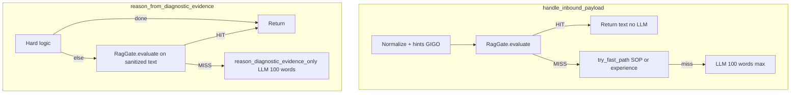

# Unified RagGate, 100-word cap, Prometheus RAG, ingest, ReAct

## Bối cảnh hiện tại

- [`src/workers/handlers.py`](src/workers/handlers.py) (khoảng 1400–1470): `source == "prometheus"` **bỏ** `preflight_infra_kb` / `enrich_working_text_with_infra` và dùng `working_text = raw_user_text` — cần **gỡ** theo yêu cầu.
- [`src/workers/evidence_consumer.py`](src/workers/evidence_consumer.py): sau hard-logic → gọi thẳng [`reason_diagnostic_evidence_only`](src/workers/reasoning_evidence_inbound.py) (LLM + RAG snippet lồng) — chưa có **gate HIT → không LLM**.
- [`src/workers/reasoning_evidence_inbound.py`](src/workers/reasoning_evidence_inbound.py): `fetch_k8s_expert_context_for_diagnostic` song song với LLM — sẽ **thay/thu hẹp** khi gate đã quyết định HIT/MISS để tránh embed trùng.
- [`src/training/k8s_official_ingest.py`](src/training/k8s_official_ingest.py): crawler + upsert đã có; cần **tăng độ phủ** và khả năng vận hành để giảm MISS.
- ReAct: [`src/workers/agentic_slow_path.py`](src/workers/agentic_slow_path.py) parse JSON tool quanh `_parse_tool_json` — cần log **`TRACE_ACTION_JSON`**.

## 1. `src/pkg/rag/gate.py` (Unified RagGate)

- Tạo package [`src/pkg/rag/__init__.py`](src/pkg/rag/__init__.py) + [`src/pkg/rag/gate.py`](src/pkg/rag/gate.py).
- **API đề xuất** (có thể tinh chỉnh khi code):
  - `RagGateOutcome`: `hit: bool`, `score: float | None`, `collection: str`, `formatted: str` (chuỗi trả user), `detail: dict` (debug).
  - `normalize_rag_query(text: str, hints: dict | None) -> str`: GIGO — độ dài tối thiểu/tối đa, strip, gộp hints an toàn (namespace/pod) vào query embed khi hợp lệ (tránh MagicMock: chỉ `isinstance(str)`).
  - `async evaluate(ctx, raw_text: str, *, hints: dict | None, trace: str | None) -> RagGateOutcome`:
    - Gọi `ctx.vector_store.similarity_search` với `collection_id = ctx.settings.pgvector_collection_k8s_expert`, `limit`, `score_threshold` từ **WorkerSettings** mới (ví dụ `rag_gate_enabled`, `rag_gate_score_threshold`, `rag_gate_top_k`, `rag_gate_max_output_chars`).
    - **HIT** khi `best_score >= threshold` và có ít nhất một chunk hợp lệ.
    - `formatted`: ghép các đoạn `[CONTEXT: k8s_expert score=… url=…]` + trích `text`/`summary` + **truncate theo 100 từ** (dùng helper chung với mục 2).
    - **Không** gọi LLM trong module này.

## 2. Kill Prometheus skip + tích hợp gate trong handlers

- Trong [`handlers.py`](src/workers/handlers.py):
  - Xóa nhánh đặc biệt `if src == "prometheus": learned = LearnedContext()` và `working_text = raw_user_text` — **thống nhất** với các source khác: `preflight_infra_kb` + `enrich_working_text_with_infra` (hoặc gọi gate trước rồi mới enrich — thứ tự cụ thể bên dưới).
  - **Thứ tự đề xuất** để khớp “RAG trước, không có mới LLM”:
    1. `outcome = await rag_gate.evaluate(ctx, raw_user_text, hints=..., trace=trace)`
    2. Nếu `outcome.hit`: **return** `outcome.formatted` (đã giới hạn 100 từ), **không** `try_fast_path` / **không** slow-path LLM.
    3. Nếu miss: `learned = await preflight_infra_kb(...)` + `working_text = await enrich_working_text_with_infra(...)` như hiện tại cho mọi `src` (kể cả prometheus).
  - **Rủi ro hồi quy**: enrich làm phình context — bắt buộc thêm **trần token** (settings mới hoặc tái dùng `diag_*` / giới hạn block trong [`infra_context.py`](src/workers/infra_context.py)) cho mọi source, đặc biệt prometheus; log `event=infra_enrich_capped` khi cắt.

- `try_fast_path` giữ **sau** gate miss (SOP / `action_experience` — vẫn không LLM nếu hit).

## 3. Evidence / Prober: gate trước LLM

- Trong [`evidence_consumer.py`](src/workers/evidence_consumer.py), sau khi có `sanitized_text` và **trước** `reason_diagnostic_evidence_only`:
  - Gọi `rag_gate.evaluate(ctx, sanitized_text, hints=...)` (hints từ `ev_doc`: namespace, pod, … nếu có).
  - Nếu **HIT**: trả `outcome.formatted`, gửi Telegram như hiện tại, **không** gọi LLM.
- Trong [`reasoning_evidence_inbound.py`](src/workers/reasoning_evidence_inbound.py):
  - Khi đã có gate ở consumer: **bỏ hoặc điều kiện hoá** `fetch_k8s_expert_context_for_diagnostic` trên đường sanitized để tránh **hai lần embed**; chỉ giữ enrich LLM khi gate MISS.

## 4. Hard cap 100 words (Analyst + Alert Summary)

- Thêm field settings (ví dụ `omni_summary_max_words: int = 100`) trong [`settings.py`](src/workers/settings.py).
- Dùng [`truncate_plain_text_to_max_words`](src/workers/ollama_prompts_en.py) (hoặc tách helper dùng chung) cho:
  - Output gate `formatted`
  - Output [`reason_diagnostic_evidence_only`](src/workers/reasoning_evidence_inbound.py) (sau `chat`)
  - Output cuối inbound alert/summary trong handlers khi không phải ReAct JSON path (xem mục 5).
- System prompt analyst: nhắc “tối đa 100 từ, không văn vở”.

## 5. Ngoại lệ ReAct + log `TRACE_ACTION_JSON`

- Trong [`agentic_slow_path.py`](src/workers/agentic_slow_path.py), tại mỗi lần parse JSON tool thành công (`_parse_tool_json` / lệnh gọi tool hợp lệ): `logger.info("TRACE_ACTION_JSON ...", extra=...)` hoặc một dòng JSON có key cố định `event=TRACE_ACTION_JSON`, `trace_id`, `tool`, `args_preview` (redact).
- **Không** áp 100 từ lên nội dung JSON tool / observation — chỉ áp lên **tin nhắn user-facing** cuối phiên nếu có path “reply”; nếu không rõ, mặc định: cap 100 từ cho **final user reply** trong agentic khi `reply` tool hoặc bước kết thúc — cần đọc thêm vòng lặp để gắn đúng chỗ (tránh cắt JSON).

## 6. Crawler `k8s_official_ingest.py` — giảm MISS

- Tăng độ phủ có kiểm soát: thêm tùy chọn **sitemap** hoặc nhiều `k8s_official_docs_seed_urls` mặc định, tăng `max_pages`/`max_depth` qua env (đã có field trong settings).
- Thêm `--max-pages` CLI override (tùy chọn) để chạy batch lớn trong Job.
- Ghi chú vận hành: CronJob / `kubectl exec` định kỳ (đã có pattern trước đó).

## 7. Kiểm tra ReAct loop

- Rà [`agentic_slow_path.py`](src/workers/agentic_slow_path.py): điều kiện thoát, `react_max_turns`, tool unknown, escalate — đối chiếu với [`tests/test_agentic_slow_path.py`](tests/test_agentic_slow_path.py) (và tương tự).
- Thêm/ cập nhật test nhỏ: gate HIT không gọi `ollama.chat`; handlers prometheus đi qua gate (mock).

## 8. Kiểm thử & triển khai (pytest + build + deploy)

- `pytest tests/ -q --ignore=tests/integration`
- `docker build -t multi-agent-system:latest -f Dockerfile .`
- `make deploy-worker` khi cluster sẵn sàng (theo rule repo).

## 9. Đẩy alert test + báo cáo lại (bắt buộc — không chỉ pytest)

Sau khi image đã rollout, phải có **một bước E2E có báo cáo**, không dừng ở unit test:

- **Mục tiêu**: chứng minh một alert thật (hoặc payload tương đương) đi qua pipeline: gateway hoặc Kafka `omni-alerts` → prober/diagnostic → evidence/analyst (tuỳ luồng đang bật), và **quan sát được** `RagGate` / `TRACE_ACTION_JSON` / giới hạn 100 từ trong log (hoặc Telegram nếu có).
- **Công cụ có sẵn trong repo** (chọn một hoặc kết hợp; ghi rõ trong báo cáo):
  - [`scripts/gateway_alert_loki_verify.sh`](scripts/gateway_alert_loki_verify.sh) — alert gateway + logs/Loki (theo [.cursor/rules/omni-cicd-k8s.mdc](.cursor/rules/omni-cicd-k8s.mdc)).
  - `make e2e-proactive` / [`scripts/proactive_e2e.sh`](scripts/proactive_e2e.sh) — nếu cần vòng proactive + audit.
- **Báo cáo tối thiểu** (file ngắn hoặc comment PR): thời gian chạy, lệnh đã dùng, **trace_id** (nếu có), kết luận PASS/FAIL và 1–2 dòng log chứng minh (không dump cả MB).

## Rủi ro / ghi chú

- **Trùng trách nhiệm gate vs `try_fast_path`**: gate = **k8s_expert** encyclopedia; fast path = **SOP + experience** — thứ tự rõ: gate → fast path → LLM.
- **omni-alerts chỉ chạy diagnostic pipeline**: LLM nằm ở analyst; gate tập trung ở `evidence_consumer` + `handlers` là đủ cho “Prometheus + Prober evidence” theo yêu cầu.
