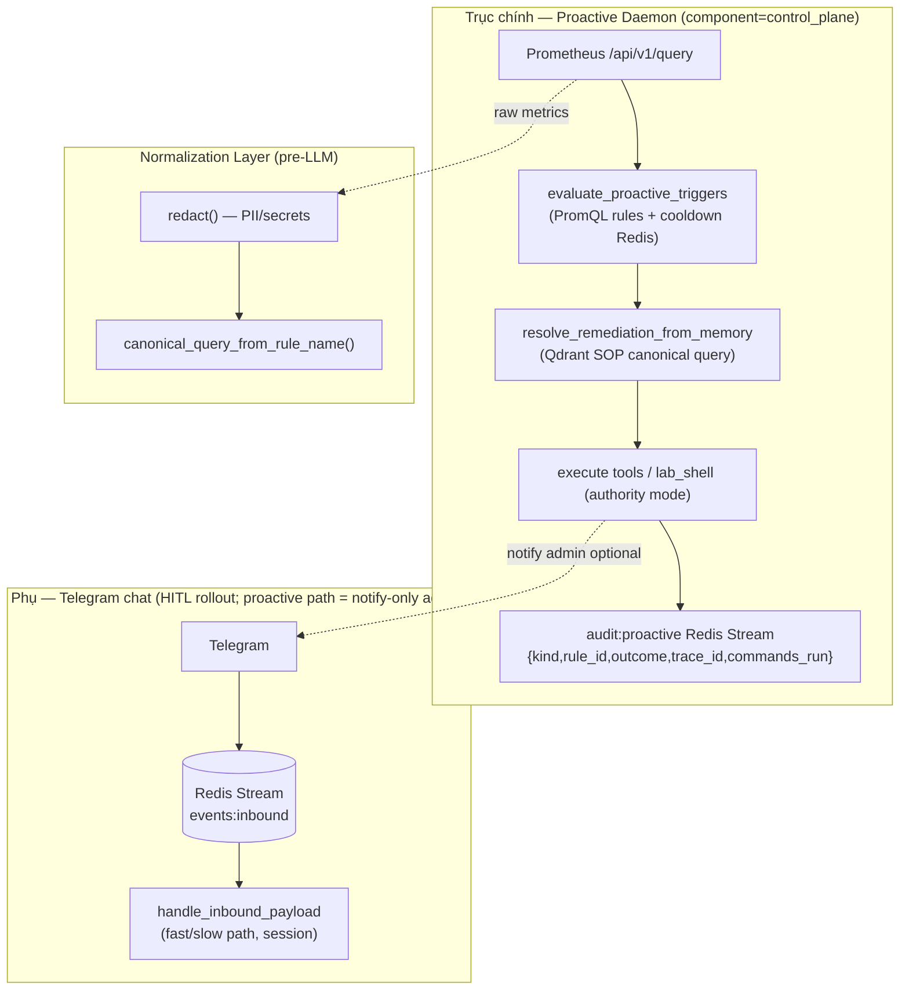

# Kiến trúc — Project Blueprint (Omni-Worker / Autonomous Operator)

Tài liệu này mô tả **trạng thái hiện tại** của repo (quét: `workers/`, `llm/`, `rag/`, `k8s/`). Mục tiêu: phân tách rõ **Control Plane** (suy luận, chính sách) và **Data Plane** (I/O, công cụ, side-effect).

---

## 1. System Topology

- **Control Plane (Proactive — PRIMARY):** `proactive_control_loop` trong `omni_worker.py` — Prometheus → AnomalyEvent → Qdrant SOP → tool execution → `audit:proactive`.
- **Control Plane (Reactive — SECONDARY):** `stream_loop` + `telegram_loop` — human chat, HITL confirm rollout; không phải nguồn trigger vận hành.
- **Normalization layer** (`src/observability/normalize.py`): redact PII/secrets trước khi bất kỳ string nào vào LLM hoặc Qdrant; canonical query `[ACTION] [RESOURCE] [ERROR_SIG]` làm embed string cố định cho SOP retrieval.
- **Prometheus** chạy stack `monitor` (Service cluster DNS); worker gọi HTTP PromQL.
- **Qdrant** lưu vector SOP, error ledger, action experience, infra topology (tên collection trong `rag/qdrant_store.py`).

---

## 2. Luồng dữ liệu (Data Flow)

### 2.1 Từ Prometheus về “bộ não” (LLM)

**Thực tế repo:** bộ não chính là **Ollama** (`ollama-service:11434` hoặc tương đương), **không** phải Gemini. Gemini có thể được chọn qua `WorkerSettings` cho một số backend (`agent_reasoning_backend`, v.v.) nhưng **đường chính của Omni-worker là Ollama + `num_ctx` cố định**.

Luồng điển hình:

1. **Metrics / PromQL:** `httpx` → Prometheus `/api/v1/query(_range)` (SDK tools trong `workers/sdk_service_tools.py`).
2. **Chuỗi thời gian / chart:** pandas/matplotlib → bytes PNG → (tuỳ chọn) Telegram.
3. **Ngữ cảnh vào LLM:** prompt **không** nhét raw dump Prometheus toàn bộ — tóm tắt số liệu, chart, hoặc JSON đã rút gọn trong handler (`truncate_for_prompt`, session).
4. **Embed (Qdrant):** `nomic-embed-text` qua Ollama cho truy vấn SOP / experience (fast-path).

### 2.2 Từ LLM ra “thực thi” (Execution)

**Không** có luồng “Gemini → subprocess” trên pod worker: **subprocess/shell trực tiếp trên omni-worker bị cấm** theo chính sách repo; thực thi cho phép:

| Cơ chế | Vai trò |
|--------|---------|
| **Tool JSON** (`workers/tools.py`) | K8s (SDK), Redis health, PromQL, psutil, sandbox HTTP, v.v. |
| **OpenSandbox** | Shell cách ly qua HTTP (`execute_in_sandbox`, …) khi bật |
| **Lab / god_mode** | `execute_shell_command` có giới hạn policy (không phải mặc định production) |

Vì vậy “Data Plane thực thi” = **HTTP/SDK async**, không phải fork process tùy tiện.

---

## 3. Control Plane vs Data Plane

| | Control Plane | Data Plane |
|---|----------------|------------|
| **Là gì** | Chọn route model, parse JSON tool, policy (confirm rollout), session, trace_id, giới hạn vòng slow_path | Redis, Qdrant, Prometheus, K8s API, Telegram send, OpenSandbox, Ollama HTTP |
| **File gợi ý** | `handlers.py`, `model_routing.py`, `routing_policy.py`, `session_state.py` | `sdk_service_tools.py`, `k8s_tools.py`, `omni_worker.py`, `ollama_client.py` |
| **Rủi ro** | Prompt/ context quá lớn, vòng lặp tool vô hạn | Rate limit Ollama, timeout Prometheus, RBAC K8s |

---

## 4. Entrypoint thực tế (không phải `main.py` gốc)

- **CMD image:** `python -m workers` → `workers/__main__.py` → `omni_worker.main()`.
- **`handlers.py`:** xử lý payload inbound (fast/slow path, tool registry).
- Kế hoạch “daemon” nên neo vào **`omni_worker.py`** (vòng lặp asyncio + SIGTERM), không phát minh `main.py` mới trừ khi refactor có chủ đích.

---

## 5. Internal Audit — 3 điểm yếu lớn (chưa tự trị hoàn toàn)

1. **Vòng lặp “sự cố” chưa khép kín theo state machine:** Có `stream_loop`, `autonomous_forecast_loop`, Deep Scout — nhưng **không có một state machine duy nhất** nối *phát hiện metric lạ* → *SOP* → *hành động* → *xác nhận* → *báo cáo* mà không phụ thuộc Telegram user (forecast chỉ chạy khi bật flag + admin chat).

2. **Retry / self-heal không đồng nhất:** Quy tắc workspace yêu cầu retry tool ~2 lần trước khi escalate; triển khai thực tế phân tán theo từng tool/handler — **thiếu lớp điều phối chung** (circuit breaker, backoff chung cho Prometheus/Ollama).

3. **Context & “rác” prompt:** `slow_path` + session có cơ chế cắt (`truncate_for_prompt`, compressor) nhưng **không có budget token cứng** theo từng phase; dễ tràn ngữ cảnh khi chain nhiều tool + Qdrant chunk.

---

## 6. Plan Refactor — hướng “Daemon chạy ngầm” (chưa thực hiện — chỉ kế hoạch)

Mục tiêu: một tiến trình **một entry**, nhiều task nền, tách rõ “luồng người dùng” và “luồng tự trị”.

| Hướng | Việc làm |
|-------|----------|
| **Entry** | Giữ `python -m workers`; gom khởi tạo Redis/Ollama/Qdrant/settings vào một `bootstrap_context()` rõ ràng trong `omni_worker.py` (đã gần đạt — chỉ cần tài liệu hóa và giảm nhánh). |
| **handlers.py** | Tách **nhận message** (parse inbound) khỏi **orchestration** (slow_path): interface `handle_inbound_payload` giữ nguyên contract; phần policy dài có thể tách module `handlers_orchestrate.py` để daemon không “ôm” 1000+ dòng một file. |
| **Background tasks** | Đăng ký tập trung: `stream_loop`, `telegram_polling` (nếu có), `autonomous_forecast_loop`, `deep_scout` — mỗi task có `stop` event + log `component=` thống nhất. |
| **Daemon semantics** | Không block SIGTERM: đã có pattern `stop` + `wait`; bổ sung **health/readiness** (metrics exporter đã có port 9090) làm điều kiện “sẵn sàng” cho probe tùy chọn. |
| **Tự trị sau này** | Thêm consumer hoặc timer riêng cho “incident pipeline” đọc từ Redis stream nội bộ hoặc channel metric — **không** nhét vào cùng handler Telegram trước khi có thiết kế SOP trong `decision_tree.md`. |

---

## 7. Đồng bộ với tài liệu khác trong `.system/blueprints/`

- Vòng quyết định chi tiết: [decision_tree.md](./decision_tree.md)
- Tool & quyền: [tool_inventory.md](./tool_inventory.md)
- Trạng thái: [state_machine.md](./state_machine.md)
- SOP / nhóm ký ức: [sop_mapping.md](./sop_mapping.md)
