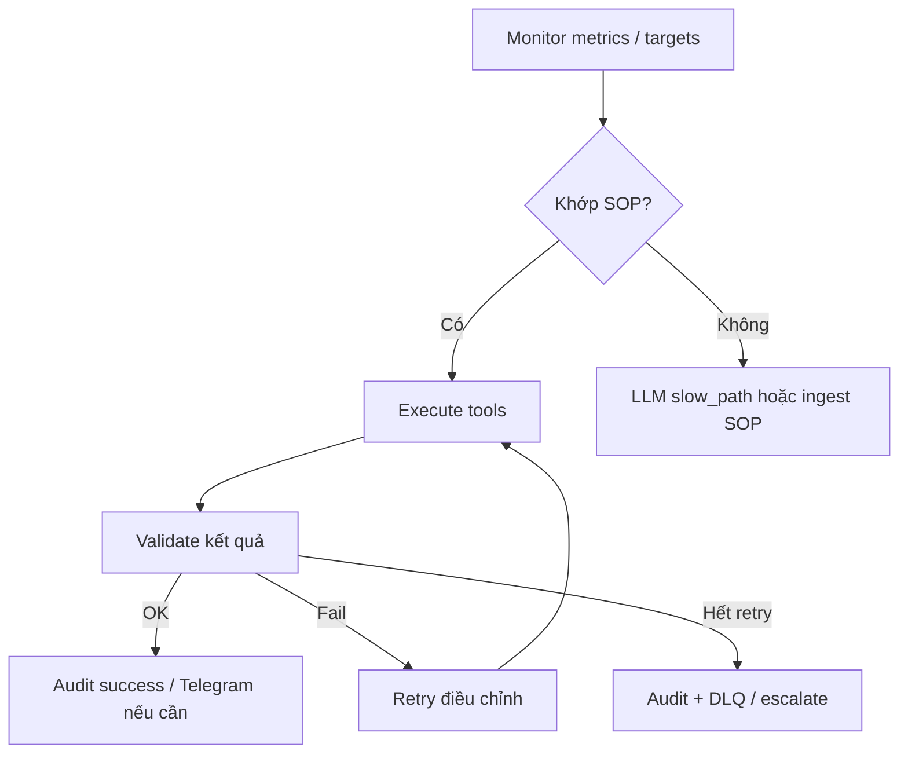

# Decision Tree — Quy trình vận hành tự trị (The Loop)

Mục tiêu: mô tả **cách hệ thống nên quyết định** khi metric bất thường mà **không hỏi người** — lớp mục tiêu; triển khai hiện tại có thể mới đạt một phần (xem [architecture.md](./architecture.md) mục Internal Audit).

---

## Khung bắt buộc

```text
Monitor → Match SOP (Qdrant) → Execute → Validate → Audit
```

---

## 1. Monitor

| Nguồn | Việc làm |
|-------|----------|
| Prometheus | PromQL instant/range; so ngưỡng; anomaly (Prophet/linear trong forecast loop — khi bật) |
| K8s API | Pod phase, rollout status (qua SDK tools) |
| Redis | latency, memory hints (tool redis_health) |
| Omni metrics | `omni-worker` exporter `:9090` |

**Ra quyết định:** phát hiện drift / threshold / empty series → tạo **sự kiện nội bộ** (hiện: chủ yếu qua handler user hoặc vòng forecast tách biệt).

---

## 2. Match SOP (Qdrant)

1. **Embed** câu hỏi / chữ ký lỗi / tóm tắt metric (Ollama embed).
2. **Search** collection `itops_sop_ledger` (và `action_experience` khi có hit routing).
3. **Chọn** procedure phù hợp (CPU saturation, OOM pattern, network drop, …) — xem [sop_mapping.md](./sop_mapping.md).

**Nếu không khớp:** fallback slow_path LLM hoặc ghi `no_data` + audit observability (tool audit stack).

---

## 3. Execute

- Chỉ qua **TOOL_REGISTRY** — JSON có schema (`workers/tools.py`).
- **K8s:** `k8s_list_pods`, `k8s_rollout_restart` (rollout có thể yêu cầu Telegram confirm theo policy).
- **Prometheus:** `promql_instant` / `query_prometheus_metrics` / dataframe tools.
- **Shell:** không trực tiếp trên worker; ưu tiên OpenSandbox hoặc gated allowlist.

---

## 4. Validate

| Kiểm tra | Pass / Fail |
|----------|-------------|
| HTTP Prometheus | status success + có series (hoặc chấp nhận empty có giải thích) |
| K8s | không ApiException quyền; rollout status |
| Tool | JSON parse OK; không vượt `slow_path_max_tool_attempts` |
| Policy | rollout restart: confirm nếu bắt buộc |

**Retry:** ít nhất 2 lần điều chỉnh tham số trước khi escalate (theo quy ước vận hành).

---

## 5. Audit

- **Redis Stream DLQ** khi handler thất bại: ghi lỗi + `XACK` (không kẹt PEL).
- **Error ledger / Qdrant** (`itops_error_ledger`) khi có payload lỗi đáng ghi nhớ.
- **Structured log** `start_request` / `end_request` + `trace_id` (request_trace).

---

## Sơ đồ tóm tắt



---

## Khoảng trống so với mục tiêu “không hỏi user”

- **Rollout / destructive** vẫn thường cần **Telegram CONFIRM** — đúng cho banking-grade; full auto cần policy riêng + break-glass.
- **Autonomous forecast** chỉ là một nhánh; chưa có **một queue incident** thống nhất cho mọi loại metric.
