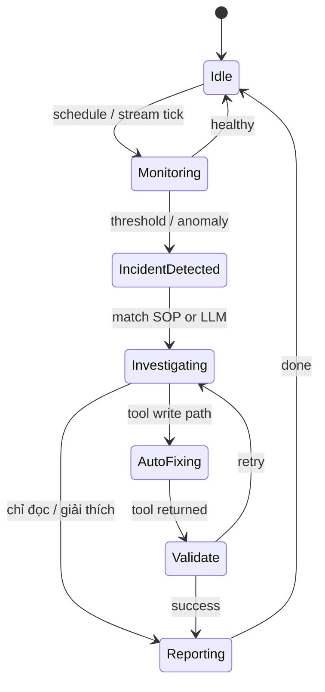

# State Machine — Trạng thái hệ thống (vận hành)

Mô hình **mục tiêu** cho Autonomous Operator. Trạng thái có thể được log bằng `trace_id` / metric tùy triển khai tương lai; hiện tại phân tán giữa session Redis và các vòng lặp asyncio.

---

## Trạng thái

| Trạng thái | Ý nghĩa | Kích hoạt gợi ý |
|------------|---------|----------------|
| **Idle** | Chờ sự kiện (stream rỗng, không forecast) | Block `XREADGROUP` |
| **Monitoring** | Đang đọc metric định kỳ / deep scout / forecast loop | Timer hoặc schedule |
| **Incident Detected** | Ngưỡng vượt, SLO vi phạm, series empty bất thường | Prophet threshold, PromQL alert, audit WARN |
| **Investigating** | Slow_path: tool chain, Qdrant SOP, LLM | `handle_inbound_payload` / autonomous branch |
| **Auto-fixing** | Thực thi tool có side-effect (rollout, scale policy sau này) | Sau CONFIRM hoặc policy auto |
| **Reporting** | Telegram admin / user, chart, bản tóm tắt | Gửi message cuối vòng |

---

## Sơ đồ chuyển trạng thái (mục tiêu)

---

## Ghi chú triển khai

- **Incident → Investigating** không phải lúc nào cũng tách biệt trong code: thường là **một** phiên `slow_path` dài.
- **Auto-fixing** với K8s destructive cần **policy** (Telegram confirm) — xem [decision_tree.md](./decision_tree.md).
