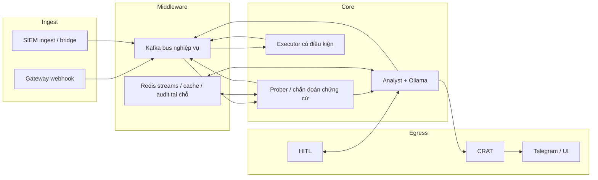

# CONCEPT_MAP — Omni Autonomous SRE & Smart-SIEM

**Trạng thái:** Concept Phase (chờ phê duyệt trước khi lập kế hoạch chi tiết hoặc chỉnh implementation).

**Phạm vi tài liệu:** Định nghĩa kiến trúc logic, luồng dữ liệu end-to-end và ranh giới trách nhiệm. Không chứa source code, không chứa manifest triển khai.

---

## 1. Định hướng dự án (tự nhận thức tổng thể)

Hai mảng sản phẩm cùng tồn tại trong một đại dương kỹ thuật:

| Mảng | Mục đích | Vai trò trong hệ sinh thái |
|------|-----------|-----------------------------|
| **Omni Autonomous SRE** | Tự động hóa SRE trên Kubernetes: nhận tín hiệu, chẩn đoán, đề xuất hoặc (có kiểm soát) thực hiện hành động | **Control plane phân tích / điều phối** — xử lý bất đồng bộ, Kafka-first, tách vai trò prober / analyst / executor |
| **Smart-SIEM** | Data plane SOC tại chỗ: thu thập, tương quan, UI vận hành, HITL, tuân thủ air-gap / egress kiểm soát | **Data plane sự cố & hiển thị** — Redis Streams, Postgres, BFF, tích hợp provider qua đường egress có kiểm soát |

**Điểm hội tụ có chủ đích:** Sự cố và tín hiệu từ Smart-SIEM (hoặc các nguồn cạnh biên) được đưa vào **cùng bus cảnh báo** mà Omni prober hiểu, để một **trace_id** có thể đi xuyên suốt từ ingest tới advisory và audit. Ranh giới pháp lý và vận hành (tenant, egress, HITL) vẫn thuộc Smart-SIEM; **suy luận và chuỗi audit ký** thuộc Omni, trừ khi kiến trúc tương lai gộp vai trò.

---

## 2. Kiến trúc logic chuẩn (bốn tầng)

### 2.1 Ingest (tiếp nhận)

**Vai trò:** Biến sự kiện bên ngoài thành **tin nhắn hàng đợi** có `trace_id`, đủ ngữ nghĩa để downstream phân loại và chọn chính sách chẩn đoán.

**Hai họ kênh chính:**

1. **Gateway (Observability / webhook)**  
   Nhận payload kiểu cảnh báo (Prometheus, Alertmanager, hoặc hệ thống tương đương qua webhook). Trách nhiệm: xác thực (theo chính sách), giới hạn tốc độ, gói envelope chuẩn, đẩy vào bus cảnh báo. **Không** chạy suy luận LLM.

2. **SIEM ingest**  
   Luồng sự cố đã chuẩn hóa hoặc thô từ Smart-SIEM (streams, adapter, bridge). Trách nhiệm: ánh xạ sang envelope mà **cùng consumer alert** có thể xử lý, giữ ngữ cảnh tenant / severity / danh mục.

**Nguyên tắc:** Ingest chỉ trả lời câu hỏi *có vào hàng đợi an toàn không*; không quyết định sửa chữa.

---

### 2.2 Middleware (phân phối và trạng thái)

**Vai trò:** Tách thời gian, tách quy mô, đảm bảo **ít nhất một lần** hoặc có vị trí lưu để replay, và lưu trạng thái phiên / cache.

**Hai lớp bổ sung:**

1. **Kafka (luồng nghiệp vụ chính)**  
   - Cảnh báo thô → chẩn đoán → hành động → phản hồi → (tuỳ chọn) audit phụ.  
   - Mỗi topic mang một **hợp đồng** rõ: ai produce, ai consume, độ bền mong muốn.

2. **Redis (streams, cache, vector ngắn hạn, chuỗi audit tại chỗ)**  
   - Streams: hàng đợi phía SIEM, delayed work, hoặc ingress song song.  
   - Cache / semantic cache / RAG hot path: giảm chi phí LLM, không thay thế nguồn sự thật cho quyết định HITL.

**Nguyên tắc:** Middleware không **hiểu** ngữ nghĩa nghiệp vụ đầy đủ; nó đảm bảo tin nhắn tới đúng subscriber và có chỗ trữ chứng cứ ngắn hạn.

---

### 2.3 Core (Ollama, Analyst Agent, Prober)

**Vai trò:** Biến cảnh báo + chứng cứ thành **kết luận có cấu trúc** và (theo chính sách) **lệnh gợi ý hoặc lệnh được kiểm soát**.

**Phân tách logic (không gắn tên image):**

| Thành phần | Trách nhiệm khái niệm |
|------------|------------------------|
| **Alert consumer / Prober** | Đọc cảnh báo; thu thập chứng cứ đo đạc được (API cluster read-only, metrics, log tail có chính sách); phát **batch chứng cứ** cho analyst. Không phải nơi duy nhất gọi LLM cho advisory cuối. |
| **Evidence consumer / Analyst** | Tổng hợp chứng cợ; cổng RAG; gọi **Ollama (hoặc tương đương)** để sinh advisory có schema; áp điều kiện kill-switch và advisory-only. **CRAT phải thành công trước** phát tín hiệu ra ngoài có thể gây hành động hoặc hiểu nhầm là mệnh lệnh. |
| **Ollama** | Mô hình suy luận / embedding **tại chỗ** (hoặc host được mạng tin cậy). Không nắm trạng thái nghiệp vụ; chỉ nhận prompt/ctx và trả văn bản có cấu trúc sau khi agent đã giới hạn ngữ cảnh. |
| **Executor (khi bật thực thi)** | Đọc hàng đợi hành động; thực hiện thay đổi **trong phạm vi RBAC**; báo phản hồi để vòng đóng. Trong chế độ chỉ gợi ý, executor không đụng tới mutate. |

**Nguyên tắc:** Core là nơi **quyết định được diễn giải**; mọi emit ra ngoài phải tuân fail-closed đã định nghĩa (CRAT trước emit).

---

### 2.4 Egress (Telegram, CRAT, UI, HITL)

**Vai trò:** Đưa kết quả tới người và hệ thống khác **có thể kiểm chứng**.

| Kênh | Mục đích |
|------|-----------|
| **Telegram (Bot API)** | Thông báo advisory (tóm tắt, verdict, trace, gợi ý bước tiếp theo). Không thay thế dashboard SOC; phù hợp cảnh báo sớm. |
| **CRAT (Cryptographic Regulatory Audit Trail)** | Ghi khối audit liên kết hash / chữ ký (tùy chế độ vận hành); **điều kiện tiên quyết** trước khi advisory hoặc dispatch hành động được coi là hợp lệ trong fail-closed. |
| **Smart-SIEM UI / BFF** | Vận hành viên xem incidents, timeline, quyết định HITL. |
| **HITL API** | Cổng nhận quyết định người; không thay Omni analyst cho chẩn đoán tự động. |

**Nguyên tắc:** Egress không làm nhiệm vụ ingest; tránh hai kênh song song gửi **cùng một sự kiện** với mức giàu thông tin khác nhau mà không có chính sách (trùng lặp / lệch kỳ vọng người dùng).

---

## 3. Luồng E2E logic (một cảnh báo đi hết đường)

Mô tả **ý tưởng** một lần xử lý thành công từ góc nhìn người vận hành (không ràng buộc tên pod):

1. **Kích hoạt:** Một nguồn tin cậy (quan sát được hoặc SIEM) tạo cảnh báo.
2. **Ingest:** Gateway hoặc adapt SIEM đưa cảnh báo vào bus cảnh báo với `trace_id`.
3. **Chẩn đoán sớm:** Consumer alert lên kế hoạch chứng cứ; thu thập chứng cứ đo đạc được; publish batch chứng cứ.
4. **Phân tích:** Analyst kết hợp chứng cợ và (nếu cần) RAG; gọi LLM; thu advisory có cấu trúc.
5. **CRAT:** Ghi khối audit cho quyết định advisory (và các bước liên quan trong chính sách). Nếu bước này thất bại → **dừng** phát kết quả “có thể hành động”.
6. **Chính sách hành động:**  
   - **Chỉ gợi ý:** Đẩy `SUGGEST_REMEDIATION` (hoặc tương đương) lên bus hành động để audit / hiển thị; executor không mutate.  
   - **Có thực thi (khi được bật):** Executor thực hiện trong RBAC; phản hồi quay lại analyst để xác minh hoặc replan.
7. **Egress người:** Telegram (hoặc UI) nhận advisory có trace; người quyết định bước thủ công hoặc phê duyệt HITL theo quy trình Smart-SIEM.

**Tiêu chí “xanh thực tế” (concept):** Cùng một `trace_id` có thể truy vết từ ingest → chứng cợ → advisory → CRAT → kênh người; người nhận được **phân tích, mức độ tin cậy / verdict, và thao tác gợi ý** phù hợp chính sách (không chỉ tin nhắn thô từ hệ thống giám sát).

---

## 4. Ranh giới trách nhiệm (Boundary)

### 4.1 Kubernetes (nền tảng điều phối)

**Thuộc về K8s:** Đặt vấn đề, cô lập failure domain (namespace, network policy khái niệm), schedule, secret mount, rollout, quota.

**Không thuộc về K8s:** Ngữ nghĩa CRAT, schema advisory, logic “fail-closed” nghiệp vụ — đó là **hợp đồng phần mềm** trên các workload.

**Ranh giới:** K8s đảm bảo **process và mạng**; hợp đồng dữ liệu giữa services là **ứng dụng + middleware**.

---

### 4.2 Cơ sở dữ liệu HA (Postgres, Redis, object store)

**Thuộc về DB HA:** Bản sao, failover, backup, persistence Redis/AOF hoặc tương đương, nhất quán theo tier (OLTP vs analytics).

**Thuộc về ứng dụng:** Schema migrations, connection pooling cấu hình, idempotency theo khóa nghiệp vụ.

**Ranh giới:** DB HA **không** quyết định Kafka offset hay chính sách “advisory-only”; ứng dụng **không** giả định “một bản sao” nếu HA yêu cầu đọc sau failover có trễ.

---

### 4.3 AI Agent (LLM + agent loop)

**Thuộc về AI Agent:** Biên dịch bằng chứng thành ngôn ngữ có cấu trúc; tuân schema output; biết từ chối khi thiếu chứng cứ (theo policy).

**Không thuộc về AI Agent:** Nguồn sự thật cho compliance; chữ ký audit; quyền mutate trên cluster — những thứ đó ở **CRAT + executor + RBAC**.

**Ranh giới:** LLM là **kênh suy luận**; quyết định “được phép emit” là **cổng chính sách + CRAT** trong code analyst.

---

## 5. Sơ đồ luồng dữ liệu (quan niệm)

---

## 6. Sau phê duyệt (không thực hiện trong Concept Phase)

Khi `CONCEPT_MAP.md` được chấp nhận, bước tiếp theo là lập **kế hoạch chi tiết**: ánh xạ từng hộp khái niệm sang repo hiện có, rà soát trùng lặp kênh egress, và định nghĩa tiêu chí nghiệm thu E2E vận hành — vẫn tách biệt với “script lab” trừ khi script đó được công nhận là proxy cho ingress thực.

---

**Chờ phê duyệt:** Sửa đổi nội dung khái niệm trong file này trước khi chuyển sang Planning / Implementation.
