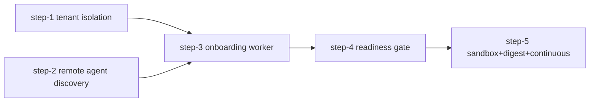

# Execution plan — Onboarding + Operations Agent đa-tenant

**Ngày:** 2026-06-19
**Nguồn:** [`agent/DESIGN_PROMPT.md`](../DESIGN_PROMPT.md) (blueprint-kickoff prompt chốt 2026-06-19, KHÔNG tự suy diễn lại bối cảnh)
**Mục tiêu:** Mở rộng Omni từ hệ thống tự-vận-hành sang khả năng (A) tự học/onboard hệ thống của KHÁCH HÀNG (đa-tenant, 1→100) và (B) vận hành liên tục trên nền Lane 1-4/Advisory Mode đã có, cách ly tuyệt đối theo `tenant_id` ở mọi tầng.

---

## Hướng dẫn cho agent thực thi (bắt buộc đọc trước khi sửa code)

1. Root [`CLAUDE.md`](../../CLAUDE.md) — invariants, pipeline, RBAC, kill-switch.
2. [`agent/DESIGN_PROMPT.md`](../DESIGN_PROMPT.md) — bối cảnh đã chốt, KHÔNG LÀM list.
3. Mỗi step dưới đây có "Context brief" tự chứa — không cần đọc step trước để bắt đầu, nhưng PHẢI tôn trọng dependency order (cột Depends on).
4. Sau mỗi step: chạy `pytest` phần liên quan + `git diff` review trước commit. Dùng agent `python-reviewer` + `code-reviewer` sau mỗi PR (yêu cầu của DESIGN_PROMPT.md).
5. Verify KHÔNG leak chéo tenant là điều kiện exit bắt buộc của MỌI step (RAG key, baseline key, audit chain, Mermaid source, Telegram chat_id).

---

## Checklist công việc (5 PR = 5 phase, đúng theo DESIGN_PROMPT.md)

- [ ] **step-1-tenant-isolation-rag-sop-baseline** — Vá gap `omni:rag:sop`/`semcache:` gộp chung tenant; chuẩn hóa namespace pattern.
- [ ] **step-2-remote-agent-discovery-evidence** — Mở rộng remote agent: process/port/service-topology discovery + doc/API spec forwarding (A1, A2).
- [ ] **step-3-onboarding-worker-mermaid-askloop** — Worker role `onboarding` tổng hợp tài liệu sống + sinh mã Mermaid + ask-loop A5 + readiness checklist.
- [ ] **step-4-readiness-gate-lane-unlock** — Readiness gate đọc checklist từ step 3 → mở Lane 1-4/Advisory cho tenant đã pass (B1, B2).
- [ ] **step-5-sandbox-digest-continuous-worker** — Chaos sandbox theo tenant (B3) + digest baseline định kỳ (B4) + wiring continuous worker role (B5).

---

## Dependency graph & parallelism



- **step-1** và **step-2** không chạm file chung → có thể chạy **song song** (2 agent độc lập, 2 branch riêng).
- **step-3** PHẢI chờ cả step-1 (namespace pattern để lưu tài liệu/Mermaid theo tenant) và step-2 (format discovery evidence) merge xong. Lưu ý: chỉ task 2-3 của step-3 (lưu doc/diagram theo tenant) thật sự cần step-1; task 1 (wiring consumer topic) chỉ cần step-2 — agent thực thi step-3 CÓ THỂ bắt đầu task 1 sớm nếu step-2 merge trước step-1, miễn không merge task 2-3 trước khi step-1 xong.
- **step-4** PHẢI chờ step-3 (readiness checklist flag).
- **step-5** PHẢI chờ step-4 (B3 sandbox chỉ mở sau readiness gate pass — invariant cứng trong DESIGN_PROMPT.md, không thương lượng).

> **Ghi chú thuật ngữ:** DESIGN_PROMPT.md dòng 65 nhắc "mở khóa Nhóm B + Nhóm C" nhưng chỉ định nghĩa Nhóm A (onboarding) và Nhóm B (vận hành) — không có Nhóm C nào được mô tả trong tài liệu nguồn. Coi đây là chú thích dư/lỗi đánh máy của bản gốc; readiness gate (step-4) CHỈ mở Nhóm B. Không tự suy diễn thêm 1 nhóm C nào khác.

---

## step-1-tenant-isolation-rag-sop-baseline

**Model:** Opus 4.8 (thiết kế namespace cách ly — quyết định ảnh hưởng toàn hệ thống, theo đúng chỉ định DESIGN_PROMPT.md).
**Depends on:** none (chạy đầu tiên hoặc song song với step-2).
**Rollback:** Đổi tên Redis key là thay đổi tương thích ngược dễ vỡ — viết script migrate `omni:rag:sop` (key cũ) → `omni:rag:sop:{tenant_id}` (mặc định `tenant_id=default` cho dữ liệu lab hiện có) thay vì xóa/ghi đè. Nếu lỗi: giữ song song key cũ (đọc fallback) cho tới khi migrate xác nhận xong, KHÔNG xóa key cũ trong cùng PR.

### Context brief
- Gap xác nhận: `src/rag/redis_vector_store.py:41-67` — `COLLECTION_SOP = "itops_sop_ledger"` tĩnh, không có tenant_id. `src/rag/semantic_cache.py:22` — `_SEMCACHE_PREFIX = "semcache:"` cũng không tenant-aware.
- Mẫu pattern ĐÃ ĐÚNG cần copy: `src/anomaly/three_sigma.py:27-28` — `_SIGMA_CONFIG_KEY_FMT = "omni:sigma:config:{namespace}:{deployment}"`, dùng trong `observe_adaptive()` (dòng 96-133) qua HGETALL/EXPIRE. Baseline remote host đã có `3sigma:remote:{tenant?}` tương tự (xem `feedback`/memory `project_remote_agent_sensor_model`).
- Tenant context đã có sẵn ở gateway: `src/gateway/api.py:173-186` hàm `_parse_tenant_apikeys()` parse `OMNI_TENANT_APIKEYS=tid:key,...` → dict. PostgreSQL schema `migrations/omni_admin/0001_init.sql:62-83` đã có bảng `tenant`, `tenant_api_key`.
- `tenant_id` hiện KHÔNG được truyền xuyên qua context tới RAG/SOP/semantic-cache layer (chỉ tới gateway và baseline). Cần thread `tenant_id` vào `ctx` hoặc tham số hàm RAG/SOP.

### Task list
1. Thêm `tenant_id: str` field bắt buộc vào hàm public của `redis_vector_store.py` (HNSW index name + key prefix: `f"itops_sop_ledger:{tenant_id}"` hoặc tương đương, audit toàn bộ caller).
2. Tương tự cho `semantic_cache.py`: `_SEMCACHE_PREFIX = f"semcache:{tenant_id}:"`.
3. Viết script migrate 1 lần: đọc toàn bộ `omni:rag:sop` hash hiện có (HLEN=1019/1020 theo memory `project_sre_autonomous_hardening_plan`), copy sang `omni:rag:sop:default`, KHÔNG xóa key cũ.
4. Cập nhật mọi caller (advisory_ingest.py, sop_ingest.py, RAG-gate trong evidence_consumer.py) để truyền `tenant_id` (mặc định `"default"` khi không xác định — giữ tương thích lab hiện tại).
5. Audit toàn bộ chuỗi `omni:tenant:{tenant_id}:` hiện có (rate-limit, KPI) để xác nhận format mới đồng nhất — không tạo 2 convention khác nhau.
6. Audit `3sigma:remote:` (baseline cho remote host, xem memory `project_remote_agent_sensor_model`) và `omni:sigma:config:{namespace}:{deployment}` (`three_sigma.py:27-28`) — xác nhận đã tenant-scoped đúng (key có chứa tenant_id phân biệt) hay cần thêm `{tenant_id}` vào format. Đây là tầng B1 mà DESIGN_PROMPT.md yêu cầu cách ly — KHÔNG bỏ qua chỉ vì pattern này "trông đã đúng".
7. Test KHÔNG leak chéo tenant: seed RAG cho tenant A và B với nội dung khác nhau → query tenant A không bao giờ trả kết quả tenant B. Lặp lại test tương tự cho baseline 3σ (task 6).

### Verification commands
```bash
.venv/bin/python -m pytest tests/ -k "rag or semantic_cache or vector_store" -q
kubectl exec -n multi-agent redis-0 -- redis-cli HLEN "omni:rag:sop:default"   # phải == HLEN cũ "omni:rag:sop"
PYTHONPATH=src .venv/bin/python src/training/advisory_ingest.py --path data/rag_training/omni_sop_samples.jsonl --redis-url redis://localhost:16379/0 --tenant-id default
```

### Exit criteria
- Không còn caller nào dùng key tĩnh `omni:rag:sop`/`semcache:` không tenant-scoped (grep rỗng, trừ script migrate đọc 1 lần).
- Test cross-tenant-leak PASS (RAG + baseline 3σ).
- Data lab hiện tại (tenant `default`) không mất (HLEN khớp trước/sau).
- Ghi note trong PR description: lịch cleanup key cũ `omni:rag:sop` (không versioned) — xóa fallback đọc-key-cũ ở 1 PR dọn dẹp riêng SAU khi xác nhận ổn định ≥ 7 ngày chạy lab, để tránh tech-debt vĩnh viễn. Không xóa ngay trong step này.

---

## step-2-remote-agent-discovery-evidence

**Model:** Sonnet 4.6.
**Depends on:** none (song song với step-1).
**Rollback:** Discovery probe mới là additive (field mới trong payload) — không sửa probe cũ. Nếu lỗi: feature-flag `OMNI_REMOTE_DISCOVERY_ENABLED=false` tắt hoàn toàn không ảnh hưởng probe hiện có.

### Context brief
- Payload chuẩn hiện có: `src/remote_agent/evidence.py:8-44` hàm `build_envelope()` — fields `trace_id, probe, alert_rule, alert_hint, result, extracted_fact, raw, symptom_group, lane, lane_hint, lane_authoritative, stream_tags, namespace, ts`.
- Evidence dispatch hiện có (theo `evidence_source`): `src/workers/evidence_consumer.py:2224-2262`, early-return cho `"RemoteAgent"`, `"DirectDatabase"`, `"DirectStorage"`, `"DirectServices"` → `handle_remote_agent_evidence()`.
- `coerce_evidence_dict()` tại `src/pkg/reasoning/schema.py:46-81` — normalize field `evidence_source` (dòng 65).
- Agent KHÔNG xử lý LLM tại máy khách (yêu cầu cứng DESIGN_PROMPT.md A2) — chỉ thu thập raw + gửi nguyên về Omni.

### Task list
1. Thêm probe mới trong remote agent: `probe="process_list"`, `probe="port_scan"`, `probe="service_topology"` — set `extracted_fact={"discovery_data": {...}}`.
2. Thêm probe đọc tài liệu tại máy khách: README/OpenAPI/config/sample log — gửi raw content + metadata, KHÔNG parse LLM tại agent.
3. Set `evidence_source="DiscoveryEvidence"` trong envelope khi probe thuộc nhóm discovery (phân biệt với `"RemoteAgent"` hiện có dùng cho alert/metric).
4. Thêm elif block trong `evidence_consumer.py` SAU dòng 2256 (`"DirectServices"`): `elif evidence_source == "DiscoveryEvidence": await handle_discovery_evidence(...)` — early-return, KHÔNG rơi vào K8s-specific logic phía dưới (đúng instinct project đã ghi nhận).
5. Định nghĩa `handle_discovery_evidence()` (stub ở step này): chỉ validate + publish lên Kafka topic mới `omni-discovery-evidence` (xem step-3 để worker tiêu thụ thật).
6. Thêm `kafka_topic_discovery_evidence: str = "omni-discovery-evidence"` vào `src/workers/settings.py` cạnh `kafka_topic_diagnostic_evidence` (dòng ~596), theo đúng convention `auto_offset_reset="earliest"`.
7. Feature flag `OMNI_REMOTE_DISCOVERY_ENABLED` (default false) để bật/tắt không ảnh hưởng path cũ.

> **Cảnh báo PR-size:** step này gộp 2 mảng (A1-probe hệ thống + A2-probe tài liệu) + Kafka topic + consumer stub + settings + feature flag. Nếu diff vượt ~400 dòng khi thực thi, TÁCH thành step-2a (A1: process/port/topology probe) và step-2b (A2: doc/API/config/log probe + Kafka topic + dispatch) — cả hai vẫn độc lập với step-1, không đổi dependency graph tổng.

> **Handover doc (biên bản bàn giao):** DESIGN_PROMPT.md A5 (dòng 60-61) yêu cầu nạp tài liệu handover/post-mortem cũ do KHÁCH HÀNG cung cấp làm nguồn bổ sung — đây KHÔNG phải agent tự đọc tại máy (khác A2), mà là upload thủ công. Out of scope cho step-2 (remote agent); endpoint nhận upload này thuộc step-3 (xem task 8 ở step-3).

### Verification commands
```bash
.venv/bin/python -m pytest tests/ -k "remote_agent or discovery or evidence_consumer" -q
make ensure-kafka-topics   # xác nhận omni-discovery-evidence được tạo
```

### Exit criteria
- `evidence_source="DiscoveryEvidence"` đi qua early-return riêng, KHÔNG chạm K8s-specific logic phía dưới trong `evidence_consumer.py`.
- Probe discovery cũ (process_list/port_scan/...) publish thành công lên `omni-discovery-evidence`, có `tenant_id` trong payload (lấy từ agent config, không phải LLM suy đoán).
- Flag tắt mặc định, không phá test/behavior hiện có khi `OMNI_REMOTE_DISCOVERY_ENABLED=false`.

---

## step-3-onboarding-worker-mermaid-askloop

**Model:** Sonnet 4.6.
**Depends on:** step-1 (namespace pattern), step-2 (discovery evidence format + topic) — PHẢI merge trước khi bắt đầu.
**Rollback:** Worker role mới là additive (`role="onboarding"` không nằm trong `role="full"` mặc định cũ trừ khi thêm tường minh) — tắt bằng cách không set `OMNI_WORKER_ROLE=onboarding`, không deploy pod mới.

### Context brief
- Worker role pattern: `src/workers/omni_worker.py:942-1000` hàm `_worker_background_tasks()`, đọc `ctx.settings.worker_role`. Role hiện có: `executor/full/prober/analyst/core`. Role mới `onboarding` cần thêm `elif role in ("full", "onboarding"):` (quyết định: KHÔNG thêm vào `"full"` — onboarding là role độc lập, không phải phần monolith legacy).
- Mermaid: lưu mã thô (text) làm nguồn chuẩn, versioned, theo tenant — KHÔNG render ảnh lưu trữ (invariant cứng). Theo namespace pattern từ step-1 (`omni:onboarding:doc:{tenant_id}`, `omni:onboarding:diagram:{tenant_id}:v{N}`).
- Ask-loop A5: tái dùng Telegram per-tenant. Pattern hiện có `render_advisory_to_telegram(ctx, advisory, chat_id, ...)` tại `src/workers/telegram_advisory_emitter.py:418` — `chat_id` là tham số, cần lookup `tenant_id → chat_id` (PostgreSQL `omni_admin.tenant` hoặc bảng mới).
- Readiness checklist: định nghĩa NGƯỠNG cụ thể, không phải vòng lặp vô hạn (yêu cầu DESIGN_PROMPT.md A5) — ví dụ: `% endpoint mapped >= 80%`, `% luồng nghiệp vụ chính xác nhận >= 80%`, `0 câu hỏi mở quá 7 ngày`.

### Task list
1. Thêm consumer: worker role `onboarding` tiêu thụ topic `omni-discovery-evidence` (từ step-2) → `kafka_discovery_evidence_loop`, theo đúng `auto_offset_reset="earliest"`.
2. Tổng hợp dần (A3): accumulate evidence theo tenant vào Redis (`omni:onboarding:doc:{tenant_id}` — JSON/hash: kiến trúc, API list, luồng nghiệp vụ).
3. Sinh Mermaid (A4): từ dữ liệu A3, sinh 3 loại diagram (component architecture, sequence API, flowchart nghiệp vụ) → lưu text tại `omni:onboarding:diagram:{tenant_id}:v{N}` (versioned, KHÔNG overwrite version cũ — diff được).
4. Thêm UI endpoint mới (đọc-only) trả mã Mermaid thô theo tenant_id (xác thực qua tenant API key hiện có) — client tự render bằng mermaid.js. KHÔNG render PNG ở bước này trừ khi gọi riêng cho B4 (digest Telegram, để step-5).
5. Ask-loop A5: khi gap phát hiện (field thiếu, API không rõ mục đích) → sinh câu hỏi cụ thể → gửi Telegram theo `chat_id` riêng tenant (lookup từ `omni_admin.tenant` hoặc cột mới `telegram_chat_id`).
6. Định nghĩa + lưu readiness checklist (`omni_admin.tenant_readiness_state` — bảng mới, xem step "Schema" dưới). Ngưỡng (80%/80%/7-ngày) là VÍ DỤ mặc định trong DESIGN_PROMPT.md, KHÔNG hardcode trong code — lưu vào `omni_admin.runtime_flag` (bảng đã có, JSONB value) theo key `readiness_threshold:{tenant_id}` hoặc dùng giá trị global default nếu tenant không override, để vận hành chỉnh ngưỡng per-tenant không cần deploy lại.
7. Set READINESS FLAG khi checklist đạt ngưỡng (ghi vào Postgres + cache Redis, theo đúng pattern `resolve_tier` ưu tiên cache → PG → env đã ghi nhận trong memory, để step-4 đọc nhất quán).
8. Endpoint nhận handover doc (biên bản bàn giao) do khách upload thủ công — xác thực qua tenant API key, lưu raw + đẩy vào cùng pipeline A3 (accumulate doc) như 1 nguồn evidence bổ sung (KHÔNG cần đi qua remote agent/Kafka, đây là input trực tiếp tại Omni trung tâm).
9. Quản lý vòng đời câu hỏi mở (ask-loop A5): mỗi câu hỏi lưu `{question_id, tenant_id, created_at, resolved_at|null, channel="telegram"}` trong Redis/Postgres — `open_questions_over_threshold` ở task 6 tính bằng đếm câu hỏi có `resolved_at IS NULL AND created_at < now() - threshold_days`, không phải số đếm tĩnh.

### Schema addition (migration mới, KHÔNG sửa `0001_init.sql`)
```sql
-- migrations/omni_admin/000X_tenant_readiness.sql
CREATE TABLE omni_admin.tenant_readiness_state (
  tenant_id TEXT PRIMARY KEY REFERENCES omni_admin.tenant(tenant_id),
  endpoint_mapped_pct NUMERIC,
  business_flow_confirmed_pct NUMERIC,
  open_questions_over_threshold INT,   -- tính động từ vòng đời câu hỏi (task 9), không phải số tĩnh
  readiness_flag BOOLEAN NOT NULL DEFAULT false,
  updated_at TIMESTAMPTZ NOT NULL DEFAULT now()
);
ALTER TABLE omni_admin.tenant ADD COLUMN IF NOT EXISTS telegram_chat_id BIGINT;
-- Ngưỡng readiness (endpoint_mapped_pct >= X%, ...) đọc từ omni_admin.runtime_flag
-- key='readiness_threshold:{tenant_id}' (per-tenant override) hoặc 'readiness_threshold:default' (global),
-- KHÔNG hardcode trong code ứng dụng.
```

### Verification commands
```bash
.venv/bin/python -m pytest tests/ -k "onboarding or readiness or mermaid" -q
kubectl exec -n multi-agent redis-0 -- redis-cli HGETALL "omni:onboarding:doc:default"
```

### Exit criteria
- Mermaid lưu dạng text versioned theo tenant, không có file ảnh nào được persist.
- Readiness flag chỉ chuyển `true` khi cả 3 ngưỡng đạt — test đơn vị cho từng ngưỡng riêng (đạt 2/3 → vẫn `false`).
- Ask-loop gửi đúng `chat_id` của tenant tương ứng (test 2 tenant, xác nhận không gửi nhầm chat).

---

## step-4-readiness-gate-lane-unlock

**Model:** Sonnet 4.6.
**Depends on:** step-3 (đọc `tenant_readiness_state.readiness_flag`).
**Rollback:** Gate chỉ THÊM điều kiện kiểm tra trước khi cho phép Lane 1-4/Advisory chạy trên tenant đó — nếu lỗi, set toàn bộ tenant về `readiness_flag=false` thủ công sẽ tự đóng lại Nhóm B (fail-closed, đúng nguyên tắc kill-switch hiện có).

### Context brief
- Tier gate hiện có (`shadow/assist/auto`) đã DORMANT-rồi-active theo memory iter19 (`project_lane_operator_loop_ledger`): `resolve_tier()` đọc Redis cache → PG → env. Đây LÀ cơ chế gate sẵn có cần mở rộng thêm điều kiện `readiness_flag`, KHÔNG xây gate mới song song.
- Lane 1-4 hiện tại chạy không phân biệt tenant readiness — cần thêm 1 check trước khi `kafka_evidence_loop`/baseline xử lý event của 1 tenant cụ thể.
- B2 (Advisory Mode) giữ nguyên `SUGGEST_REMEDIATION`, **TUYỆT ĐỐI** không bật `EXECUTE_MUTATE` cho tenant mới (đã có kill-switch `OMNI_AUTO_EXECUTE_ENABLED` + tier `shadow` mặc định — tenant mới luôn khởi tạo ở tier `shadow`).

### Task list
1. Thêm hàm `is_tenant_ready(tenant_id) -> bool` đọc `tenant_readiness_state.readiness_flag` (cache Redis 60s TTL để tránh query Postgres mỗi event).
2. Wire check này vào điểm đầu vào Lane 1-4 cho data có `tenant_id` gắn kèm (baseline ingest, evidence_consumer dispatch theo tenant) — nếu chưa ready: log + drop với metric `omni_tenant_not_ready_events_total{tenant_id}`, KHÔNG silent swallow (ghi log rõ).
3. Khởi tạo tenant mới luôn ở tier `shadow` (default đã đúng theo code hiện tại) — không cần sửa, chỉ test xác nhận.
4. Audit chain: ghi CRAT event mới `TENANT_READINESS_GATE_OPENED` khi tenant chuyển từ not-ready → ready (audit trail cho compliance). Event type mới PHẢI được thêm vào enum event-type hiện có tại `src/services/audit_ledger/` (cạnh `ADVISORY_DECISION`, `SOP_PROMOTED`, ...) — KHÔNG dùng string tự do ngoài enum; chạy lại test verify hash-chain để xác nhận thêm event type không phá `write_audit_block()`/chain integrity.
5. Test toàn bộ matrix: tenant chưa ready → mọi Lane 1-4 event bị chặn; tenant ready → event đi qua bình thường, vẫn dừng ở `SUGGEST_REMEDIATION` (không tự mutate).

### Verification commands
```bash
.venv/bin/python -m pytest tests/ -k "tenant_readiness or readiness_gate" -q
make autonomy-gate
```

### Exit criteria
- Tenant chưa pass readiness: 0 advisory/alert nào được xử lý cho tenant đó (test xác nhận drop có log, có metric).
- Tenant pass: Lane 1-4 hoạt động đầy đủ, tier vẫn `shadow` (không tự nâng `auto`).
- CRAT có block `TENANT_READINESS_GATE_OPENED` khi gate mở.

---

## step-5-sandbox-digest-continuous-worker

**Model:** Sonnet 4.6.
**Depends on:** step-4 (B3 sandbox CHỈ mở sau khi gate pass — invariant cứng, không bypass).
**Rollback:** Sandbox chạy trong namespace/cluster riêng hoặc dry-run mode — không động tới hạ tầng thật của tenant nếu lỗi. Digest worker mới là additive cron loop, tắt bằng việc không deploy.

### Context brief
- Chaos harness có sẵn: `scripts/omni_dev_death_loop.sh` (exit code convention 10/11/12=build/deploy, 20=pytest, 30/31=e2e/matrix) và `scripts/chaos_drill_rollback.py:34-100` (inject bad configmap → verify auto-rollback qua CRAT).
- B4 digest: tái dùng `unified_incident_card.py` (form thống nhất đã có, nhãn VI canonical `LBL_*`) — chỉ thêm 1 loop định kỳ mới, không sửa form card.
- B5 continuous worker: pattern `auto_offset_reset="earliest"` đã chuẩn cho tự phục hồi sau pod restart — role `onboarding`/vận hành tenant phải theo đúng pattern này (đã set ở step-3, chỉ cần xác nhận ở step-5 cho phần vận hành liên tục).

### Task list
1. B3 sandbox: viết wrapper `scripts/tenant_chaos_drill.py` quanh `chaos_drill_rollback.py`, nhận `--tenant-id`, set `evidence_source="DiscoverySimulation"`, input lỗi-hiếm lấy từ RAG/post-mortem RIÊNG tenant đó (dùng namespace pattern step-1: `omni:rag:sop:{tenant_id}`).
2. Guard cứng: wrapper PHẢI gọi `is_tenant_ready(tenant_id)` (từ step-4) trước khi chạy — nếu `false`, abort với exit code rõ ràng, KHÔNG chạy ngầm.
3. Output case giả lập + cách xử lý xác nhận → ghi ngược vào RAG riêng tenant (qua `advisory_ingest.py --tenant-id`).
4. B4: thêm cron loop mới trong worker role vận hành (`core` hoặc `onboarding` mở rộng) gọi `unified_incident_card.py` ở mode digest (tổng hợp baseline theo kỳ, không phải alert tức thời) — nếu cần kèm diagram: render PNG on-demand lúc gửi từ Mermaid step-3 (`mermaid-cli`), không persist ảnh.
5. B5: xác nhận continuous worker role tự phục hồi đúng pattern hiện có — viết test pod-restart-simulation (kill consumer giữa batch, xác nhận resume từ offset earliest, không mất event).
6. Cập nhật `k8s/deployments/` thêm Deployment cho role vận hành tenant nếu cần (theo `omni-fullstack-rbac.yaml` đã consolidate — KHÔNG tạo lại split-role RBAC cũ).

### Verification commands
```bash
NS=multi-agent bash scripts/omni_dev_death_loop.sh   # xác nhận harness vẫn chạy nguyên vẹn
.venv/bin/python scripts/tenant_chaos_drill.py --tenant-id default --dry-run
.venv/bin/python -m pytest tests/ -k "tenant_chaos or digest or continuous_worker" -q
```

### Exit criteria
- Sandbox B3 KHÔNG thể chạy cho tenant chưa pass readiness gate (test phủ định bắt buộc).
- Case giả lập ghi đúng vào RAG namespace riêng tenant, không lẫn case giữa tenant A/B.
- Digest B4 gửi đúng `chat_id` tenant, ảnh PNG (nếu có) không tồn tại trên disk sau khi gửi (kiểm tra cleanup).
- Continuous worker resume đúng offset sau simulate pod-restart, 0 event mất.

---

## Verify cuối plan (sau khi cả 5 step merge)

```bash
.venv/bin/python -m pytest tests/ -q --ignore=tests/integration
.venv/bin/python -m pytest tests/integration/ -q
make autonomy-gate
```

- Test cross-tenant-leak tổng hợp: seed 2 tenant đầy đủ (RAG/SOP, baseline, Mermaid, audit chain, Telegram chat_id) → xác nhận 0 leak ở MỌI tầng trong 1 lần chạy end-to-end.
- python-reviewer + code-reviewer review sau mỗi PR (per DESIGN_PROMPT.md).
- Tier/kill-switch giữ `shadow` cho tenant mới tới khi qua step-4 (Phase 4) — không có exception.

## KHÔNG LÀM (nhắc lại từ DESIGN_PROMPT.md — áp dụng cho mọi step)

- Không viết lại Lane 1-4/AnalystAdvisory/CRAT/unified_incident_card từ đầu.
- Không gộp RAG/SOP/baseline/case-giả-lập/mã-Mermaid giữa các tenant.
- Không render và lưu trữ ảnh diagram — chỉ lưu mã Mermaid thô, render ảnh là tạm thời/không persist.
- Không mở step-5 (B3 sandbox) trước khi step-4 (readiness gate) pass.
- Không cho agent tự mutate hạ tầng khách hàng ở B2 khi tier=shadow.
