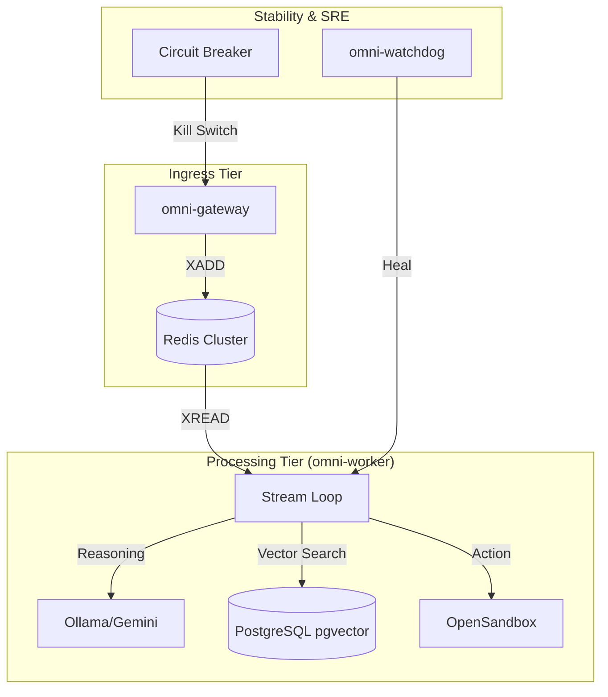

# Architectural Analysis: Omni Autonomous Platform

This document provides a deep-dive into the architectural design, data flows, and intelligence patterns of the Omni system.

## 1. High-Level Architecture Overview

Omni is an **Autonomous SRE Engine** designed to close the loop between observability and remediation. It follows a "Monitor -> Reason -> Act" cycle.

---

## 2. Component Deep-Dive

### A. Ingress & Rate Management
The **`omni-gateway`** is not just a proxy; it's a **backpressure gate**.
*   **Token Bucket (TPS)**: Limits incoming traffic to prevent Redis OOM or LLM saturation.
*   **Circuit Breaker Integration**: At setiap request, it checks a Redis flag `omni:circuit_breaker:active`. If the worker's processing queue is backed up, the gateway returns `503 Service Unavailable` immediately.

### B. The Intelligence Core (Worker Loops)
The **`omni-worker`** runs multiple concurrent `asyncio` tasks:
*   **Stream Loop**: The main ReAct agent. It decides whether to use a cached solution (FastPath) or invoke the LLM to think (SlowPath).
*   **Deep Scout**: A "Knowledge Crawler" that scans Kubernetes Resources and converts YAML/status into vector embeddings. This ensures the RAG layer always knows the latest "As-Is" state of the cluster.
*   **Forecast Loop**: Uses statistical models (3-Sigma) and time-series forecasting (Prophet) to detect "Silent Failures" that haven't tripped alerts yet.

### C. Data Layer (RAG & PGVector)
The system migrated from Qdrant to **High-Availability PostgreSQL (CloudNativePG)** to leverage SQL's transactional integrity alongside vector capabilities.
*   **Partitioning**: Data is partitioned by `collection_name` (e.g., `doc_sop`, `itops_error_ledger`).
*   **HNSW Indexing**: Uses `pgvector`'s HNSW index for sub-millisecond retrieval of SOPs based on cosine similarity.

### D. Security & Execution
*   **OpenSandbox Shim**: A sidecar-style service that executes shell commands and scripts in an isolated environment.
*   **PII Sanitization**: All observations and outputs are passed through a sanitizer to prevent sensitive data (passwords, tokens) from being sent back to the LLM or user.

---

## 3. The Self-Healing Framework (SRE Watchdog)

The newly introduced **`omni-watchdog`** operates on a separate control plane to monitor the "Monitor".
*   **Log Diagnostics**: It parses tracebacks from other pods to identify specific infrastructure failures.
*   **Autonomous Repair**: It has RBAC permissions to trigger `kubectl rollout restart` or perform SQL ownership fixes (`ALTER OWNER`).
*   **Zero-Overhead Health Checks**: Uses low-impact `SELECT 1` queries to verify HA routing via Pgpool-II.

---

## 4. Critical Design Decision: Redis Cluster
The system uses **Redis Streams** for durable, asynchronous task distribution. By using `XREADGROUP`, it ensures that even if a worker pod crashes, the message remains "Pending" (PEL) and can be reclaimed by another worker, preventing event loss.

## 5. Potential Bottlenecks & Future Roadmap
*   **LLM Latency**: Reasoning via `qwen2.5:7b` on Ollama is slower than simple rule-based systems. **Optimization**: Increasing "FastPath" hit rate through experience-based routing.
*   **Secret Management**: Current rely on K8s Secrets. **Roadmap**: Integration with HashiCorp Vault for dynamic secret rotation.
