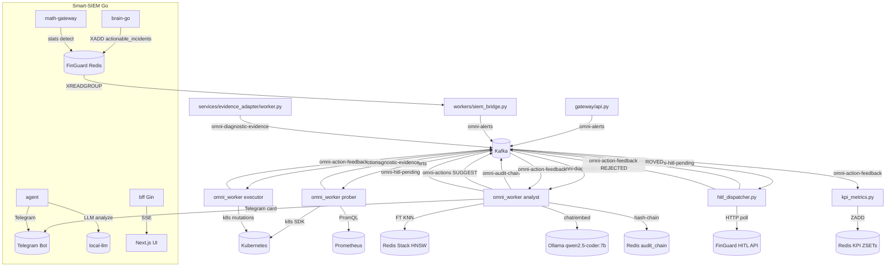

# Omni SRE — Codebase Map

## Current verified state (2026-07-14)

The latest full frontend/backend/business-logic audit is recorded in
[frontend-backend-logic-verification-2026-07-14](reports/frontend-backend-logic-verification-2026-07-14.md).
The product release gate is green: backend `6150 passed, 5 deselected, 173 warnings`,
boundary/safety `61 passed`, portal E2E `18/18`, pre-deploy `17/17`, both portal
builds/typechecks passed, and production dependency audit reported zero high-severity
vulnerabilities.

The runtime boundary is intentional: `src/workers/` remains the execution engine;
`src/aoip/` is the product/domain/control-plane layer. They are not physically merged.
Shared contracts belong in `src/pkg/`, and gateway/AOIP code must not import workers.
See [ADR-004](architecture/ADR-004-runtime-convergence.md).

The current control-plane path includes tenant/environment lifecycle, scoped agent
enrollment, durable missions and command idempotency, tenant-scoped autonomy, and
plan/entitlement enforcement. PostgreSQL migrations `0007`, `0008`, and `0009` are
part of this path. Tenant creation provisions a bounded default `tenant_plan` in the
same transaction; provider `/licenses` exposes the plan operation surface.

Latest UI fixes include shared form wrapping/min-width rules, the tenant active-context
header, role rendering, and the `aoip-btn` class correction. Next.js is pinned to
`16.2.6` across portals, unused `next-auth` was removed, and production PostCSS is
overridden to `8.5.10`.

## Architecture Overview

### Customer System Understanding (updated 2026-07-14)

The customer-facing System Twin is a graph projection, not a card list. It excludes
Omni/Remote Agent nodes and filters Linux platform noise from the primary view. The
topology is based on observed hosts, operational services, ports and connection
facts. API sequence drawing is contract-first: OpenAPI/Swagger metadata is discovered
or supplied, then access-log metadata verifies runtime routes. TCP connection evidence
alone is labelled `network_only`; see
[Customer System Understanding](architecture/customer-system-understanding.md).

Omni is an async-first, multi-agent SRE automation platform for Kubernetes. Inbound signals arrive via three paths: HTTP alerts through the FastAPI Gateway (→ Kafka `omni-alerts`), SIEM incidents from FinGuard Redis streams (siem-bridge → `omni-alerts`), and direct SIEM evidence injection (evidence-adapter → `omni-diagnostic-evidence`). The **prober** role consumes `omni-alerts`, runs K8s SDK + Prometheus probes, and publishes per-probe evidence to `omni-diagnostic-evidence`. The **analyst** role batches evidence by `trace_id`, runs RAG gate + Ollama LLM (qwen2.5-coder:7b, num_ctx=8192), and emits `SUGGEST_REMEDIATION` → `omni-actions` with mandatory CRAT audit writes before any Telegram or action emission. Approved mutations flow through `omni-hitl-pending` → HITL dispatcher → `omni-actions` → **executor**; feedback returns to analyst via `omni-action-feedback` for re-evaluation or learning. Smart-SIEM (Go) runs as a parallel pipeline: brain-go correlates events → agent applies LLM analysis → BFF serves the React UI.

> **Lab deployment (2026-06-05):** single consolidated pod `omni-fullstack` (`OMNI_WORKER_ROLE=full`) — split-role deployments deleted. Active model `qwen2.5-coder:7b` (embed `nomic-embed-text`) on OrbStack host Ollama. Graduated-autonomy tiers (shadow→assist→auto) are live with PostgreSQL `omni_admin` as config source-of-truth — see [Autonomy Tiers & Admin Config](#autonomy-tiers--admin-config-2026-06-05) below.

---

## Module Index

### src/workers/ — Core pipeline logic

| File | Mô tả | Depends on |
|------|-------|------------|
| `omni_worker.py` | Main entry point: wires all async loops per OMNI_WORKER_ROLE, SIGTERM safe | settings, kafka_bus, most worker modules |
| `__main__.py` | Python `-m workers` entry: calls omni_worker.main() | omni_worker |
| `settings.py` | Pydantic BaseSettings (OMNI_* prefix); all runtime knobs including kill-switches | pydantic_settings |
| `handler_context.py` | `WorkerHandlerContext` dataclass: redis, llm, vector_store, kafka, telegram, settings | redis, vllm_client, kafka_bus, llm_semaphore |
| `handlers.py` | Fast-path RAG + tool; slow-path agentic session; primary request handler for Telegram/gateway messages | rag, llm, pkg.executor, k8s_tools, session_state |
| `evidence_consumer.py` | Consume `omni-diagnostic-evidence`; RAG gate → LLM advisory; emit SUGGEST_REMEDIATION | pkg.reasoning, advisory_analyst_handler, kafka_bus, audit_ledger |
| `advisory_analyst_handler.py` | LLM chat with retry → AnalystAdvisory schema; CRAT write before Telegram emit | audit_ledger, analyst_advisory_schema, llm_trace |
| `advisory_mode_kill_switch.py` | AdvisoryModeKillSwitch: blocks mutations when OMNI_AUTO_EXECUTE_ENABLED=false (fail-closed) | audit_ledger |
| `advisory_mode_system_prompt.py` | L1→L4 bottom-up advisory system prompt builder (read-only, no mutations) | — |
| `advisory_hitl_compat.py` | HITL compatibility shim in Advisory Mode: prevents omni-hitl-pending emission | — |
| `analyst_agentic_loop.py` | N-step ReAct planner: EXECUTE_MUTATE plan after RAG miss; post-mutate verify planner | pkg.reasoning, autonomous_execute, evidence_mutate_emit |
| `agentic_slow_path.py` | Multi-iteration JSON tool ReAct slow path; learns on omni_mark_resolved | execution.experience, session_state, model_routing |
| `autonomous_decider.py` | Stateful ReAct (Thought→Action→Observation) or legacy one-shot; Redis cooldown/lease | tool_registry, tools, env_mode |
| `autonomous_execute.py` | Executor-side EXECUTE_MUTATE: K8s SDK + kubectl only; MUTATE_TOOL_ALLOWLIST enforcement | k8s_tools, pkg.reasoning |
| `autonomous_feedback_loop.py` | Consume `omni-action-feedback`; success → hot cache; fail → LLM replan | analyst_agentic_loop, execution.memory_normalize, audit_ledger |
| `autonomous_route.py` | Deterministic kubectl-style → SDK tool routing (no LLM for simple read ops) | — |
| `autonomy_contract.py` | Shared transition constants + emit_transition/emit_terminal_tombstone (state machine) | — |
| `baseline_snapshot.py` | System health manifest: Prometheus + K8s events → Redis `omni:baseline:snapshot` (3-sigma input) | sdk_service_tools, kubernetes_asyncio |
| `diagnostic_dispatcher.py` | Classify AnomalyEvent → probe plan via DiagnosticMatrixFile; publish per-probe evidence to Kafka | diagnostic_mapping, diagnostic_probe_registry, evidence_batch, kafka_bus |
| `diagnostic_evidence.py` | ProbeRunRaw + EvidenceObject models; evidence_from_probe() factory | pydantic |
| `diagnostic_k8s_clinical.py` | K8s SDK clinical probes: pod_status, pod_metrics, log_tail, log_previous, events, resource_quota | kubernetes_asyncio, diagnostic_evidence |
| `diagnostic_mapping.py` | Load YAML DiagnosticMatrixFile; match AnomalyEvent → probe_ids list | yaml, pydantic, proactive_models |
| `diagnostic_pod_plan.py` | Tier-2 smart probe plan from k8s_clinical_pod_status structured_hint | — |
| `diagnostic_probe_registry.py` | run_probe() dispatcher: routes probe_id → clinical/prom/security handler | diagnostic_k8s_clinical, security_probes |
| `diagnostic_resource.py` | Classify workload CPU/mem alerts; extract pod identity from AnomalyEvent | proactive_models |
| `evidence_batch.py` | Redis-based evidence accumulator per trace_id; flush on quorum or timeout | redis |
| `evidence_consumer.py` | (see above — top-level analyst path) | — |
| `evidence_mutate_emit.py` | Build EXECUTE_MUTATE payloads from evidence batch; SIEM HITL gate helpers | pkg.autonomous_actions, alert_to_event |
| `alert_to_event.py` | Map Alertmanager/gateway payloads → AnomalyEvent for probe dispatch | proactive_models, pkg.autonomy.gigo |
| `alert_sdk_truth_compare.py` | Compare alert claims vs K8s SDK ground truth; detect false positives | — |
| `proactive_observer.py` | Kafka proactive incidents loop + evaluate loop; PrometheusEvaluate → anomaly → SOP tool | sdk_service_tools, proactive_guardrails, autonomy_contract |
| `proactive_react_runner.py` | Proactive fallback ReAct phase (diagnose→prescribe→treat→recheck) | proactive_guardrails, proactive_tool_policy, tool_registry |
| `proactive_guardrails.py` | Namespace freeze + resource lease (Redis) for proactive mutations | — |
| `proactive_policy_gate.py` | Wilson lower-bound learning governance gate for proactive fallback | metrics_exporter |
| `proactive_models.py` | AnomalyEvent Pydantic model (canonical alert representation) | pydantic |
| `proactive_tool_policy.py` | PROACTIVE_DIAGNOSE_TOOLS / PROACTIVE_RECHECK_TOOLS allowlists | — |
| `forecast_autonomous_loop.py` | Periodic: Prometheus → Prophet/linear forecast → threshold → Telegram admin | anomaly.prophet_forecast, metrics.prometheus_dataframe, visualization |
| `kafka_actions_consumer.py` | Consume `omni-actions`: execute_write_pending, EXECUTE_MUTATE, audit SUGGEST_REMEDIATION | autonomous_execute, pkg.executor, autonomy_contract |
| `siem_bridge.py` | Bridge worker: FinGuard Redis stream → Kafka `omni-alerts`; optional dual-emit to `omni-siem-raw` | aiokafka, redis.asyncio |
| `hitl_dispatcher.py` | Consume `omni-hitl-pending`; poll FinGuard HITL API; route APPROVED→omni-actions / REJECTED→omni-action-feedback | httpx, aiokafka, redis |
| `kpi_metrics.py` | KPIStore: rolling 24h ZADD window for MTTD/MTTR/acceptance_rate/false_positive metrics | redis |
| `metrics_exporter.py` | Prometheus /metrics server (thread-based); all inc_*/observe_* counters used by other modules | prometheus_client |
| `health_server.py` | Passive health/readiness HTTP server (thread-based); read from metrics state | — |
| `otel_tracing.py` | OpenTelemetry OTLP tracing setup; child_span/proactive_trace_span context managers | opentelemetry (optional) |
| `request_trace.py` | Per-message trace_id via ContextVar; OmniWorkerTraceFilter prefixes all log lines | logging |
| `session_state.py` | Redis `session_state:{chat_id}` short-term memory (goal, pending, slots, recent messages) | pydantic, redis |
| `llm_semaphore.py` | Redis LIST token pool: proactive/reactive lanes; lease TTL for crash recovery | redis |
| `llm_context_budget.py` | Configurable truncation helpers (tokens, words) for LLM-bound strings | — |
| `llm_prompts_en.py` | English prompt constants; LLM_MAX_OUTPUT_WORDS cap; VENDOR_KNOWLEDGE_GUIDANCE | — |
| `llm_trace.py` | Structured INFO logs for raw LLM output and JSON/tool parse outcomes | — |
| `model_routing.py` | Classify user text → RouteKind (default/reasoning/heavy); dispatch_task selector | — |
| `redis_client.py` | create_redis_client: standalone or Sentinel from WorkerSettings | redis.asyncio |
| `temporal_evidence_collector.py` | Dynamic PromQL generation from alert context; inject temporal evidence into narrative | prober.temporal_evidence |
| `reasoning_evidence_inbound.py` | Read-only LLM reasoning on diagnostic evidence (no executor imports) | pkg.reasoning, llm_context_budget |
| `advisory_analyst_handler.py` | (see above) | — |
| `log_surge_probe.py` | Loki log probe: classify HTTP errors (5xx/429/499/401/403); sigma bypass logic | httpx |
| `k8s_tools.py` | K8s SDK tools: list/inspect pods, rollout_restart, rollout pending, pod_index cache | kubernetes_asyncio, visualization |
| `k8s_cluster_tools.py` | K8s cluster mutating tools via @register_tool: patch_deployment, scale, apply_rbac, delete_pod | kubernetes_asyncio, tool_registry |
| `k8s_readonly_tools.py` | K8s read-only tools: list_nodes, describe_service, ingress via @register_tool | kubernetes_asyncio, tool_registry |
| `k8s_resource_snapshot.py` | Read small JSON snapshot of a namespaced K8s object (SDK) | kubernetes_asyncio, k8s_tools |
| `kubectl_cluster.py` | kubectl subprocess @register_tool: apply/delete/CRD operations not covered by SDK | os_executor_adapter, tool_registry |
| `sdk_service_tools.py` | Service tools: Prometheus PromQL, psutil, Scapy, matplotlib charts, historical series | anomaly.forecast, metrics.prometheus_dataframe, rag, visualization |
| `diagnostic_probe_registry.py` | run_probe(): routes probe_id to correct handler function | diagnostic_k8s_clinical, security_probes |
| `security_probes.py` | probe_k8s_rbac_drift + probe_k8s_configmap_security_drift (RBAC/ConfigMap security self-remediation) | kubernetes_asyncio, diagnostic_evidence |
| `tools.py` | TOOL_REGISTRY dict + ToolCallPayload; imports all tool modules (side-effect registration) | k8s_tools, k8s_cluster_tools, k8s_readonly_tools, sdk_service_tools |
| `tool_registry.py` | Typed ToolRegistry: ToolSpec(name, input_model, handler); invoke with model_validate + audit | pydantic, tool_observation |
| `tool_observation.py` | Prepare tool return values for LLM prompt (truncation, formatting) | — |
| `tool_backend.py` | Tool backend routing helpers | tool_registry |
| `tool_approval.py` | Tool execution approval gate helpers | — |
| `routing_policy.py` | ROUTING_SOURCES_FAST_PATH_EXECUTE; shell_fast_path_enabled; routing source constants | — |
| `slow_path_trace.py` | AttemptRecord, format_slow_path_autopsy, consecutive_same_signature_streak for loop detection | — |
| `react_logging.py` | log_react_json: structured ReAct step logging (Thought/Action/Observation) | — |
| `infra_context.py` | Semantic search k8s_expert + infra_topology collections for diagnostic enrichment | rag.pgvector_store |
| `infra_preflight.py` | LearnedContext: namespace/pod inference from alert text + pgvector semantic search | rag.pgvector_store |
| `clarification.py` | Detect ambiguous resource checks; parse follow-up resource hints | — |
| `clarification_context.py` | Context helpers for clarification flow | — |
| `entity_extract.py` | extract_entities_llm: extract namespace/pod/deployment from free text via LLM | — |
| `env_mode.py` | env_mode()/is_dev_mode()/namespace_allowed() governance helpers | — |
| `omni_actions_remediation.py` | Build SUGGEST_REMEDIATION and SUGGEST_OS_RUNBOOK Kafka body shapes | — |
| `autonomous_route.py` | kubectl-style → SDK tool routing (no LLM for simple read ops) | — |
| `post_mutate_sdk_verify.py` | Re-run same probes post-mutation to confirm issue cleared | diagnostic_probe_registry |
| `post_verify_deployment_state.py` | Verify Deployment rollout state after SDK probes pass | kubernetes_asyncio |
| `alert_sdk_truth_compare.py` | Compare alert claims vs K8s state machine ground truth | — |
| `archivist.py` | Write REDACTED post-mortems to disk; recall similar playbooks from pgvector | rag.pgvector_store |
| `selflearning_shadow.py` | Shadow self-learning: three-hypotheses generation (opt-in, non-impact) | — |
| `analytics_ts.py` | parse_prometheus_matrix_first_series; analyze_series for time-series analytics | — |
| `vm_timeseries_helpers.py` | Prometheus timeseries → line chart PNG bytes helper | visualization |
| `vm_slot_accumulation.py` | Accumulate PromQL query slots (pod/workload) across multi-turn conversation | clarification |
| `promql_presets.py` | resolve_intent_from_keywords; build_dynamic_promql; build_kube_state_promql | — |
| `promql_workload_helpers.py` | workload_prefix_from_tool_args: derive workload regex from tool args | — |
| `prometheus_alert_enrichment.py` | Enrich alert payload with Prometheus metadata | — |
| `telegram_advisory_emitter.py` | Render AnalystAdvisory → Telegram Markdown V1 cards with forecast timelines | pkg.reasoning.analyst_advisory_schema |
| `telegram_outbound.py` | send_telegram_out_for_inbound: shared Telegram message sender | handlers |
| `telegram_escalation.py` | format_operator_triage_card: escalation card (Problem/Reason/Chain/Advise) | — |
| `telegram_ctx.py` | effective_telegram_chat_id / should_send_telegram_chart helpers | — |
| `log_preview.py` | alert_payload_summary, log_preview, json_obj_preview for structured log output | — |
| `observation_sanitize.py` | sanitize_for_llm: clean tool observation before LLM feed | — |
| `observability_audit.py` | Audit Prometheus + LGTM stack health via httpx + SDK | kubernetes_asyncio, httpx |
| `lab_shell.py` | LAB: subprocess shell on omni-worker pod (policy-gated, audit topic) | execution.policy |
| `sandbox_tools.py` | tool_execute_in_sandbox: HTTP to OpenSandbox server; record_sandbox_lesson | execution.manager, execution.pod_env_clone |
| `gated_execute.py` | tool_gated_allowlisted_execute: lazy import of execution.promotion | execution.promotion |
| `os_executor_adapter.py` | wrap_host_command: host command execution adapter | — |
| `agent_audit.py` | append_agent_audit: structured Kafka audit for agentic sessions | — |
| `session_state.py` | (see above) | — |
| `schemas/agentic_planner.py` | validate_suggest_os_runbook_data Pydantic schema | pydantic |
| `memory/trace_memory.py` | OmniTraceMemory: Redis-backed blackboard for agentic planner (ActionRecord history per trace) | pydantic, redis |
| `memory/initial_symptom.py` | InitialSymptom: structured Alertmanager snapshot for planner prompts | pydantic |
| `adapters/contracts.py` | AdapterEvent/AdapterPlan/AdapterExecutionResult dataclasses (portable interfaces) | — |
| `adapters/k8s_adapter.py` | K8sProbeAdapter/K8sPlannerAdapter/K8sActuatorAdapter backed by worker primitives | autonomous_execute, diagnostic_dispatcher |
| `adapters/mock_external_adapter.py` | Mock adapter for testing | — |

### src/gateway/ — HTTP Ingress

| File | Mô tả | Depends on |
|------|-------|------------|
| `api.py` | FastAPI app: POST /webhook → Kafka `omni-alerts`; Bearer auth; circuit breaker; rate limit | fastapi, aiokafka, redis |
| `routes/kpi.py` | GET /kpi/summary + /kpi/trend: read KPI from Redis ZADD windows | fastapi, redis |
| `trace_context.py` | install_gateway_trace_logging: trace_id ContextVar for gateway logs | — |

### src/pkg/reasoning/ — LLM Schema + Diagnostic Policy

| File | Mô tả | Depends on |
|------|-------|------------|
| `analyst_advisory_schema.py` | AnalystAdvisory Pydantic schema: WHAT/WHO/WHY/HOW-TO/Forecast (VerificationStep, ProposedRemediationStep, ForecastTimeline) | pydantic |
| `diagnostic_policy.py` | INV_* invariants (INV_NO_RESTART_ON_BROKEN_SPEC, INV_READ_BEFORE_MUTATE, etc.); evaluate_diagnostic_invariants | evidence_signals, reason_codes |
| `reason_codes.py` | All ERR_*/INV_*/PLANNER_* constants; severity map | — |
| `evidence_signals.py` | critical_evidence_present; deterministic signals from evidence batch | deterministic_mutate_from_evidence |
| `evidence_anchor.py` | llm_contradicts_sdk_facts; summarize_facts_for_anchor (SDK vs LLM contrast) | — |
| `sanitize.py` | filter_evidence_for_rag; format_batch_sanitized_analyst_user_text; evidence_relevance_warning | pkg.rag.embed_utils |
| `incident_matrix_profile.py` | Load incident_training_matrix.yaml; VALID_PROOF_LANES; pick_matrix_row_for_batch | yaml |
| `deterministic_mutate_from_evidence.py` | deterministic_mutate_plan_from_batch: rule-based mutate plan bypassing LLM | — |
| `alert_identity.py` | SignalDNA; parse_signal_dna_from_labels; infer_root_cause_id | — |
| `preflight_deployment_secret_refs.py` | Check deployment secret refs for credential failures | — |
| `schema.py` | Base reasoning output schema types | pydantic |
| `sre_output.py` | compact_sre_diagnosis: format SRE diagnosis for Telegram | — |
| `two_channel_sdk.py` | parse_two_channel_sdk_only: parse SDK-only two-channel evidence | — |

### src/pkg/rag/ — RAG Gate

| File | Mô tả | Depends on |
|------|-------|------------|
| `gate.py` | RagGateOutcome; evaluate_rag_gate: k8s_expert semantic search → formatted text (no LLM) | rag.pgvector_store, embed_utils |
| `embed_utils.py` | truncate_for_embedding: safe text truncation before Ollama embed call | — |

### src/anomaly/ — Anomaly Detection & Forecasting

| File | Mô tả | Depends on |
|------|-------|------------|
| `three_sigma.py` | ThreeSigmaGate: Redis LIST rolling z-score (window=100, TTL=3600s); anomaly when |z|>3 | redis.asyncio |
| `forecast.py` | linear_forecast_horizon (scipy linregress); oom_risk_from_series; pandas_trend_forecast | numpy, pandas, scipy |
| `prophet_forecast.py` | Prophet (optional) or linear fallback with CI bands; horizons_to_periods; step_to_pandas_freq | pandas, numpy, anomaly.forecast |

### src/execution/ — Sandbox + Promotion + Experience

| File | Mô tả | Depends on |
|------|-------|------------|
| `experience.py` | fetch/record action experience in pgvector; record_routing_exhausted; record_sandbox_lesson | rag.pgvector_store, memory_normalize |
| `manager.py` | SandboxManager: httpx → OpenSandbox server; Kafka audit | execution.policy, workers.settings |
| `memory_normalize.py` | canonical_symptom_text; extract_workload_fingerprint; strip_ephemeral_from_args | — |
| `pod_env_clone.py` | Clone pod env/labels for sandbox execution context | — |
| `policy.py` | check_sandbox_command/check_promotion_tool; PolicyVerdict denylist | — |
| `promotion.py` | execute_write_pending_from_redis: gated sandbox → validation → SDK tool | execution.manager, execution.policy, workers.k8s_tools |

### src/services/analyst/ — Analyst Service Boundary

| File | Mô tả | Depends on |
|------|-------|------------|
| `__init__.py` | Package boundary marker (only pkg.reasoning imports allowed) | — |
| `__main__.py` | Analyst service entry point | — |

### src/services/audit_ledger/ — CRAT (Cryptographic Regulatory Audit Trail)

| File | Mô tả | Depends on |
|------|-------|------------|
| `chain_writer.py` | write_audit_block: SHA-256 hash-chaining + Ed25519; Redis `audit_chain:*` + Kafka `omni-audit-chain` | signer, redis, aiokafka |
| `signer.py` | Ed25519 PEM key load/sign (OMNI_AUDIT_PRIVATE_KEY_PATH); AuditLedgerError | cryptography |
| `verifier.py` | verify_block_hash + verify_chain: detect retrospective tampering | — |

### src/services/evidence_adapter/ — SIEM Evidence Injection

| File | Mô tả | Depends on |
|------|-------|------------|
| `worker.py` | AdapterGeneratorWorker: Redis stream → evidence envelopes → Kafka `omni-diagnostic-evidence` | aiokafka, redis, protocol |
| `siem_adapter.py` | SIEMEvidenceAdapter: FinGuard incident dict → Omni evidence envelopes | — |
| `protocol.py` | EvidenceAdapter protocol definition | — |

### src/services/playbook/ — Pre-approved Remediation Playbooks

| File | Mô tả | Depends on |
|------|-------|------------|
| `store.py` | PlaybookStore: Redis JSON + FT search index (`idx:playbooks`, key prefix `pb:`) | redis |
| `matcher.py` | PlaybookMatcher: match SIEM incident → Playbook by id/category/severity | store, models |
| `state_machine.py` | StepStateMachine: Redis-backed step state tracker (`omni:playbook:state:{trace}:{playbook_id}`) | redis |
| `models.py` | Playbook/PlaybookStep Pydantic models | pydantic |

### src/prober/ — Prober Facade

| File | Mô tả | Depends on |
|------|-------|------------|
| `clinical.py` | Re-exports probe_k8s_clinical_pod_{status,metrics,log_tail} from workers.diagnostic_k8s_clinical | workers.diagnostic_k8s_clinical |
| `temporal_evidence.py` | TemporalMetric + TemporalEvidenceBlock: historical metrics fetcher for evidence narrative | httpx |

### src/rag/ — Vector Store + Caches

| File | Mô tả | Depends on |
|------|-------|------------|
| `redis_vector_store.py` | RedisVectorStore: Redis Stack HNSW COSINE; 768-dim (nomic-embed-text); 9 named collections | redis, pydantic, tenacity |
| `pgvector_store.py` | Compat shim: re-exports everything from redis_vector_store (Postgres removed) | rag.redis_vector_store |
| `semantic_cache.py` | SemanticCache: FT KNN on embedding vectors; TTL-based RAG result cache | redis, rag.redis_vector_store |
| `error_ledger.py` | ErrorLedger: Redis SETEX error log with redaction + TTL=7days | redis, redis_vector_store |
| `sop_ledger.py` | sop_payload_for_fast_path helper; SOP_COLLECTION constant | rag.pgvector_store |

### src/llm/ — LLM Clients

| File | Mô tả | Depends on |
|------|-------|------------|
| `vllm_client.py` | VLLMClient: async Ollama (OpenAI-compatible) chat + embed; DEFAULT_MAX_TOKENS=4096 | openai |
| `gemini_client.py` | Gemini Developer API async client; retry 429; spillover to Ollama | google.genai, llm.vllm_client |

### src/messaging/ — Kafka Transport

| File | Mô tả | Depends on |
|------|-------|------------|
| `kafka_bus.py` | KafkaBus.send_dict; create_producer; decode_kafka_value_to_fields; idempotent producer | aiokafka |

### src/metrics/ — Prometheus Data

| File | Mô tả | Depends on |
|------|-------|------------|
| `prometheus_dataframe.py` | matrix_json_to_dataframe; fetch_range_dataframe: Prometheus query_range → pandas DataFrame | pandas, workers.analytics_ts |

### src/observability/ — Normalization + Redaction

| File | Mô tả | Depends on |
|------|-------|------------|
| `normalize.py` | redact() PII/secrets; canonical_query_from_rule_name; infer_error_hint_from_promql | re |

### src/ingest/ — External Input

| File | Mô tả | Depends on |
|------|-------|------------|
| `telegram.py` | TelegramClient: async httpx Telegram Bot API; TelegramBotSettings | httpx, pydantic_settings |

### src/init/ — Startup Initialization

| File | Mô tả | Depends on |
|------|-------|------------|
| `deep_scout.py` | DeepScout: K8s + psutil + httpx baseline → Redis `sys:host:specs`, `metrics:baseline:24h`; pgvector infra_topology upsert | kubernetes_asyncio, psutil, rag |
| `deep_scout_autonomous.py` | run_deep_scout_autonomous: autonomous variant of deep scout | init.deep_scout |

### src/knowledge/ — Vendor Knowledge Ingestion

| File | Mô tả | Depends on |
|------|-------|------------|
| `pipeline.py` | Ingest pipeline: fetch → clean → chunk → embed → upsert to COLLECTION_VENDOR_KNOWLEDGE | knowledge.chunk/clean/fetch_*, rag.pgvector_store |
| `chunk.py` | chunk_by_markdown_headings: split documents by heading | — |
| `clean.py` | clean_html/clean_plain/assert_no_embed_raw_html | — |
| `fetch_crawl.py` | fetch_url_jina: fetch URL via Jina reader | httpx |
| `fetch_local.py` | fetch_local_markdown: load local Markdown files | — |
| `enrich.py` | Document enrichment helpers | — |
| `models.py` | RawDocument/SourceEntry models | pydantic |
| `config.py` | Knowledge ingestion config | — |
| `ingest_main.py` | CLI entry for knowledge ingestion | knowledge.pipeline |

### src/training/ — RAG Training / SOP Ingest

| File | Mô tả | Depends on |
|------|-------|------------|
| `sop_ingest.py` | Embed + bulk upsert SOP entries into Redis vector store | rag, llm.vllm_client, training.sop_expand |
| `sop_expand.py` | Expand SOP seed entries to variants | — |
| `k8s_official_ingest.py` | Ingest kubernetes.io official docs into k8s_expert collection | rag, llm |
| `cli_hil_ingest.py` | CLI HIL (Human-In-the-Loop) training data ingest | rag |
| `cli_hil_pools.py` | CLI HIL pool management | — |

### src/sre/ — Watchdog

| File | Mô tả | Depends on |
|------|-------|------------|
| `watchdog.py` | OmniWatchdog: K8s API watch + pattern-based self-healing diagnostics | kubernetes_asyncio, workers.settings |

### src/visualization/ — Chart Generation

| File | Mô tả | Depends on |
|------|-------|------------|
| `chart_bytes.py` | line_chart_png_bytes; pod_cpu_memory_bar_png_bytes: matplotlib → PNG BytesIO (no disk) | matplotlib |

### src/devtools/ — Developer Utilities

| File | Mô tả | Depends on |
|------|-------|------------|
| `kafka_inject_proactive_incident.py` | CLI: inject synthetic proactive incident into Kafka for testing | aiokafka |
| `redis_cleanup_stuck.py` | CLI: clean stuck Redis keys (batches, locks, sessions) | redis |

### src/pkg/autonomy/ — Autonomy Primitives

| File | Mô tả | Depends on |
|------|-------|------------|
| `gigo.py` | build_gigo_metadata: normalize Prometheus labels → K8s-oriented routing metadata | — |
| `lifecycle.py` | Autonomy lifecycle helpers | — |
| `llm_contract.py` | LLM output contract validation helpers | — |
| `transform.py` | Data transform utilities for autonomy pipeline | — |

### src/pkg/executor/ — Mutation Facade

| File | Mô tả | Depends on |
|------|-------|------------|
| `__init__.py` | Re-exports execute_write_pending_from_redis, redis_key_rollout/write_pending — NOT for analyst import | execution.promotion, workers.k8s_tools |

### src/pkg/autonomous_actions.py

Kafka action body builders: build_execute_mutate_body, build_action_feedback_body, infer_exit_code_from_tool_output.

---

## smart-siem/ — Go Services

### smart-siem/omni/siem/brain-go/ — Event Correlator + Publisher

| File | Mô tả | Depends on |
|------|-------|------------|
| `cmd/brain-go/main.go` | Main: load config, create App, run ingest loop | internal/* |
| `cmd/siem-redis-producer/main.go` | Dev tool: inject synthetic SIEM events into Redis stream | — |
| `internal/app/app.go` | App: wires ingest loop + correlator + publisher; BRAIN_TRANSPORT=redis\|kafka | correlate, ingest, publisher, transport |
| `internal/config/config.go` | Config from env: transport, Redis URL, Kafka bootstrap, stream names | — |
| `internal/ingest/loop.go` | Redis XREADGROUP loop: consume normalized SIEM events → publish incidents | publisher |
| `internal/ingest/decode.go` | Decode/normalize raw Redis stream messages | — |
| `internal/correlate/correlator.go` | Redis ZSET sliding-window (5 min, threshold=3): emit CHAIN_DETECTED when ≥threshold events | publisher, domain |
| `internal/normalize/normalize.go` | Normalize raw event fields to canonical incident format | domain |
| `internal/domain/incident.go` | IncidentMessage domain type | — |
| `internal/publisher/publisher.go` | Publisher interface | — |
| `internal/publisher/redis_stream.go` | RedisStreamPublisher: XADD to `stream:actionable_incidents` | — |
| `internal/publisher/incident_contract.go` | Incident envelope builder | — |
| `internal/transport/interface.go` | Transport interface (redis/kafka) | — |
| `internal/transport/kafka.go` | KafkaTransport: consume `omni-siem-raw`, produce `omni-siem-incidents` | kafka-go |
| `pkg/siempipeline/pipeline.go` | Pipeline composition helper | — |

### smart-siem/omni/siem/agent/ — SIEM Incident Agent

| File | Mô tả | Depends on |
|------|-------|------------|
| `cmd/agent/main.go` | Main: wire agent app, start consumer | internal/* |
| `cmd/hitl-api/main.go` | HITL API server for agent-side decision endpoint | internal/hitl |
| `internal/app/app.go` | App: RedisStreamConsumer + handler + DLQ + Reaper + audit; license monotonic check | consumer, audit, feedback, analyze, local-llm |
| `internal/app/action_executor.go` | Execute remediation actions from approved incidents | internal/remediation |
| `internal/app/action_executor_rag.go` | RAG-augmented action executor | internal/analyze, local-llm |
| `internal/app/persistence_handler.go` | Persistence handler for incident lifecycle | internal/persistence |
| `internal/analyze/llm_analyzer.go` | LLMAnalyzer: enrich incident with local LLM analysis; fallback on timeout | local-llm |
| `internal/audit/logger.go` | AsyncLogger: non-blocking audit log writes | — |
| `internal/audit/emergency.go` | Emergency audit fallback (disk) | — |
| `internal/audit/shipper.go` | Ship audit events to external sink | — |
| `internal/consumer/redis_stream.go` | RedisStreamConsumer: XREADGROUP with XACK | — |
| `internal/consumer/dlq.go` | DeadLetterWriter: persist unprocessable messages | — |
| `internal/domain/incident.go` | IncidentMessage domain | — |
| `internal/feedback/collector.go` | Collect LLM/remediation feedback | — |
| `internal/feedback/llm_adapter.go` | LLM adapter for feedback enrichment | local-llm |
| `internal/feedback/store.go` | Redis-backed feedback store | — |
| `internal/hitl/api.go` | HITL decision API: register/poll/approve/reject | — |
| `internal/notify/telegram.go` | Telegram notifier: send incident cards to operator channel | — |
| `internal/notify/ratelimit.go` | Rate limiter for Telegram notifications (Redis 1/tenant/5min) | — |
| `internal/persistence/postgres.go` | Postgres-backed incident persistence + remediation store | pgx |
| `internal/provider/license/postgres_source.go` | License source from Postgres | — |
| `internal/remediation/runner.go` | RemediationRunner: execute playbook steps | — |

### smart-siem/omni/siem/bff/ — Backend-for-Frontend (Gin)

| File | Mô tả | Depends on |
|------|-------|------------|
| `cmd/bff/main.go` | Main: wire Server deps, start Gin engine | internal/* |
| `cmd/bff/server.go` | Server: SessionManager + Broadcaster + TunnelClient + TicketStore + CratLedger | gin, internal/* |
| `cmd/bff/server_handlers_impl.go` | REST handlers: incidents, advisories, CRAT, forecast | — |
| `cmd/bff/server_handlers_admin.go` | Admin handlers: users, rules, audit | — |
| `cmd/bff/server_tickets.go` | Ticket CRUD handlers | — |
| `cmd/bff/server_tunnel_proxy.go` | Tunnel proxy handlers (provider → customer tunnel) | — |
| `cmd/bff/pii_response.go` | PII masking middleware for responses | — |
| `cmd/dashboard-aggregator/main.go` | Standalone dashboard data aggregator service | — |
| `internal/auditsearch/minio.go` | MinIO-backed audit log search | — |
| `internal/auth/session.go` | Session manager: JWT + Redis session store | — |
| `internal/config/config.go` | BFF config from env | — |
| `internal/cratledger/reader.go` | Read CRAT blocks from Redis `audit_chain:blocks` | — |
| `internal/dashboardcache/cache.go` | Redis-backed dashboard data cache | — |
| `internal/hitlverify/verify.go` | Verify HITL decision integrity | — |
| `internal/pii/mask.go` | PII masking for display | — |
| `internal/redispipeline/redispipeline.go` | Redis pipeline helpers | — |
| `internal/sse/broadcaster.go` | SSE broadcaster: fan-out to connected clients | — |
| `internal/sse/consumer.go` | SSE consumer: read from Redis pubsub | — |
| `internal/store/postgres.go` | Postgres store: incidents, decisions, tenants | pgx |
| `internal/store/hitl.go` | HITL decisions store | — |
| `internal/store/rules.go` | Detection rules store | — |
| `internal/store/tracing.go` | Trace correlation store | — |
| `internal/store/users.go` | User management store | — |
| `internal/tickets/store.go` | Ticket Redis index + HTTP API | — |
| `internal/tunnel/client.go` | Tunnel client to provider HQ | — |

### smart-siem/omni/siem/math-gateway/ — Metric Anomaly Gateway

| File | Mô tả | Depends on |
|------|-------|------------|
| `cmd/math-gateway/main.go` | Main: wire app, start metric consumer | internal/* |
| `internal/app/app.go` | RedisMetricReader + StatsDetector + Publisher; license enforcement | consumer, detector, publisher |
| `internal/consumer/metric.go` | Redis XREAD metric stream consumer | — |
| `internal/detector/stats.go` | Statistical anomaly detector (z-score, spike detection) | domain |
| `internal/domain/metric.go` | MetricSample domain type | — |
| `internal/publisher/publisher.go` | Publisher to Redis stream `stream:actionable_incidents` | — |

### smart-siem/omni/siem/local-llm/ — Air-gapped Local LLM Client

| File | Mô tả | Depends on |
|------|-------|------------|
| `client.go` | LLM HTTP client (vLLM/llama.cpp cluster-internal); NO external calls | net/http |
| `prompt.go` | Prompt builders for remediation suggestions | — |
| `rag.go` | RAG context retrieval helpers | — |

### smart-siem/omni/siem/contracts-go/ — Shared Go Contracts

| File | Mô tả | Depends on |
|------|-------|------------|
| `types.go` | Incident, SuggestedAction canonical types; AllowedSources | — |
| `logging.go` | Structured logging helpers | — |

### smart-siem/omni/siem/license-validator/ — License Enforcement

| File | Mô tả | Depends on |
|------|-------|------------|
| `pkg/enforcement/lockdown.go` | License lockdown enforcement (fail-closed on violation) | — |
| `pkg/monotonic/check.go` | Monotonic clock check: detect timestamp replay attacks | — |
| `internal/hardware/binding.go` | Hardware binding for license validation | — |

### smart-siem/customer/ui/ — FinGuard Customer UI API (Go/Gin)

| File | Mô tả | Depends on |
|------|-------|------------|
| `cmd/ui/main.go` | Main: Gin server for FinGuard customer UI backend | internal/* |
| `internal/api/handler.go` | REST API: incidents, HITL decisions, advisory proxy | store.PostgresStore, store.RedisStore |
| `internal/config/config.go` | UI backend config from env | — |
| `internal/store/postgres.go` | PostgresStore: incidents + HITL | pgx |
| `internal/store/redis.go` | RedisStore: session + cache | go-redis |

### smart-siem/provider/backend/ — Provider HQ Backend

| File | Mô tả | Depends on |
|------|-------|------------|
| `cmd/server/main.go` | Provider HQ: operator API (Bearer) + tunnel ingress (mTLS); Postgres required in prod | api, drm, provision, store |
| `internal/api/*` | Auth handlers, operator CRUD, provisioning, tunnel, observability, CORS middleware | pgx, store |
| `internal/services/*` | License service, tenant service, ticket service, PII helpers | store |
| `internal/store/postgres/*` | Postgres implementations: provisioning, releases, tunnel_catalog, usage_samples | pgx |
| `internal/drm/gateway.go` | DRM (Digital Rights Management) gateway | licensecrypto |
| `internal/provision/*` | Customer provisioning: SSH key generation, worker provisioning | — |

### smart-siem/customer/audit-pipeline/

| File | Mô tả | Depends on |
|------|-------|------------|
| `opensearch_to_minio/main.go` | Audit pipeline: export OpenSearch audit logs to MinIO for long-term storage | — |

---

## ui/app/ + ui/components/ — Next.js 15 Admin Dashboard

| File | Mô tả | Depends on |
|------|-------|------------|
| `app/layout.tsx` | Root layout: Geist font, dark bg, Providers wrapper | components/providers |
| `app/page.tsx` | Dashboard home: SIEM overview, diagnostic lanes, agent pods, KPI charts | components/*, recharts, api/* |
| `app/kpi/page.tsx` | KPI page: MTTD/MTTR/acceptance rate radial charts; 24h trend | recharts, api/kpi |
| `app/ledger/page.tsx` | Error ledger: filterable error/critical/warning entries with TTL bars | api/ledger |
| `app/playbooks/page.tsx` | Playbook CRUD: list + create/edit/delete pre-approved remediation playbooks | api/playbooks |
| `app/login/page.tsx` | NextAuth credentials login form | next-auth |
| `app/api/agents/route.ts` | GET /api/agents: static pod list (prober/analyst/executor/gateway roles) | — |
| `app/api/auth/[...nextauth]/route.ts` | NextAuth handler with Redis rate-limiting | lib/auth, lib/redis |
| `app/api/kpi/route.ts` | Proxy to OMNI_GATEWAY_URL/kpi/summary or mock KPI data | — |
| `app/api/ledger/route.ts` | Mock error ledger entries from WORKERS list | — |
| `app/api/playbooks/route.ts` | GET/POST playbooks via OMNI_REDIS_URL → `pb:*` keys | lib/redis |
| `app/api/playbooks/[id]/route.ts` | PUT/DELETE individual playbook | lib/redis |
| `app/api/redis/metrics/route.ts` | GET Redis metrics from OMNI_REDIS_URL | lib/redis |
| `app/api/siem/overview/route.ts` | SIEM telemetry: proxy SIEM_METRICS_URL Prometheus or mock shape | — |
| `components/diagnostic-lanes.tsx` | DiagnosticLanes: 4-lane status cards (sys_resource/sys_hard_fail/app_http/siem_security) | ui/* |
| `components/sidebar.tsx` | Navigation sidebar with route links | — |
| `components/providers.tsx` | SessionProvider (NextAuth) + any global context | next-auth |
| `components/ui/*.tsx` | shadcn/ui primitives: Button, Card, Badge, Dialog, Table, Tabs, etc. | radix-ui |
| `lib/auth.ts` | NextAuth config: CredentialsProvider + Redis login rate-limit | next-auth, lib/redis |
| `lib/redis.ts` | Singleton ioredis client (OMNI_REDIS_URL) | ioredis |
| `lib/utils.ts` | cn() helper: tailwind-merge + clsx | tailwind-merge, clsx |

---

## Kafka Topic Map

| Topic | Producer(s) | Consumer(s) | Purpose |
|-------|-------------|-------------|---------|
| `omni-alerts` | gateway/api.py, siem_bridge.py, devtools/kafka_inject | omni_worker (prober role): `kafka_alerts_loop` | Inbound alerts from HTTP gateway + SIEM bridge |
| `omni-diagnostic-evidence` | diagnostic_dispatcher.py, evidence_adapter/worker.py | omni_worker (analyst role): `reason_from_diagnostic_evidence` | Per-probe evidence batches for analyst |
| `omni-actions` | evidence_consumer.py (SUGGEST_REMEDIATION/EXECUTE_MUTATE), hitl_dispatcher.py (APPROVED) | kafka_actions_consumer.py (executor role) | Actions: suggest + execute + runbooks |
| `omni-action-feedback` | kafka_actions_consumer.py (executor result), hitl_dispatcher.py (REJECTED) | autonomous_feedback_loop.py (analyst), kpi_metrics.py (KPI collector) | Execution results + KPI tracking |
| `omni-hitl-pending` | evidence_consumer.py (HITL_PENDING) | hitl_dispatcher.py | Awaiting human approval |
| `omni-audit-chain` | audit_ledger/chain_writer.py | (downstream SIEM/compliance consumers) | CRAT tamper-evident audit blocks |
| `omni-siem-raw` | siem_bridge.py (SIEM_BRIDGE_DUAL_EMIT=true) | brain-go (BRAIN_TRANSPORT=kafka) | Raw FinGuard incidents to brain-go Kafka mode |
| `omni-siem-incidents` | brain-go/internal/transport/kafka.go | (downstream consumers) | Correlated SIEM incidents from brain-go |

---

## Redis Key Map

| Key Pattern | Owner Module | TTL | Purpose |
|-------------|-------------|-----|---------|
| `omni:baseline:snapshot` | workers/baseline_snapshot.py | 1h | System health manifest (Prometheus + K8s events, z_cpu/z_mem) |
| `omni:baseline:ts` | workers/baseline_snapshot.py | — | Last baseline snapshot timestamp |
| `omni:diag_batch:{trace}` | workers/evidence_batch.py | 120s | Evidence accumulator per trace (HSET) |
| `omni:diag_batch_t0:{trace}` | workers/evidence_batch.py | 120s | Batch start time (t0) |
| `omni:diag_flush_lock:{trace}` | workers/evidence_batch.py | 30s | Flush lock per trace (prevents double flush) |
| `omni:diag_expected:{trace}` | workers/evidence_batch.py | 120s | Expected probe IDs for smart quorum |
| `omni:memory:trace:{trace_id}` | workers/memory/trace_memory.py | 4h | Agentic planner blackboard (ActionRecord history) |
| `omni:trace:transition_seq:{trace_id}` | workers/autonomy_contract.py | 2h | Monotonic transition sequence counter |
| `session_state:{chat_id}` | workers/session_state.py | — | Telegram session (goal, slots, recent messages) |
| `omni:k8s:pod_index:{ns}` | workers/k8s_tools.py | — | Pod list cache per namespace |
| `omni:rollout_pending:{chat_id}` | workers/k8s_tools.py | — | Pending rollout restart for chat user |
| `omni:write_pending:{chat_id}` | workers/k8s_tools.py | — | Pending write after gated sandbox+validation |
| `omni:semaphore:{llm}:pool` | workers/llm_semaphore.py | — | LLM slot token pool (LIST) |
| `omni:semaphore:{llm}:lease:{token}` | workers/llm_semaphore.py | dynamic | LLM slot lease TTL |
| `omni:kpi:z:accepted` | workers/kpi_metrics.py | 48h | ZADD accepted advisories (24h rolling) |
| `omni:kpi:z:rejected` | workers/kpi_metrics.py | 48h | ZADD rejected advisories |
| `omni:kpi:z:false_positive` | workers/kpi_metrics.py | 48h | ZADD false positives |
| `omni:kpi:detected:{lane}` | workers/kpi_metrics.py | 48h | ZADD detection timestamps per lane |
| `omni:kpi:resolved:{lane}` | workers/kpi_metrics.py | 48h | ZADD resolution timestamps per lane |
| `omni:autonomous_fix:cooldown:{key}` | workers/autonomous_decider.py | dynamic | Cooldown per anomaly fingerprint |
| `omni:autonomous:react_state:{trace}` | workers/autonomous_decider.py | dynamic | ReAct state machine state |
| `omni:learning:pattern:{key}` | workers/proactive_policy_gate.py | — | Wilson LB stats (total/success) per pattern |
| `omni:post_verify_react_mem:{trace}` | workers/analyst_agentic_loop.py | — | Post-verify ReAct memory |
| `omni:playbook:state:{trace}:{pb_id}` | services/playbook/state_machine.py | 2h | Playbook step state per trace |
| `pb:{playbook_id}` | services/playbook/store.py | — | Playbook JSON document |
| `audit_chain:head_hash` | services/audit_ledger/chain_writer.py | — | CRAT chain head hash |
| `audit_chain:seq` | services/audit_ledger/chain_writer.py | — | CRAT block sequence number |
| `audit_chain:blocks` | services/audit_ledger/chain_writer.py | — | CRAT block list (RPUSH) |
| `sys:host:specs` | init/deep_scout.py | 1h | Host hardware specs (psutil) |
| `metrics:baseline:24h` | init/deep_scout.py | — | 24h metric baseline |
| `3sigma:metric:{metric_id}` | anomaly/three_sigma.py | 1h | Rolling window list for z-score |
| `semcache:{uuid}` | rag/semantic_cache.py | dynamic | Cached RAG query results keyed by embedding |
| `login:attempts:{username}` | ui/lib/auth.ts | 60s | Login rate limit counter |
| `corr:win:{key}` | brain-go/correlate/correlator.go | dynamic | Correlation sliding window ZSET |
| `corr:dedup:{key}` | brain-go/correlate/correlator.go | 15m | Chain re-emit dedup |
| `stream:actionable_incidents` | brain-go/agent | — | FinGuard actionable incident Redis stream |

---

## Critical Data Flows

### Flow 1: Prometheus Alert → Advisory → Telegram

```
Alertmanager
  POST /webhook → gateway/api.py
    → rate-limit + circuit breaker check (Redis)
    → produce omni-alerts (Kafka, envelope: trace_id + data JSON)

omni_worker [prober]
  kafka_alerts_loop → build_anomaly_event_from_alert_payload()
    → run_diagnostic_pipeline(ctx, ev)
      → classify_event (diagnostic_mapping.py: YAML matrix → probe_ids)
      → register_diag_expected_probes (evidence_batch.py → Redis diag_expected)
      → run_probe() × N (diagnostic_probe_registry.py)
        → probe_k8s_clinical_pod_status / pod_metrics / log_tail (kubernetes_asyncio)
        → prom_pod_cpu_cores / prom_pod_memory_wss (httpx → Prometheus)
      → _publish_diagnostic_evidence → omni-diagnostic-evidence (Kafka)

omni_worker [analyst]
  kafka_evidence_loop → reason_from_diagnostic_evidence()
    → append_evidence_and_take_flush_batch (Redis accumulator, quorum or timeout)
    → evaluate_rag_gate (k8s_expert FT KNN search)
    → HIT: build_suggest_remediation_body → SUGGEST_REMEDIATION
    → MISS: run_advisory_analyst_handler()
      → build_advisory_system_prompt (L1→L4 bottom-up)
      → llm.chat (Ollama qwen2.5-coder:7b, num_ctx=8192)
      → AnalystAdvisory.model_validate (schema validation)
      → write_audit_block (CRAT: Redis hash-chain + Kafka omni-audit-chain)  ← FAIL-CLOSED
      → emit SUGGEST_REMEDIATION → omni-actions (Kafka)
      → telegram_advisory_emitter → Telegram Bot (card with WHAT/WHO/WHY/HOW-TO + 5-horizon forecast)
```

### Flow 2: SIEM Incident → Advisory → HITL

```
FinGuard Redis stream:actionable_incidents
  → siem_bridge.py (XREADGROUP)
    → translate FinGuard severity/category → Omni AnomalyEvent
    → produce omni-alerts (Kafka)
    [OPTIONAL: SIEM_BRIDGE_DUAL_EMIT=true → produce omni-siem-raw (brain-go)]

omni_worker [prober]
  kafka_alerts_loop → run_diagnostic_pipeline (SIEM probe plan)
    → publish omni-diagnostic-evidence

omni_worker [analyst]
  reason_from_diagnostic_evidence()
    → PlaybookMatcher.match (pb: Redis JSON)
      → HIT: state_machine.StepStateMachine → step execution
    → MISS: LLM advisory (same as Flow 1)
    → _siem_hitl_required() check
      → TRUE: emit_hitl_pending → omni-hitl-pending
      → FALSE: emit SUGGEST_REMEDIATION → omni-actions

hitl_dispatcher.py
  omni-hitl-pending (Kafka)
    → POST /v1/hitl/register (FinGuard HITL API)
    → poll GET /v1/hitl/decisions/{id} (exponential backoff)
    → APPROVED: produce omni-actions
    → REJECTED: produce omni-action-feedback
```

### Flow 3: Proactive Anomaly → Evidence → Advisory

```
omni_worker [prober]
  proactive_evaluate_loop (periodic, PromQL preset queries)
    → proactive_gigo_cluster_identity_ok check
    → run_proactive_react_fallback (diagnose/prescribe/treat/recheck)
      → learning_governance_decision (Wilson LB gate)
      → tool calls: k8s SDK + Prometheus probes
      → try_acquire_resource_lease (Redis lease)
      → [ALLOWED] k8s_rollout_restart / k8s_scale_deployment
      → produce action feedback → omni-action-feedback

  kafka_proactive_incidents_loop → run_diagnostic_pipeline (same as alert path)
    → evidence → omni-diagnostic-evidence → analyst
```

### Flow 4: Action Feedback → KPI → Dashboard

```
executor (kafka_actions_consumer.py)
  run_execute_mutate_tool → tool result
    → publish_action_feedback → omni-action-feedback

omni_worker [analyst]
  kafka_action_feedback_loop (autonomous_feedback_loop.py)
    → SUCCESS: pgvector upsert action_experience (embedding)
    → FAIL: run_post_mutate_state_verify_planner → EXECUTE_MUTATE retry or REQUIRES_HUMAN

kpi_metrics.py (separate consumer group: omni-kpi-collector)
  omni-action-feedback
    → KPIStore.record_accepted/rejected/false_positive
    → Redis ZADD 24h rolling window

ui/app/api/kpi/route.ts
  → GET OMNI_GATEWAY_URL/kpi/summary
    → gateway/routes/kpi.py
      → Redis ZCOUNT(omni:kpi:z:*) → acceptance_rate, MTTR, MTTD
```

---

## Dependency Graph (Mermaid)



---

## Worker Role Map

| OMNI_WORKER_ROLE | Active loops / tasks |
|------------------|----------------------|
| `prober` | `kafka_alerts_loop` (consume omni-alerts → run_diagnostic_pipeline → publish evidence), `delayed_queue`, `circuit_breaker`, `telegram_polling` (Telegram Bot commands) |
| `analyst` | `kafka_evidence_loop` (consume omni-diagnostic-evidence → reason_from_diagnostic_evidence), `kafka_action_feedback_loop` (autonomous_feedback_loop) |
| `core` | `deep_scout_periodic_loop` (baseline_snapshot), `autonomous_forecast_loop` (Prophet/linear), `baseline_snapshot_loop`, `proactive_evaluate_loop` |
| `executor` | `kafka_actions_loop` (consume omni-actions → execute_mutate or suggest_remediation audit) |
| `full` | All loops above (legacy monolith — all roles in one process) |
| `siem-bridge` | `siem_bridge.py` XREADGROUP loop: FinGuard Redis → omni-alerts Kafka |
| `evidence-adapter` | `evidence_adapter/worker.py` XREADGROUP loop: siem_evidence_raw Redis → omni-diagnostic-evidence Kafka |
| `hitl-dispatcher` | `hitl_dispatcher.py` loop: omni-hitl-pending → FinGuard HITL API poll → omni-actions / omni-action-feedback |
| `gateway` | FastAPI HTTP server (separate Docker image — MUST NOT import workers/) |

> **analyst/full extra loops (autonomy tiers):** `crat_outbox_drainer_loop` (drain `crat_outbox` PENDING → CRAT block, FOR UPDATE SKIP LOCKED), `tier_readiness_loop` (compute Wilson-LB readiness → Redis `omni:tier:readiness:{tenant}`), `hitl_ui_decisions_loop` (consume `omni-hitl-decisions` → route APPROVED/REJECTED). All wired in `tier_loops.py`.

---

## Autonomy Tiers & Admin Config (2026-06-05)

Graduated autonomy: every mutation passes a **tier gate** (`shadow`→`assist`→`auto`, default `shadow`, fail-closed) crossed with a **risk class** (`READONLY`<`LOW`<`MEDIUM`<`HIGH`). PostgreSQL schema `omni_admin` is the **source-of-truth**; Redis is a write-through cache for the hot-path gate. Every config write is an atomic **Transactional Outbox** TX (upsert target + `config_change_log` + `crat_outbox` PENDING) → COMMIT → cache invalidate → CRAT drainer writes the tamper-evident block (at-least-once, `dedup_key` UNIQUE). Tier changes are **operator-only** and never auto-jump.

### PostgreSQL `omni_admin` (config source-of-truth)

| Object | Mô tả |
|--------|-------|
| `migrations/omni_admin/0001_init.sql` | 9 tables: `autonomy_tier`, `risk_class_override`, `runtime_flag`, `tenant`, `tenant_api_key`, `hitl_pending`, `config_change_log`, `crat_outbox`, schema/version. Auto-run at startup via `pool.run_migrations` (reads `/app/migrations/omni_admin`). Seeds tier=`shadow`. |
| `k8s/deployments/omni-postgres.yaml` | PostgreSQL 18.4 StatefulSet in ns `multi-agent`, Service `omni-postgres:5432`, Secret `omni-pg-secret` (user omni / db omnidb / DSN), PVC local-path 2Gi. (CloudNativePG removed — plain StatefulSet.) |
| env `OMNI_ADMIN_PG_DSN` | DSN from secret → omni-fullstack + omni-gateway. Empty → store offline (fail-safe): config endpoints 503, gate falls back to env-derived tier. |

### src/services/admin_config/ — Admin config store (shared, gateway-safe)

| File | Mô tả | Depends on |
|------|-------|------------|
| `pool.py` | asyncpg pool factory + `run_migrations` (idempotent SQL apply from migrations dir) | asyncpg |
| `cache.py` | Write-through Redis cache for tier/risk/flags hot-path reads | redis |
| `repo.py` | `AdminConfigRepo`: atomic 3-in-1 outbox TX. Reads: `list_runtime_flags/list_risk_class_overrides/list_tenants/list_api_keys/list_hitl_pending`. Writes: `set_autonomy_tier/set_risk_class_override` (DANGEROUS_TOOLS clamp <HIGH → ValueError), `set_runtime_flag`, `create_tenant/set_tenant_status/create_api_key` (sha256 hash, plaintext once)/`revoke_api_key`, `decide_hitl` (idempotent; enqueues `HITL_DECISION` outbox). **Decoupled from audit_ledger** (local CRAT-mirror constants) so gateway stays light. | asyncpg, redis |
| `drainer.py` | `CratOutboxDrainer`: `FOR UPDATE SKIP LOCKED` poll of `crat_outbox` PENDING → `write_audit_block` → mark SENT + crat_ref | audit_ledger, asyncpg |

### Autonomy worker modules (src/workers/, src/pkg/)

| File | Mô tả |
|------|-------|
| `pkg/risk_taxonomy.py` | STATIC §2 risk taxonomy: `STATIC_RISK_CLASS` (74 tools), `DANGEROUS_TOOLS`, fail-closed HIGH default. **Gateway-safe** (pure data, no workers import) — `Dockerfile.gateway` MUST `COPY src/pkg/risk_taxonomy.py`. |
| `workers/risk_class.py` | Re-exports `risk_taxonomy` + worker-side helpers | 
| `workers/risk_class_resolver.py` | Resolve effective risk: DB override → cache → STATIC default |
| `workers/tier_gate.py` | `resolve_tier` (cache→DB→env-derive) + `evaluate_tier_gate`/`validate_execution_gate(tier=, risk_override=)` decision matrix. READONLY→ALLOW; shadow→SUGGEST; HIGH→HITL (any tier); assist LOW→ALLOW/MEDIUM→HITL; auto LOW+MEDIUM→ALLOW. `tier=None` keeps legacy path (backward-compat). |
| `workers/tier_readiness.py` | `compute_tier_readiness`: KPI ZSET + Wilson lower-bound; display-only promotion hint |
| `workers/tier_loops.py` | analyst/full loops: `crat_outbox_drainer_loop`, `tier_readiness_loop`, `hitl_ui_decisions_loop` (consume `omni-hitl-decisions`) |
| `workers/hitl_telegram.py` | `build_hitl_card` (callback `hitl:approve\|reject:{id}`), `handle_hitl_callback` (CRAT HITL_DECISION before dispatch, fail-closed), `dispatch_hitl_ui_decision` (UI-origin: CRAT already in outbox, only routes APPROVED→omni-actions/REJECTED→omni-action-feedback) |

### Gateway autonomy endpoints (src/gateway/routes/autonomy.py)

All read `app.state.admin_repo` (503 if store offline) and never import workers (taxonomy via `pkg.risk_taxonomy`).

| Endpoint | Mô tả |
|----------|-------|
| `GET/POST /autonomy/tier` · `GET /autonomy/readiness` | Tier read + change (raise requires `confirm=true`, else 409) |
| `GET/POST /autonomy/risk-class` | STATIC + overrides; downgrade `confirm=true` (409); dangerous→<HIGH 400 |
| `GET/POST /autonomy/flags` | Runtime flags |
| `GET/POST /autonomy/tenants` · `POST /tenants/{id}/status` · `GET/POST /tenants/{id}/api-keys` · `DELETE /tenants/{id}/api-keys/{keyId}` | Tenant + API-key lifecycle (key sha256-hashed, plaintext returned once) |
| `GET /autonomy/hitl/pending` · `POST /autonomy/hitl/{id}/decide` | HITL queue; decide publishes Kafka `omni-hitl-decisions` |

### UI Admin Config (ui/) — write-capable, route-per-panel

Proxy layer `ui/lib/gateway-proxy.ts` (`authHeaders` Bearer `OMNI_GATEWAY_API_KEY`, `proxyGet/proxyBody`) + `ui/app/api/autonomy/{tier,risk-class,flags,tenants,tenants/[tenantId]/{api-keys,api-keys/[keyId],status},hitl,hitl/[pendingId]}/route.ts` (NextAuth-gated). Config panels (`ui/components/admin/`): `TierControlPanel`, `RiskClassMatrixPanel` (dangerous-locked + 2-step downgrade confirm), `RuntimeFlagsPanel`, `TenantPanel` (plaintext key shown once), `HitlQueuePanel` (approve/reject + poll), `AutonomyPanel`. Rendered on **dedicated routes** `/admin/tier · /admin/risk-class · /admin/flags · /admin/tenants · /admin/hitl`; `/admin` is a short overview; observability panels grouped under `/admin/observability`.

### New Kafka topic & Redis keys (autonomy)

| New | Mô tả |
|-----|-------|
| Kafka `omni-hitl-decisions` (partitions=3) | UI HITL decisions → `hitl_ui_decisions_loop` |
| Redis `omni:tier:readiness:{tenant}` | Tier readiness snapshot (Wilson LB) |
| Redis `omni:kpi:z:{tenant_id}:{accepted\|rejected\|false_positive}` | Per-tenant KPI ZSETs (migrated from flat keys) |
| Postgres `crat_outbox` | Transactional Outbox staging (PENDING→SENT, dedup_key UNIQUE) |
