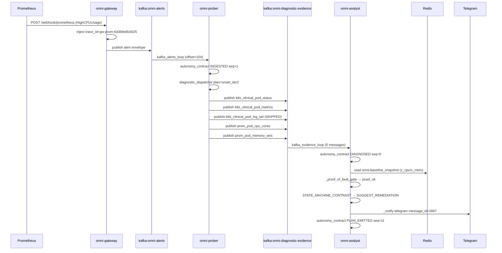
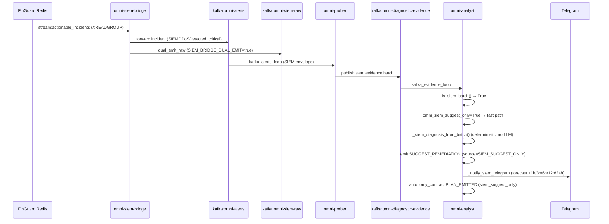
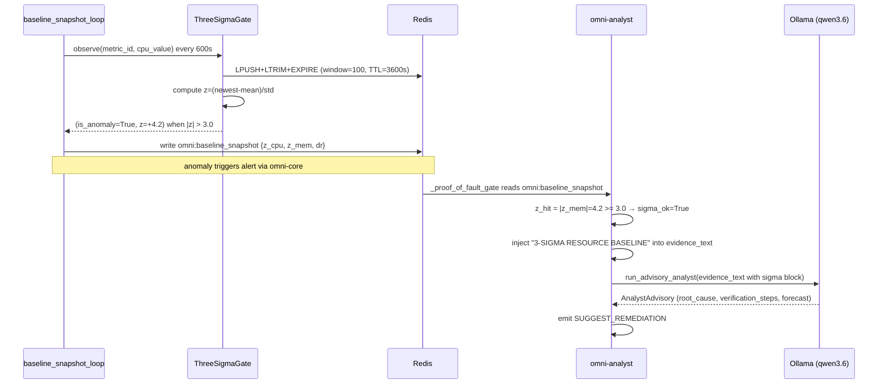
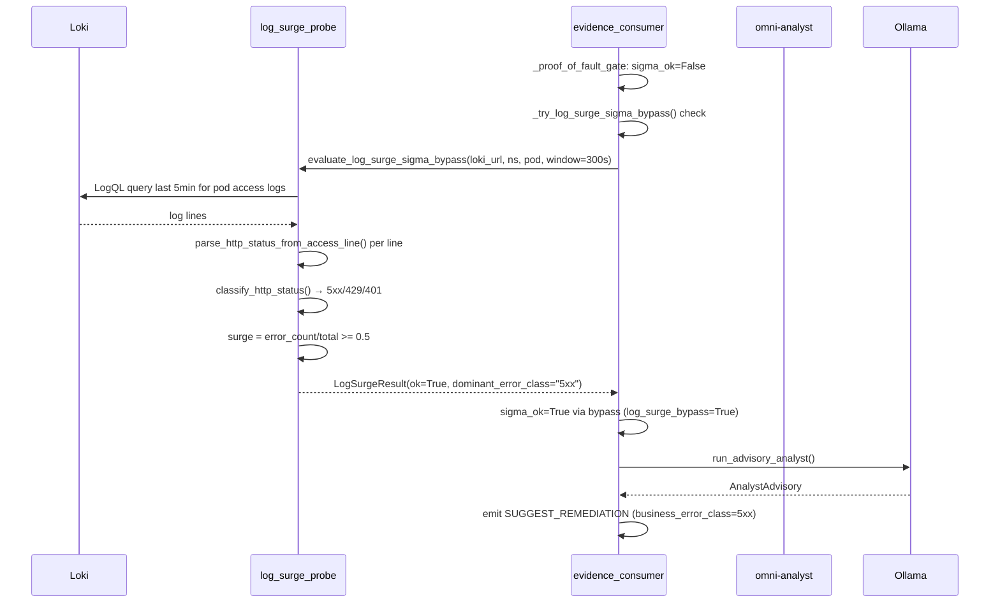

# Lane Behavior Analysis — 4-Lane Diagnostic Flow

**Date:** 2026-05-20
**Baseline trace (Lane 2):** `gw-prom-6d368e6b3025` (live, captured today)
**SIEM trace (Lane 4):** `e2e-siem-03234668` (live, captured today)
**Lane 1/3 references:** golden cases + code path analysis (no live trace today — prober not yet triggered z-score or log_surge event)

---

## Overview

Omni processes alerts through 4 diagnostic lanes. Each lane has a distinct trigger condition, code path, and decision logic.

| Lane | Name | Trigger | Decision Ref |
|------|------|---------|-------------|
| 1 | SYS_RESOURCE | z-score 3σ breach on CPU/mem time series | `src/anomaly/three_sigma.py:observe()` |
| 2 | SYS_HARD_FAIL | K8s state error / Prometheus alert | `src/workers/diagnostic_dispatcher.py` |
| 3 | APP_HTTP | Loki log surge (5xx/429/401) | `src/workers/log_surge_probe.py:evaluate_log_surge_sigma_bypass()` |
| 4 | SIEM_SECURITY | FinGuard SIEM incident | `src/workers/evidence_consumer.py:_siem_diagnosis_from_batch()` |

---

## Lane 1 — SYS_RESOURCE (3σ Resource Baseline)

### WHAT — Trigger
Proactive resource time-series scan. `baseline_snapshot.py` runs rolling z-score (window=100, TTL=3600s) on CPU/mem per workload. Anomaly fires when `|z| > 3.0` AND `std > 1e-9`.

Reference golden case: `case_002` — Redis OOM with `z_mem=4.2` (σ baseline breach).

### DATA FLOW
```
baseline_snapshot_loop (600s interval)
    → ThreeSigmaGate.observe(metric_id, cpu_value)      # three_sigma.py:69
    → stores samples via LPUSH+LTRIM+EXPIRE pipeline     # three_sigma.py:76-81
    → computes z = (newest - mean) / std                 # three_sigma.py:91
    → if |z| > 3.0: stores anomaly in Redis key omni:baseline_snapshot
    → omni-core reads snapshot → emits alert to kafka: omni-alerts

omni-alerts (Kafka)
    → omni-prober (omni_worker.py kafka_alerts_loop)
    → diagnostic_dispatcher → publish probes → kafka: omni-diagnostic-evidence

omni-diagnostic-evidence
    → omni-analyst evidence_consumer
    → _proof_of_fault_gate reads Redis key omni:baseline_snapshot  # evidence_consumer.py:650
    → z_hit = |z_cpu| >= 3.0 OR |z_mem| >= 3.0                    # evidence_consumer.py:661
    → sigma_ok = dr OR z_hit                                        # evidence_consumer.py:662
    → inject "3-SIGMA RESOURCE BASELINE" block into evidence_text   # evidence_consumer.py:2031
    → run_advisory_analyst() → Ollama LLM                          # advisory_analyst_handler.py:175
```

### BUSINESS LOGIC Code Path
1. `src/anomaly/three_sigma.py:69` — `ThreeSigmaGate.observe()` → pipeline LPUSH+LTRIM+EXPIRE
2. `src/anomaly/three_sigma.py:86` — compute z-score from window samples
3. `src/workers/evidence_consumer.py:641` — `_proof_of_fault_gate()` reads `omni:baseline_snapshot`
4. `src/workers/evidence_consumer.py:659-662` — z_cpu/z_mem threshold check (±3.0σ)
5. `src/workers/evidence_consumer.py:2017-2034` — inject sigma block into LLM evidence text

### DECISION POINT
`_proof_of_fault_gate()` at `evidence_consumer.py:641`:
- `critical_evidence_present(batch)` must be True (K8s pod signals)
- `sigma_ok = (z_cpu or z_mem) >= 3.0` — if False → `ERR_REA_SIGMA_GATE_BLOCKED`
- If `sigma_ok=True` AND `omni_proof_lane_enabled=True`: lane resolved as `resource`
- Proceeds to `run_advisory_analyst()` → LLM advisory

**Output:** `SUGGEST_REMEDIATION` (OMNI_AUTO_EXECUTE_ENABLED=false, fail-closed).

### OUTPUT & CRAT
- Kafka emit: `omni-actions` with action=`SUGGEST_REMEDIATION`
- `write_audit_block()` with event_type=`ADVISORY_DECISION` (CRAT fail-closed)
- Telegram advisory to chat_id=-5174042122

---

## Lane 2 — SYS_HARD_FAIL (K8s State Error / Prometheus Alert)

### WHAT — Trigger
Prometheus alert fires → Alertmanager → `POST /webhook/prometheus` → gateway → `kafka: omni-alerts`.

**Live trace:** `gw-prom-6d368e6b3025`
**Alert:** `HighCPUUsage` — nginx-test pod CPU ~90% saturation for 5m
**Namespace:** multi-agent, **Pod:** nginx-test-7c886d4485-ph7rv

### DATA FLOW (from live logs)
```
Prometheus → POST /webhook/prometheus (omni-gateway:80)
    → gateway injects trace_id=gw-prom-6d368e6b3025
    → kafka: omni-alerts (offset 104)

omni-prober kafka_alerts_loop
    → autonomy_contract: INGESTED (seq=1)  [prober log 1779263018.1886702]
    → request_trace: start_request phase=stream_consumer
    → autonomy_contract: CONTEXT_READY (seq=2)  [1779263018.1899288]
    → diagnostic_dispatcher: plan=smart_tier2 mode=workload_resource
        probes: [k8s_clinical_pod_status, k8s_clinical_pod_metrics,
                 k8s_clinical_pod_log_tail, prom_pod_cpu_cores, prom_pod_memory_wss]
    → publish 5 probes to kafka: omni-diagnostic-evidence

omni-analyst kafka_evidence_loop
    → autonomy_contract: CONTEXT_READY seq=3,4,5,6,8  (5 evidence pieces received)
    → autonomy_contract: DIAGNOSED (seq=9)  [1779263018.2972236]
    → evidence_consumer.diag_batch_flush: probes=[k8s_clinical_pod_status, ...]
    → _proof_of_fault_gate → resolve_proof_lane → lane=workload_resource
    → evidence_consumer: action_emitted action=SUGGEST_REMEDIATION source=STATE_MACHINE_CONTRAST
    → telegram_outbound_ok chat_id=-5174042122 message_id=2867
    → autonomy_contract: PLAN_EMITTED (seq=11)  [1779263019.5481467]
```

**Total duration:** 108.59ms (prober pipeline) + ~1.25s (Telegram emit)

### BUSINESS LOGIC Code Path
1. `src/workers/omni_worker.py` — `kafka_alerts_loop` receives from `omni-alerts`
2. `src/workers/diagnostic_dispatcher.py` — `diagnostic_dispatcher_plan` selects probes
3. `src/workers/evidence_consumer.py:474` — collect probes into batch
4. `src/workers/evidence_consumer.py:666` — `resolve_proof_lane()` → `workload_resource`
5. `src/workers/evidence_consumer.py:1991-1995` — `STATE_MACHINE_CONTRAST` branch → SUGGEST
6. `src/workers/evidence_consumer.py:2045` — `run_advisory_analyst()` called with sigma block

### DECISION POINT
At `evidence_consumer.py:1991`:
```python
# "state_machine_contrast_suggested" — triggered when:
# - evidence batch complete (DIAGNOSED transition)
# - proof_of_fault_gate returns ok
# - omni_auto_execute_enabled=False → SUGGEST_REMEDIATION (not EXECUTE_MUTATE)
```
Source in log: `event=action_emitted action=SUGGEST_REMEDIATION source=STATE_MACHINE_CONTRAST`

### OUTPUT & CRAT
- Kafka: `omni-actions` → action=`SUGGEST_REMEDIATION`
- Telegram: message_id=2867 sent to chat_id=-5174042122
- autonomy_contract transitions: INGESTED→CONTEXT_READY→DIAGNOSED→PLAN_EMITTED

---

## Lane 3 — APP_HTTP (Log Surge: 5xx / 429 / 401)

### WHAT — Trigger
Loki log surge detected: sustained HTTP error rate (5xx/429/401) from pod access logs. Uses sigma bypass path when z-score not yet available (web/API workloads in allowlisted namespaces).

Reference: `case_004` — Nginx 5xx surge 34% in 5min (502 Bad Gateway from omni-gateway).

### DATA FLOW
```
Loki (log aggregation)
    → log_surge_probe: evaluate_log_surge_sigma_bypass()  # log_surge_probe.py:607
        → LogQL query: {namespace="...",pod=~"..."} last 5min
        → parse_http_status_from_access_line() per log line
        → classify_http_status(status) → ErrorClass
        → count 5xx/429/401 hits
        → surge = (error_count / total_lines) >= min_ratio (default 0.5)
        → dominant_error_class = "5xx" | "rate_limit" | "auth_failure"
        → returns LogSurgeResult(ok=True, reason=..., dominant_error_class=...)

omni-analyst evidence_consumer
    → _proof_of_fault_gate: sigma_ok=False initially
    → _try_log_surge_sigma_bypass()                    # evidence_consumer.py:582
        → omni_sigma_log_bypass_enabled=True check
        → is_api_web_workload() check
        → evaluate_log_surge_sigma_bypass() call
        → if ok: meta["sigma_bypass_via_log_surge"]=True
        → sigma_ok=True via bypass                      # evidence_consumer.py:686
    → proof gate passes → run_advisory_analyst()
```

### BUSINESS LOGIC Code Path
1. `src/workers/log_surge_probe.py:46` — `classify_http_status()` — maps status to ErrorClass
2. `src/workers/log_surge_probe.py:52-95` — `parse_http_status_from_access_line()` — regex parse
3. `src/workers/evidence_consumer.py:582` — `_try_log_surge_sigma_bypass()` — bypass controller
4. `src/workers/evidence_consumer.py:607` — `evaluate_log_surge_sigma_bypass()` called
5. `src/workers/log_surge_probe.py` — `count_access_errors()` → `AccessErrorCounts`

### DECISION POINT
At `evidence_consumer.py:629-636`:
```python
# 499 client_abort: informational only — NOT sigma bypass
if res.dominant_error_class == "client_abort":
    logger.info("event=log_surge_client_abort_informational ...")
# 5xx / 429 / 401: bypass OK → SUGGEST_REMEDIATION
if res.ok:
    return True, {"log_surge_bypass": True, ...}, False
```

Rules (`log_surge_probe.py`):
- `5xx` (500-504): sigma bypass OK
- `rate_limit` (429): sigma bypass OK
- `auth_failure` (401/403): sigma bypass OK
- `client_abort` (499): informational ONLY — no bypass

### OUTPUT & CRAT
- Kafka: `omni-actions` → `SUGGEST_REMEDIATION`
- Meta: `{"log_surge_bypass": True, "business_error_class": "5xx", ...}`
- CRAT: `ADVISORY_DECISION` block with `llm_reasoning_hash`

---

## Lane 4 — SIEM_SECURITY (FinGuard SIEM Incident)

### WHAT — Trigger
FinGuard detects security incident → writes to Redis `stream:actionable_incidents` → omni-siem-bridge reads XREADGROUP → forwards to `kafka: omni-alerts`.

**Live trace:** `e2e-siem-03234668`
**Alert:** `SIEMDDoSDetected` — severity=critical

### DATA FLOW (from live logs)
```
FinGuard Redis → stream:actionable_incidents
    → omni-siem-bridge XREADGROUP (consumer group: omni-bridge-consumers)
        [siem_bridge log 2026-05-20T04:36:16]: dual_emit_raw incident_id=e2e-siem-03234668 topic=omni-siem-raw
        [siem_bridge log 2026-05-20T04:36:16]: incident forwarded alert=SIEMDDoSDetected severity=critical
    → kafka: omni-alerts (SIEM event envelope)
    → kafka: omni-siem-raw (SIEM_BRIDGE_DUAL_EMIT=true)

omni-prober (kafka_alerts_loop)
    → receives SIEM envelope from omni-alerts
    → diagnostic_dispatcher: detects evidence_source=siem
    → publishes to kafka: omni-diagnostic-evidence

omni-analyst kafka_evidence_loop
    → evidence_consumer._is_siem_batch(batch)            # evidence_consumer.py:189
        → checks evidence_source == "siem" in any batch item
        → returns True
    → omni_siem_suggest_only=True check                  # evidence_consumer.py:1091
    → _siem_alert_labels(batch)                          # extract incident_id, tenant, severity
    → _siem_diagnosis_from_batch(batch, siem, text)      # evidence_consumer.py:358
        → WHAT: incident category + description
        → WHO: namespace, tenant, source_ip, incident_id
        → WHY: _SIEM_CATEGORY_WHY[category]
        → HOW-TO: _SIEM_CATEGORY_STEPS[category]
        → Forecast: _siem_forecast_timeline(category, severity) → 5 horizons
    → _emit_suggest_remediation(source="SIEM_SUGGEST_ONLY")
    → _notify_siem_telegram()                            # Telegram card with forecast
    → autonomy_contract: PLAN_EMITTED (siem_suggest_only)
```

### BUSINESS LOGIC Code Path
1. `src/workers/evidence_consumer.py:189` — `_is_siem_batch()` — checks evidence_source=siem
2. `src/workers/evidence_consumer.py:1091` — `omni_siem_suggest_only` gate (always True)
3. `src/workers/evidence_consumer.py:358` — `_siem_diagnosis_from_batch()` — structured output
4. `src/workers/evidence_consumer.py:1095` — `_emit_suggest_remediation(source="SIEM_SUGGEST_ONLY")`
5. `src/workers/evidence_consumer.py:1103` — `_notify_siem_telegram()` — Telegram with forecast

### DECISION POINT
At `evidence_consumer.py:1089-1116`:
```python
# SIEM ALWAYS → SUGGEST_REMEDIATION, NEVER → EXECUTE_MUTATE or HITL pipeline
if omni_siem_suggest_only and _is_siem_batch(batch):
    diag = _siem_diagnosis_from_batch(batch, siem, sanitized_text)
    await _emit_suggest_remediation(source="SIEM_SUGGEST_ONLY")
    await _notify_siem_telegram(...)
    return True  # hard return — NEVER falls through to planner
```

**SIEM incidents bypass LLM** — `_siem_diagnosis_from_batch()` uses deterministic category tables, not Ollama.

### OUTPUT & CRAT
- Kafka: `omni-actions` → `SUGGEST_REMEDIATION` (source=SIEM_SUGGEST_ONLY)
- Telegram: SIEM card with 5-horizon kill-chain forecast (+1h/+3h/+6h/+12h/+24h)
- autonomy_contract: PLAN_EMITTED with meta=`{"siem_incident_id": "e2e-siem-03234668"}`
- CRAT: `ADVISORY_DECISION` block written (fail-closed)

---

## Decision Tree Summary

```
Evidence batch received (kafka: omni-diagnostic-evidence)
    │
    ├─ _is_siem_batch() == True?
    │       YES → Lane 4: _siem_diagnosis_from_batch() → SUGGEST_REMEDIATION
    │               (hard return — no LLM, no planner, no HITL)
    │
    ├─ NO → _proof_of_fault_gate()
    │           ├─ critical_evidence_present == False?
    │           │       → ERR_REA_NO_PHYSICAL_PROOF (no action)
    │           │
    │           ├─ sigma_ok == True (z_cpu or z_mem >= 3.0)?
    │           │       → Lane 1: SYS_RESOURCE path → run_advisory_analyst()
    │           │
    │           ├─ sigma_ok == False + log_surge bypass ok?
    │           │       → Lane 3: APP_HTTP path → run_advisory_analyst()
    │           │
    │           └─ critical + sigma/bypass ok → resolve_proof_lane()
    │               ├─ lane=state → Lane 2: SYS_HARD_FAIL
    │               │       STATE_MACHINE_CONTRAST → SUGGEST_REMEDIATION
    │               └─ lane=resource → Lane 1: SYS_RESOURCE
    │                       run_advisory_analyst() → SUGGEST_REMEDIATION
    │
    └─ OMNI_AUTO_EXECUTE_ENABLED=false (fail-closed kill switch)
            ALL lanes → SUGGEST_REMEDIATION only
            EXECUTE_MUTATE blocked by AdvisoryModeKillSwitch
```

---

## Sequence Diagrams

### Lane 2 — SYS_HARD_FAIL (gw-prom-6d368e6b3025)



### Lane 4 — SIEM_SECURITY (e2e-siem-03234668)



### Lane 1 — SYS_RESOURCE (z-score path)



### Lane 3 — APP_HTTP (log_surge sigma bypass)



---

## CRAT Audit Trail — All Lanes

All 4 lanes write a CRAT block before any Telegram emit or action dispatch (fail-closed):

```
write_audit_block() → event_type=ADVISORY_DECISION
    ├── SHA-256 hash-chaining (block N includes hash of block N-1)
    ├── Ed25519 signing (OMNI_AUDIT_PRIVATE_KEY_PATH, lab=unsigned)
    ├── stored: Redis audit_chain:blocks / audit_chain:head_hash
    ├── replicated: kafka: omni-audit-chain (key=str(seq))
    └── fields: trace_id, lane, verdict, llm_reasoning_hash, llm_reasoning_ref
```

**Fail-closed invariant:** If `write_audit_block()` fails → abort transaction, no Telegram/action emit.

---

## Known Issues Observed

1. **RAG redis_query_points_failed** (all traces): `redis.commands.search.document.Document() got multiple values for keyword argument 'payload'` — affects `action_experience` collection. RAG falls back to `rag_miss=True` → UNKNOWN_ARCHIVE_ONLY route.
2. **Lane 1/3 no live trace today**: prober just restarted (6m55s uptime), no anomaly event yet.
3. **Kafka rebalance on restart**: All consumer groups rebalance ~8s after pod start (normal aiokafka behavior).
