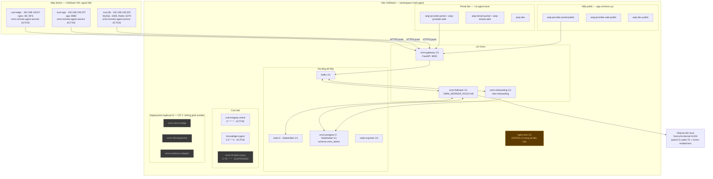
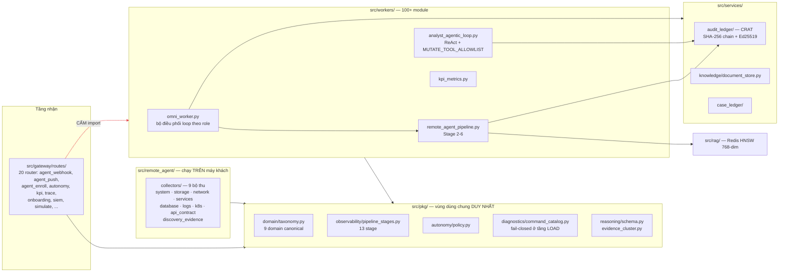
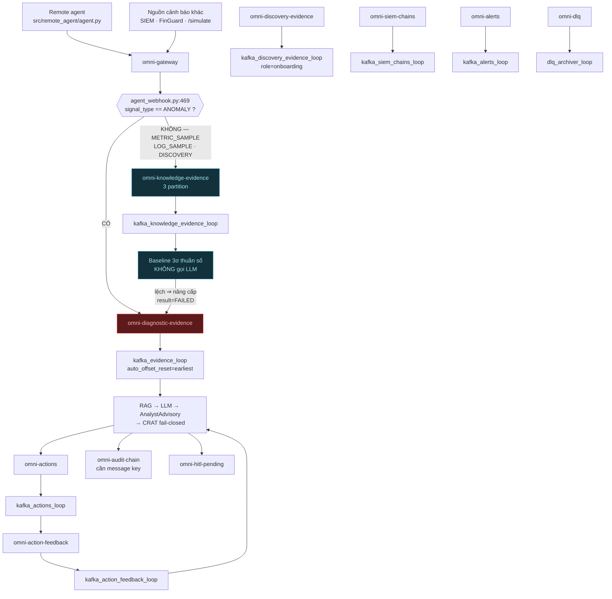
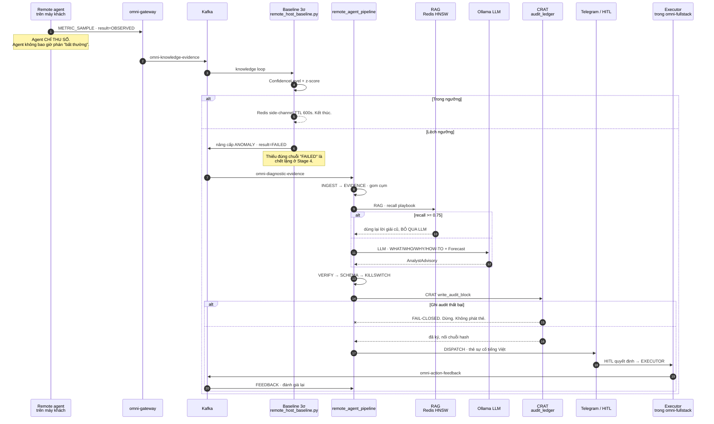
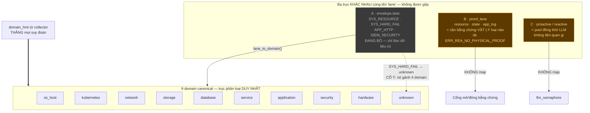

# Sơ đồ hệ thống Omni — bản VERIFIED

> **Cách đọc.** Mọi node/edge trong tài liệu này đều được xác minh bằng code hoặc cluster
> thật vào **2026-08-02**, không chép lại tài liệu cũ. Mỗi sơ đồ kèm bảng *Nguồn xác minh*.
> Mâu thuẫn giữa tài liệu và thực tế nằm ở mục [Drift phát hiện được](#drift-phát-hiện-được)
> — không tự chọn bên nào rồi vẽ im lặng.

Lệnh đã chạy để dựng tài liệu này:

```bash
kubectl get deploy,sts,cronjob,ingress -n multi-agent
kubectl exec -n multi-agent deploy/omni-fullstack -- printenv | grep OMNI_
kubectl exec -n multi-agent redis-0 -- redis-cli GET omni:cfg:tier:default
orb list && orb -m <vm> systemctl is-active omni-remote-agent.service
```

---

## 1. Topology triển khai — cái gì đang chạy ở đâu

Câu hỏi: *nếu tôi ssh vào hạ tầng lúc này, tôi thấy gì?*



**Nguồn xác minh**

| Node | Xác minh bằng |
|---|---|
| 14 Deployment Running · 3 Deployment replicas=0 | `kubectl get deploy -n multi-agent` |
| `redis-0`, `omni-postgres-0` | `kubectl get sts -n multi-agent` |
| 3 CronJob + cột SUSPEND | `kubectl get cronjob -n multi-agent` |
| 3 VM + IP | `orb list` |
| Agent ACTIVE trên cả 3 VM | `orb -m <vm> systemctl is-active omni-remote-agent.service` |
| `OMNI_WORKER_ROLE=full` | `kubectl exec deploy/omni-fullstack -- printenv` |
| Ollama endpoint | `CLAUDE.md` §INFRASTRUCTURE — **chưa xác minh runtime** |

---

## 2. Kiến trúc thành phần — ranh giới import

Câu hỏi: *code chia thế nào, và ranh giới nào không được vượt?*



**Bất biến vẽ trong hình:** `src/gateway/` **không** được import `workers/`. Code dùng chung
bắt buộc đi qua `src/pkg/`. Kiểm nhanh: `grep -rn "from workers" src/gateway/` phải rỗng.

**Nguồn xác minh**

| Node | Xác minh bằng |
|---|---|
| 20 router | `ls src/gateway/routes/` |
| 9 domain | `src/pkg/domain/taxonomy.py:30-39` |
| 13 pipeline stage | `src/pkg/observability/pipeline_stages.py:21-34` |
| 9 collector | `ls src/remote_agent/collectors/` |
| Điều phối loop theo role | `src/workers/omni_worker.py:1191-1269` |

---

## 3. Luồng Kafka — topic, ai ghi, ai đọc

Câu hỏi: *một tín hiệu đi qua topic nào, và cái gì tách ANOMALY khỏi phần còn lại?*



**INV_KNOWLEDGE_NOT_ALERT.** Việc rẽ nhánh nằm ở **gateway**, không phải worker
(`agent_webhook.py:469`). Nới có kiểm soát từ 2026-07-30: `METRIC_SAMPLE` vẫn vào topic
knowledge và **không** gọi LLM, nhưng nếu baseline phát hiện lệch thì được nâng thành
`ANOMALY` và quay lại topic diagnostic. Vòng quay này là mũi tên ngược `BASE → T1`.

**Nguồn xác minh**

| Topic | Khai báo tại |
|---|---|
| 15 topic có cấu hình | `src/workers/settings.py:90-164` |
| Rẽ nhánh theo `signal_type` | `src/gateway/routes/agent_webhook.py:468-470` |
| `omni-knowledge-evidence` 3 partition | `scripts/kafka_ensure_omni_topics.sh` |
| Tên các loop | `src/workers/omni_worker.py:569-1060` |

---

## 4. Vòng đời một sự cố — 13 stage

Câu hỏi: *từ lúc agent đo được số đến lúc có người bấm nút, đi qua đâu?*



**Cổng chặn thật hiện tại:** `OMNI_AUTO_EXECUTE_ENABLED=false` và tier hiệu lực `shadow`
⇒ nhánh `EXECUTOR` **không chạy trong lab lúc này**. Sơ đồ vẽ đường đi, không phải đường
đang được dùng.

**Nguồn xác minh**

| Bước | Xác minh bằng |
|---|---|
| 13 stage | `src/pkg/observability/pipeline_stages.py:21-34` |
| Điểm gọi từng stage | `src/workers/remote_agent_pipeline.py:119-517` |
| CRAT fail-closed | `remote_agent_pipeline.py:517` — `mark_stage(..., "CRAT", "fail")` |
| RAG ngưỡng 0.75 | `recall_playbook_advisory()` |
| Kill-switch = false | `kubectl exec deploy/omni-fullstack -- printenv` |
| Tier = shadow | `redis-cli GET omni:cfg:tier:default` |

---

## 5. Phân loại 9 domain — và cái bẫy chữ "lane"

Câu hỏi: *một sự cố được xếp vào đâu, và tại sao chữ "lane" nguy hiểm?*



**Bẫy đã trả giá:** collector tự khai `domain_hint` thì luôn phải truyền vào `detect_domain()`.
Bỏ sót một call site là để cascade nội dung gán sai lĩnh vực.

**Nguồn xác minh**

| Node | Xác minh bằng |
|---|---|
| 9 domain + unknown | `src/pkg/domain/taxonomy.py:30-39` |
| Ba trục "lane" | Khối cảnh báo `taxonomy.py:92` |
| Bảng map lane cũ | `taxonomy.py:119-121` |

---

## 6. Mặt public — vì sao phải tách hẳn

Câu hỏi: *Internet đi vào bằng đường nào, và tại sao không dùng chung với lab?*

```mermaid
flowchart LR
    U["Trình duyệt<br/>Internet"]
    CA["Cloudflare Access<br/>chỉ 1 email · one-time PIN"]
    TN["Tunnel omnisre<br/>LaunchAgent trên MacBook"]
    TR["Traefik"]

    subgraph PUBI["Ingress omnisre-public-console · app.omnisre.xyz"]
        P1["/auth + /api/provider/v1<br/>→ aoip-provider-portal-public"]
        P2["/dex → aoip-dex-public"]
        P3["/ → aoip-provider-web-public"]
    end

    subgraph LABI["Ingress lab · *.ai-agent.local — KHÔNG ĐỔI MỘT BIẾN NÀO"]
        L1["provider.ai-agent.local"]
        L2["tenant.ai-agent.local"]
        L3["dex.ai-agent.local"]
        L4["gateway.ai-agent.local<br/>+ ingress SSE riêng /trace/stream"]
    end

    U --> CA --> TN --> TR --> PUBI
    PUBI -.->|"INV_PUBLIC_PLANE_ISOLATED<br/>auth plane RIÊNG"| LABI

    N1["tenant.ai-agent.local KHÔNG có bản public<br/>mặt public hiện chỉ có provider"]
    LABI -.- N1

    classDef note fill:#5c3a00,stroke:#c98a00,color:#ffd68a
    class N1 note
```



**Vì sao tách.** `verify_id_token` so `iss` bằng chuỗi tuyệt đối, nên đổi issuer của lab là
breaking. Frontend cũng phải tách chứ không chỉ backend: `aoip-provider-web` có
`AOIP_BACKEND_URL` cứng trỏ backend lab, dùng chung sẽ khiến traffic public chui qua backend
lab và **chạy im lặng** vì `portal:session:` chung Redis.

**Nguồn xác minh**

| Node | Xác minh bằng |
|---|---|
| 7 ingress + host + backend | `kubectl get ingress -n multi-agent -o json` |
| Không có `aoip-tenant-web-public` | `kubectl get deploy -n multi-agent` |
| Ingress SSE tách riêng | ingress `omni-gateway-sse`, path `/trace/stream` |

---

## Drift phát hiện được

Những mâu thuẫn giữa tài liệu và thực tế đo được ngày 2026-08-02. **Chưa sửa gì** — liệt kê
để quyết định.

| # | Phát hiện | Bằng chứng | Mức |
|---|---|---|---|
| 1 | `OMNI_ENV_MODE=dev` trên pod thật, trong khi `CLAUDE.md` khai giá trị hợp lệ là `lab\|prod`. Hoặc tài liệu thiếu giá trị, hoặc pod đang chạy sai chế độ. | `kubectl exec deploy/omni-fullstack -- printenv` | ⚠️ cần chốt |
| 2 | `omni_worker.py` vẫn còn nhánh cho **4 role đã RETIRED** — `executor` (dòng 1193), `prober` (1201), `analyst` (1211), `core` (1250). Code chết, nhưng đọc code sẽ tưởng các role còn sống. | `src/workers/omni_worker.py:1191-1269` | ℹ️ nợ kỹ thuật |
| 3 | Deployment `nginx-test` đang Running trong namespace, **không xuất hiện trong bất kỳ tài liệu nào**. | `kubectl get deploy -n multi-agent` | ⚠️ không rõ chủ |
| 4 | Mặt public **bất đối xứng**: provider có đủ 3 workload `-public`, tenant không có bản public nào. Tài liệu không nói đây là cố ý hay chưa làm. | `kubectl get deploy` + ingress `omnisre-public-console` | ⚠️ cần chốt |
| 5 | CronJob `omni-ttl-label-expiry` đang **SUSPEND=true**, không thấy ghi ở đâu là cố ý. | `kubectl get cronjob -n multi-agent` | ⚠️ cần chốt |
| 6 | 3 Deployment `replicas=0` (`omni-siem-bridge`, `omni-hitl-dispatcher`, `omni-evidence-adapter`) — cái này **khớp** tài liệu, đã annotate `scaled-down-intentional`. Không phải drift, ghi ở đây để khỏi báo lại. | `CLAUDE.md` §Retired compatibility artifacts | ✅ khớp |
| 7 | Endpoint Ollama `host.orb.internal:11434` là claim từ tài liệu, **chưa xác minh runtime** trong lần dựng sơ đồ này. | — | ℹ️ chưa đo |

---

## Cái sơ đồ này KHÔNG trả lời được

Ghi rõ để không nhầm phạm vi:

- **Không có sơ đồ vòng học.** Memory ghi vòng học chỉ nhận nhãn KHEN, nhánh `accepted=False`
  không có call site. Vẽ vòng học lúc này sẽ vẽ ra một vòng không khép.
- **Không có sơ đồ trạng thái autonomy tier.** Tier hiệu lực đọc được là `shadow`, nhưng đường
  chuyển shadow → minimal → autonomous chưa được xác minh chạy thật.
- **Không đo được lưu lượng thật.** Sơ đồ vẽ *đường đi có tồn tại*, không phải *đường đang có
  tải*. Memory ghi ~99% tải thật là discovery + meta_self — nghĩa là phần lớn hình bên trên
  đúng về cấu trúc nhưng vắng về lưu lượng.
