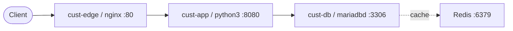

# Customer System Understanding

**Status:** Accepted · **Updated:** 2026-07-14

This is the canonical contract for how Omni understands and displays a customer
system. Omni and the Remote Agent are operators of the customer system; they are
not nodes in the customer topology diagram.

## 1. Customer topology

The primary view is a graph, not a collection of cards:

The graph is projected from observed customer facts: host identity and service
role, listening ports, and host dependencies. Linux platform noise (`systemd`,
`cron`, `dbus`, RPC/NFS helpers, dynamic kernel ports and Omni processes) remains
available in raw evidence and audit, but does not dominate the architecture view.
Reciprocal TCP observations are collapsed into one logical graph edge.

## 2. API sequence evidence contract

Omni must not draw an API sequence from process names, listening ports, or TCP
connections alone. The evidence ladder is:

1. **API contract discovery:** the Remote Agent searches bounded customer paths
   for `openapi.json/yaml`, `swagger.json/yaml` and common one-level `docs/`
   layouts. The customer may also upload a document through the handover-doc
   endpoint.
2. **Local parsing:** OpenAPI v2/v3 is parsed on the customer host (or at the
   upload boundary). Only route metadata leaves the customer boundary: method,
   route template, operation id, tags, response status keys, format, version and
   content hash.
3. **Runtime correlation:** redacted access-log metadata is matched against the
   contract by host + method + route. Query strings, headers, cookies, bodies,
   tokens and raw log lines are never used as Omni-side sequence data.
4. **Topology correlation:** an upstream/backend is displayed only when the
   access log emitted it. A socket connection may support a dependency edge but
   cannot manufacture an API hop or request order.

The read-model status is explicit:

| Status | Meaning | UI behavior |
|---|---|---|
| `runtime_verified` | Contract route matched by access-log metadata | Draw route and mark runtime hit |
| `contract_observed` | Contract found, no runtime hit yet | Draw contract shape, mark contract-only |
| `missing_contract` | Access routes exist but no OpenAPI/Swagger contract | Ask for contract; do not draw API sequence |
| `network_only` | Only host/port/connection evidence exists | Show dependency path, explicitly not HTTP |

## 3. Code map

| Concern | Source |
|---|---|
| Customer graph read model | `src/gateway/routes/onboarding.py` (`/onboarding/system-twin`) |
| Raw discovery accumulation | `src/pkg/onboarding/discovery_doc.py` |
| OpenAPI/Swagger collector | `src/remote_agent/collectors/api_contract.py` |
| Access-log metadata collector | `src/remote_agent/collectors/logs.py` |
| Contract-gap question | `src/workers/onboarding_pipeline.py` |
| Customer topology UI | `ui/apps/provider-portal/app/understanding/SystemTwinPanel.tsx` |
| UI topology styling | `ui/apps/provider-portal/app/understanding/understanding.css` |

## 4. Operational rules

- Never add Omni or Remote Agent as a node to the customer graph.
- Never label a TCP dependency as HTTP without contract/runtime evidence.
- Never persist raw customer API documents or raw access-log lines in Omni.
- Keep the graph as the primary view; raw facts and Mermaid history are audit/debug views.
- When evidence is incomplete, show the missing evidence and the next operator action instead of guessing.
