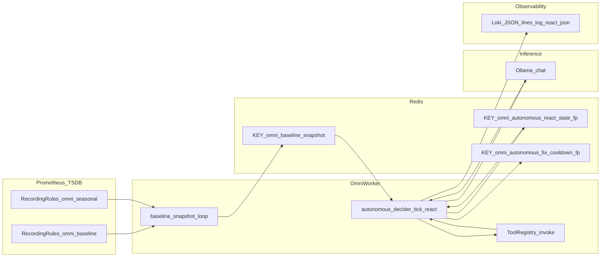

# Whitepaper Kiến trúc Enterprise: Omni-Worker V3 (AI-SRE Tự Trị)

**Phiên bản tài liệu:** nội bộ kỹ thuật — đối tượng: Ban Giám đốc / Kiến trúc sư / An toàn thông tin  
**Phạm vi:** Mô tả **bằng chứng từ mã nguồn** trong repo; không thay thế hồ sơ tuân thủ ngân hàng chính thức.  
**Liên quan:** Báo cáo slide tóm tắt nằm ở `docs/omni_v3_executive_report.md` (song song, không gộp).

---

## 1. Tóm tắt điều hành

- **Omni-Worker V3** kết hợp (1) **manifest sức khỏe** lấy từ Prometheus/baseline lưu Redis, (2) **vòng ReAct có trạng thái** (Thought → Action → Observation) với giới hạn turn, (3) **Tool Registry** kiểu Pydantic + JSON Schema cho LLM, (4) **chốt chặn bảo mật** (mask deterministic, guardrail scale, ngắt vòng lặp, Human-in-the-loop tùy cấu hình).
- Tài liệu này trích dẫn trực tiếp các module: `autonomous_decider.py`, `tool_registry.py`, `k8s_cluster_tools.py`, `observation_sanitize.py`, `tool_observation.py`, `react_logging.py`, `baseline_snapshot.py`, và recording rules trong `k8s/monitor/prometheus.yaml`.

---

## 2. Luồng dữ liệu tổng thể (Prometheus → Redis → Decider → Tool → Loki)

Sơ đồ dưới đây phản ánh **chuỗi thực tế trong code**: Prometheus ghi recording rules; baseline worker đổ snapshot vào Redis; decider đọc snapshot, gọi Ollama, thực thi tool qua registry; mọi bước suy luận/tool có thể log JSON một dòng qua `log_react_json` (Loki thu thập qua Promtail — ngoài phạm vi file Python).



**Khóa Redis (định danh trong code):**

| Khóa / tiền tố | Ý nghĩa | Nguồn |
|----------------|---------|--------|
| `omni:baseline:snapshot` | Manifest JSON (dr, evt, z_*, CHS, golden, …) | `REDIS_KEY_SNAPSHOT` trong `baseline_snapshot.py` |
| `omni:autonomous:react_state:{fp}` | Trạng thái ReAct sau mỗi lần có Observation | `REDIS_REACT_STATE_PREFIX` + `fp` trong `autonomous_decider.py` |
| `omni:autonomous_fix:cooldown:{fp}` | Cooldown sau CLEAR hoặc sau tick (kể cả abort) | `REDIS_KEY_COOLDOWN_PREFIX` trong `autonomous_decider.py` |

### 2.1 Bộ nhớ và “tự học” (ba lớp — không fine-tune)

**Phạm vi trung thực:** Hệ thống **không** cập nhật trọng số mô hình Ollama (không gradient, không RLHF). “Tự học” trong repo là **bộ nhớ có cấu trúc + retrieval** và **trạng thái phiên làm việc**:

| Lớp | Ý nghĩa | File / khóa chính |
|-----|---------|-------------------|
| **A — Stateful ReAct** | Lưu tóm tắt turn/observation theo fingerprint manifest; tick sau đọc **prior state** từ Redis | `omni:autonomous:react_state:{fp}` — mục 3 dưới đây; `autonomous_decider.py` |
| **B — Deep Scout autonomous** | Thu thập topology K8s/VM, embed → Qdrant collection **`infra_topology`**; map tên→namespace → Redis **`infra:learned:byname`**, **`infra:learned:map`** (TTL `learned_map_ttl_sec`) | `init/deep_scout_autonomous.py`; lịch startup + periodic trong `omni_worker.py` |
| **C — Routing / action_experience** | Sau **slow-path** tool thành công: embed câu user + **upsert** Qdrant **`action_experience`**; request sau có thể **fast-path** (bỏ LLM) nếu similarity đủ và `routing_source=slow_path_success` | Ghi: `execution/experience.py` (`record_routing_from_success`); đọc: `handlers.try_fast_path`; tắt: `action_experience_enabled` trong `settings.py` |

Handler còn inject **`learned_context`** (truy vấn ngữ cảnh từ `action_experience` + infra đã scout) vào prompt — đây là **ngữ cảnh đã học dạng vector**, không phải fine-tune.

**Kiểm tra nhanh (vận hành):** log `deep_scout_autonomous done` / metric `omni_worker_last_scout_timestamp`; Redis có `infra:learned:*`; Qdrant có points ở `infra_topology` và `action_experience`; log `fast_path_ok` với `source=routing_experience` sau khi đã có một slow-path thành công tương tự. **Kiểm tra tự động:** `tests/test_routing_experience.py`, `tests/test_handlers.py` (`test_fast_path_routing_experience_after_sop_miss`).

**Lưu ý:** Nếu `OMNI_AUTONOMOUS_DECIDER_ENABLED=false`, Redis có thể **không** có key `omni:autonomous:react_state:*` — lớp A chỉ ghi khi decider chạy tick ReAct. `action_experience_enabled` mặc định true trong `WorkerSettings`; ConfigMap có thể không khai báo — vẫn bật trừ khi override env.

---

## 3. Kiến trúc Stateful ReAct — mổ xẻ mã nguồn

### 3.1 Điều kiện kích hoạt và đầu vào LLM

- Decider đọc snapshot: `ctx.redis.get(REDIS_KEY_SNAPSHOT)` — key cố định `omni:baseline:snapshot` (định nghĩa tại `src/workers/baseline_snapshot.py`, dòng ~18).
- Chỉ chạy khi `dr` **hoặc** danh sách `evt` không rỗng (`_tick_react`).
- **Fingerprint** `fp = _fingerprint(manifest)` — hash SHA256 rút gọn trên `dr`, `evt`, `z_cpu`, `z_mem` để khóa cooldown/state (`autonomous_decider.py`, hàm `_fingerprint`).

**Cấu trúc `messages` gửi Ollama:**

1. **System:** `_system_prompt_react(safe_tools, allowed_ns, schema_snippet)` — mô tả schema JSON ReAct + **subset JSON Schema** của từng tool typed nằm trong allowlist (`_schemas_for_safe_tools`).
2. **User (lần đầu trong tick):** `_build_user_prompt` = phần head (sigma / evt) + `Manifest:` + JSON manifest tối đa ~12000 ký tự.
3. **Bổ sung “lần trước”:** Nếu tồn tại key `omni:autonomous:react_state:{fp}`, hàm `_load_prior_react_state` đọc JSON và **nối** vào user message dưới nhãn `Prior ReAct state (Redis, same fp):` — đây là **toàn bộ cơ chế so sánh “trước / sau” trong code hiện tại**: không có bước diff số học riêng giữa hai snapshot; model nhận **cùng manifest mới** + **chuỗi state đã lưu** (tối đa ~2500 ký tự JSON).

Tham chiếu: `autonomous_decider.py` — `_load_prior_react_state` (khoảng dòng 199–212), ghép chuỗi tại `_tick_react` (khoảng 419–422).

### 3.2 Payload lưu `omni:autonomous:react_state:{fp}`

Hàm `_save_react_state` ghi JSON:

```python
payload = {
    "turn": turn,
    "last_tool": last_tool,
    "obs": observation_masked[:2000],
    "ts": time.time(),
}
await redis.setex(_react_state_key(fp), ttl_sec, json.dumps(payload, ...))
```

- `observation_masked` đã qua `prepare_observation_for_llm` (cắt độ dài + mask) **trước** khi lưu — tránh đưa secret thô vào Redis trong trường hợp policy lưu state (xem mục 4).
- TTL: `react_state_redis_ttl_sec` hoặc fallback `max(cooldown_sec * 2, 1200)` (`WorkerSettings`).

### 3.3 Vòng lặp multi-turn

- `for turn in range(1, max_turns + 1)` với `max_turns = react_max_turns` (mặc định 4, tối đa 24 — `settings.py`, field `react_max_turns`).
- Mỗi turn: `ollama.chat` với `messages` tích lũy; parse output JSON qua `_parse_react_turn` hoặc legacy `ToolCallPayload`.
- Sau khi chạy tool: `obs_final = prepare_observation_for_llm(obs, obs_max)` với `react_observation_max_chars`; append assistant content + user `Observation (turn N): ...`.

### 3.4 Log Loki-friendly (reasoning_path)

- `log_react_json(reasoning_path, **fields)` trong `react_logging.py` xuất **một dòng** `json.dumps(..., separators=(",", ":"))` — dễ grep / `| json` trên Loki.
- Các `reasoning_path` tiêu biểu trong luồng: giá trị `rp` từ model (mặc định `v3_react_thought` nếu thiếu), `v3_tool_execute`, `v3_react_observation`, `v3_react_aborted`, và trên handler inbound **`v3_fast_path_hit`** (SOP hoặc `action_experience`) — xem §8.

---

## 4. Chốt chặn bảo mật — bằng chứng cứng

### 4.1 Policy-as-Code: guardrail scale (Pydantic)

Model đầu vào của tool `k8s_scale_deployment`:

```19:25:src/workers/k8s_cluster_tools.py
class ScaleDeploymentArgs(BaseModel):
    """Guardrail P0: replicas chỉ 0..10 tại tầng Pydantic."""

    name: str = Field(..., min_length=1, description="Deployment name")
    namespace: str = Field(..., min_length=1)
    replicas: int = Field(ge=0, le=10)
```

Registry gọi `model_validate` **trước** handler:

```40:46:src/workers/tool_registry.py
    async def invoke(self, ctx: Any, name: str, raw_args: dict[str, Any]) -> str:
        spec = self._specs.get(name)
        if spec is None:
            raise KeyError(name)
        validated = spec.input_model.model_validate(raw_args)
        raw = await spec.handler(ctx, validated)
        return prepare_tool_return_for_llm(ctx, str(raw))
```

**Hệ quả:** Giá trị `replicas` ngoài `[0, 10]` bị `ValidationError` — không đạt tới `AppsV1Api` trong handler. Đây là lớp **Policy-as-Code** độc lập với LLM.

### 4.2 Data Sanitization Compliance — regex và thứ tự xử lý

Ba mẫu trong `observation_sanitize.py`:

| Thứ tự | Mục đích | Mẫu (tóm tắt) |
|--------|----------|----------------|
| 1 | Khóa credential dạng `password=`, `token=`, `api_key`, … | `(?i)(password\|…)\s*[:=]\s*[^\s\n]+` → thay bằng `[REDACTED]` |
| 2 | Bearer JWT | `(?i)bearer\s+[^\s\n]+` → `Bearer [REDACTED]` |
| 3 | Khối PEM | `BEGIN ... END` → `[REDACTED]` |

Pipeline Observation vào LLM (`tool_observation.py`):

```19:22:src/workers/tool_observation.py
def prepare_observation_for_llm(raw: str, max_chars: int) -> str:
    """Cắt độ dài rồi mask secrets (thứ tự: truncate trước để regex nhẹ hơn)."""
    clipped = summarize_for_context(raw, max_chars)
    return sanitize_for_llm(clipped)
```

**Ví dụ TRƯỚC / SAU (minh họa, cùng logic với test nghiệm thu):**

**TRƯỚC (raw):**
```text
auth: Bearer eyJhbGciOiJIUzI1NiIsInR5cCI6IkpXVCJ9.eyJzdWIiOiIxMjM0NTY3ODkwIn0.sig tail
and password=SuperSecret123! tail
```

**SAU (`sanitize_for_llm`):**
```text
auth: Bearer [REDACTED] tail
and [REDACTED] tail
```

(Chi tiết ký tự phụ thuộc thứ tự áp dụng regex; test tham chiếu: `tests/test_v3_tools.py` — `test_acceptance_sanitize_bearer_jwt_and_password_supersecret`.)

### 4.3 Deadlock breaker — `OMNI_REACT_MAX_TURNS` và `[REACT_ABORTED]`

- Cấu hình: `react_max_turns` trong `WorkerSettings` (alias env qua prefix `OMNI_` — pydantic-settings).
- Sau vòng `for`, nếu `not resolved` (không CLEAR / không thoát sớm hợp lệ): `logger.error` với chuỗi chứa **`[REACT_ABORTED] AI stuck in reasoning loop`**, kèm `fp`, `max_turns`; đồng thời `log_react_json("v3_react_aborted", reason="max_turns_exceeded", ...)`; nếu có `telegram` + `telegram_admin_chat_id` thì gửi cảnh báo tin nhắn.

Tham chiếu khối xử lý: `autonomous_decider.py` (khoảng dòng 577–598).

---

## 5. Scalable Plugin Registry

### 5.1 Đăng ký và JSON Schema (Pydantic v2)

- Decorator `@register_tool(name, InputModel)` gắn handler `async (ctx, validated_model)`.
- `ToolRegistry.json_schema_for(name)` gọi `spec.input_model.model_json_schema()` — đúng chuẩn **OpenAPI/JSON Schema** từ Pydantic v2.

### 5.2 Nạp schema vào prompt Ollama

- Trong `_schemas_for_safe_tools`, với mỗi tool trong allowlist **và** có trong registry, append dòng:  
  `{name}: {json.dumps(reg.json_schema_for(name))[:1500]}`  
  — cắt 1500 ký tự mỗi tool để tránh nổ context (`autonomous_decider.py`, hàm `_schemas_for_safe_tools`).

### 5.3 Lợi ích mở rộng (DB / Network / Security agents)

- Thêm domain mới = **một Pydantic model + handler + `@register_tool`** + cập nhật allowlist cấu hình — contract đầu vào/đầu ra thống nhất, giảm “prompt drift” so với mô tả tự do trong prompt.
- `tools.py` đóng vai **composition root**: vừa giữ `TOOL_REGISTRY` legacy, vừa bind tên cluster tool sang `invoke` (pattern hiện có trong repo).

---

## 6. Đa biến: CHS, Z-score 24h, Seasonal WoW — công thức và nguồn

### 6.1 Composite Health Score (CHS) trong Python

Trọng số lấy từ biến môi trường **`OMNI_CHS_WEIGHTS`** (JSON), ví dụ khóa `cpu`, `mem`, `disk`, `net`. Hàm `_compute_chs`:

\[
\text{CHS} = \sum_{i} w_i \cdot |z_i|
\]

với \(z_i\) tương ứng `z_cpu`, `z_mem`, `z_disk`, `z_net` (thiếu thì coi hệ số 0 cho phần đóng góp). Mã: `baseline_snapshot.py`, hàm `_compute_chs` (khoảng dòng 193–224).

- `wide_incident = (chs > chs_thr)` với `chs_threshold` (mặc định `OMNI_CHS_THRESHOLD` / 10.0) — đưa vào manifest để decider/LLM hiểu “sự cố diện rộng”.

### 6.2 Recording rules Prometheus (Z-score 24h)

Trích từ `k8s/monitor/prometheus.yaml` (ConfigMap `omni-rules.yml`), ví dụ CPU:

- `omni:node_cpu:z = (omni:cpu_busy:instant - omni:node_cpu:avg_24h) / clamp_min(omni:node_cpu:stddev_24h, 1e-9)`  
- Tương tự cho mem và disk (trung bình node, chuẩn hóa rolling 24h).

### 6.3 Seasonal drift (Week-over-Week) + fallback

Recording `omni:health:cpu_seasonal_drift_z`:

```text
(
  (omni:cpu_busy:instant - omni:cpu_busy:instant offset 7d)
  / clamp_min(stddev_over_time((omni:cpu_busy:instant offset 7d)[1h:5m]), 1e-9)
)
or omni:node_cpu:z
```

- Phần `or omni:node_cpu:z` đảm bảo **không rỗng** khi chưa đủ lịch sử 7 ngày — đúng tinh thần “fallback Z 24h” trong thiết kế.

Worker đọc instant PromQL qua `baseline_promql_seasonal_cpu` (settings) và ghi `seasonal_drift_z` vào manifest khi cấu hình (`baseline_snapshot.py`, nhánh `zq_seasonal`).

### 6.4 Giá trị kinh doanh và quản trị rủi ro (khung C-Level)

- **Giảm false positive:** WoW so sánh “cùng giờ tuần trước” giúp phân biệt pattern theo giờ so với sự cố thật; CHS gom nhiều chiều thay vì báo động đơn lẻ — phù hợp mục tiêu **giảm fatigue vận hành** và **tập trung vào incident đa chiều**.
- **Giảm hành động sai:** Guardrail Pydantic + sanitize + giới hạn turn ReAct là các lớp **kiểm soát rủi ro** trước khi thay đổi cluster; Human-in-the-loop (`tool_approval.py`, Redis token + Telegram) là lớp **Zero-Trust** bổ sung cho thao tác nhạy cảm.
- **Không định lượng tiền trong code:** Chi phí downtime / SLA là tham số nghiệp vụ — whitepaper chỉ nêu **khung**: giảm xác suất incident kéo dài nhờ chẩn đoán đa tín hiệu và giảm rò rỉ bí mật qua kênh LLM/log.

---

## 7. Phụ lục: danh sách file tham chiếu chính

| File | Vai trò |
|------|---------|
| `src/workers/autonomous_decider.py` | ReAct, Redis keys, abort, integrate schema |
| `src/workers/tool_registry.py` | Registry, `invoke`, JSON Schema |
| `src/workers/k8s_cluster_tools.py` | Tool K8s + `ScaleDeploymentArgs` |
| `src/workers/observation_sanitize.py` | Regex mask |
| `src/workers/tool_observation.py` | Truncate + sanitize pipeline |
| `src/workers/react_logging.py` | JSON một dòng cho Loki |
| `src/workers/baseline_snapshot.py` | CHS, manifest, Redis snapshot |
| `k8s/monitor/prometheus.yaml` | Recording rules omni_baseline / omni_seasonal |
| `src/workers/settings.py` | `react_max_turns`, `tool_output_max_chars`, … |
| `src/init/deep_scout_autonomous.py` | Deep Scout “tự học” topology → Qdrant + Redis learned map |
| `src/execution/experience.py` | Upsert / đọc `action_experience`, sandbox lesson |
| `src/workers/handlers.py` | `try_fast_path`, `learned_context`, remediation embed |

---

## 8. Cơ chế Tự học (Fast Path vs Slow Path) — trung thực vận hành

**Không fine-tune:** Hệ thống không cập nhật trọng số mô hình. “Tự học” ở đây là **bộ nhớ có cấu trúc** (Redis, Qdrant) và **retrieval** theo vector.

**Fast Path không đồng nghĩa “0% CPU” hay “không chạm Ollama”:** Khi đủ điểm tương đồng trên Qdrant (`itops_sop_ledger` hoặc `action_experience`), luồng **bỏ qua** vòng suy luận phức tạp qua **`ollama.chat`** (slow path: JSON tool + ReAct). Tuy nhiên Fast Path **vẫn gọi `ollama.embed`** để vector hóa triệu chứng / câu người dùng trước khi truy vấn Qdrant — tức vẫn có chi phí inference nhẹ và tải trên máy chủ embedding. Không mô tả Fast Path là “tiết kiệm 100%” hay “zero inference”; chỉ đúng là **không** chạy mô hình chat lớn trong bước đó.

**Slow Path:** `ollama.chat` với tool JSON (và các vòng sửa JSON / helper) theo cấu hình semaphore — đây là nhánh tiêu tốn KV/context chủ yếu so với một lần embed + Qdrant.

**Quan sát:** Log một dòng JSON `reasoning_path: v3_fast_path_hit` (Loki) khi Fast Path thực thi tool thành công; phân biệt với các `reasoning_path` của decider ReAct (`v3_react_thought`, `v3_tool_execute`, …).

---

*Tài liệu được sinh từ trạng thái mã nguồn tại thời điểm biên soạn; khi refactor cần đồng bộ lại số dòng và nội dung trích dẫn.*
