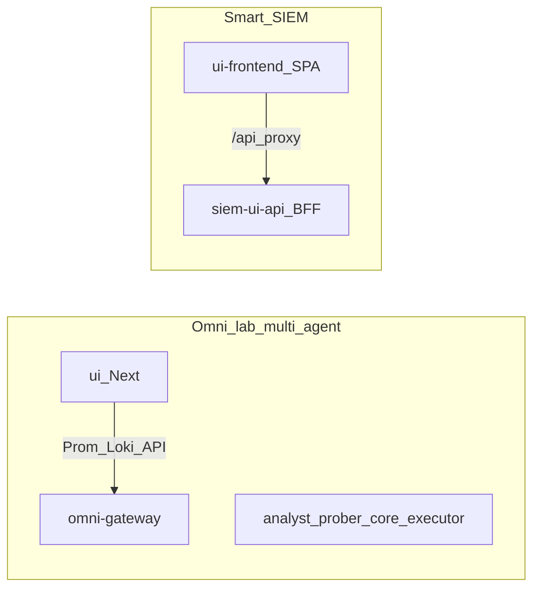

# Execution plan — Omni + Smart-SIEM dual UI + 4 technical actions

**Ngày:** 2026-05-07  
**Mục tiêu:** Thực hiện 4 hành động kỹ thuật (death loop, commit e2e scripts, audit/proactive trace clarity, tách `evidence_consumer`) và làm lại **hai UI** (Omni lab + FinGuard SOC), **không** dùng [`smart-siem/customer/ui`](../../smart-siem/customer/ui) làm đường chính.

---

## Hướng dẫn cho agent thực thi (bắt buộc đọc trước khi sửa code)

1. [`.cursor/skills/omni-cursor-workspace/SKILL.md`](../../.cursor/skills/omni-cursor-workspace/SKILL.md)  
2. [`.cursor/skills/omni-cursor-agentic-session/SKILL.md`](../../.cursor/skills/omni-cursor-agentic-session/SKILL.md)  
3. Nếu đụng worker/agentic: [`.cursor/skills/ai-agentic/SKILL.md`](../../.cursor/skills/ai-agentic/SKILL.md)  
4. Trước khi claim xong: [`.cursor/skills/omni-cursor-verify/SKILL.md`](../../.cursor/skills/omni-cursor-verify/SKILL.md)  
5. Authority: root [`CLAUDE.md`](../../CLAUDE.md); Smart-SIEM [`smart-siem/AGENTS.md`](../../smart-siem/AGENTS.md)

---

## Checklist công việc

- [ ] **verify-death-loop-commit-scripts** — Chạy lại 4-lane death loop harness; commit `scripts/omni_dev_death_loop.sh`, `scripts/omni_death_loop_single_phase.sh`, `scripts/e2e_live_profile.py` (+ log bằng chứng nếu cần).
- [ ] **audit-proactive-reporting** — Trong [`scripts/full_system_audit.py`](../../scripts/full_system_audit.py): làm rõ trạng thái proactive khi **không** bật `--inject-proactive` (vd. `skipped_not_injected`), comment Makefile/doc; tùy chọn job lab với `--inject-proactive`.
- [ ] **split-evidence-consumer** — Tách dầu [`src/workers/evidence_consumer.py`](../../src/workers/evidence_consumer.py) → package con + facade; `pytest` tập trung pipeline evidence.
- [ ] **omni-nextjs-ui-refresh** — [`ui/`](../../ui/): home theo 4 lane + từ vựng [`config/diagnostic_matrix.yaml`](../../config/diagnostic_matrix.yaml); rà [`ui/app/api/siem/overview/route.ts`](../../ui/app/api/siem/overview/route.ts); bổ sung/version `omni-ui` Deployment/Service nếu thiếu (ingress: [`k8s/ingress/ai-agent-local.yaml`](../../k8s/ingress/ai-agent-local.yaml)).
- [ ] **siem-vite-ui-refresh** — [`smart-siem/omni/siem/ui-frontend`](../../smart-siem/omni/siem/ui-frontend): tách FinGuard SOC vs Omni SRE ([`Sidebar.tsx`](../../smart-siem/omni/siem/ui-frontend/src/components/layout/Sidebar.tsx)); rà BFF routes trước khi đổi UI; `npm run build` + `npm test`.
- [ ] **deprecate-customer-ui** — Deprecated `customer/ui` trên đường build chính; optionalize `finguard/ui` trong CI/patch scripts; sửa comment [`smart-siem/customer/k3s/base/ui-stack/deployment.yaml`](../../smart-siem/customer/k3s/base/ui-stack/deployment.yaml); cập nhật [`smart-siem/AGENTS.md`](../../smart-siem/AGENTS.md).

---

## Bối cảnh repo (hai UI)

| UI | Path | Stack | Vai trò |
|----|------|--------|---------|
| **Omni (lab)** | [`ui/`](../../ui/) | Next.js, API routes | 4-lane dashboard, playbook/ledger gần `multi-agent` |
| **FinGuard SOC** | [`smart-siem/omni/siem/ui-frontend`](../../smart-siem/omni/siem/ui-frontend) | Vite + React → BFF | Incidents, HITL, pipeline; nhánh Omni SRE (admin) |

K3s SOC: [`smart-siem/customer/k3s/base/ui-stack/deployment.yaml`](../../smart-siem/customer/k3s/base/ui-stack/deployment.yaml) dùng `finguard/ui-frontend` + `siem-ui-api`, **không** dùng `customer/ui` làm SPA chính.

---

## Phần 1 — Bốn hành động kỹ thuật

### 1) Death loop + commit script e2e

- Chạy harness phù hợp nhánh lab: [`scripts/omni_dev_death_loop.sh`](../../scripts/omni_dev_death_loop.sh), [`scripts/e2e_parallel_death_loop.py`](../../scripts/e2e_parallel_death_loop.py).
- Commit các file e2e đang untracked để repo khớp trạng thái “4/4 PASS”.

### 2) `full_system_audit.py` — proactive trace

- Khi không `--inject-proactive`, `proactive_trace_ids` rỗng → `trace_stage.proactive` là `no_trace_ids` (đúng dữ liệu) nhưng dễ hiểu nhầm; `trace_stage_matrix_ok` vẫn có thể `true` vì proactive không bắt buộc khi không inject.
- Thêm field/reason **skipped / not_injected** trong JSON output; cập nhật comment Makefile (`autonomy-gate`).

### 3) Tách `evidence_consumer.py` (~2553 dòng)

- Tách theo concern (sigma, SIEM batch, HTTP surge, feedback, advisory), **không** big-bang rewrite.
- Giữ import ổn định qua facade; chạy pytest liên quan.

### 4) Nguồn sự thật cho dashboard

- Omni: recording rules `omni:node_cpu:z`, `omni:mem:z`; 4 lane.
- FinGuard admin pages: chỉ hiển thị sau khi xác nhận route BFF thực tế.

---

## Phần 2 — UI

### A) Omni — [`ui/`](../../ui/)

- Trang chủ theo L1–L4 + trạng thái tóm tắt (PASS / link runbook / death-loop).
- Sidebar/nav đồng bộ từ vựng matrix.
- Version hóa manifest K8s `omni-ui` nếu đang thiếu trong repo.

### B) Smart-SIEM — [`smart-siem/omni/siem/ui-frontend`](../../smart-siem/omni/siem/ui-frontend/)

- Làm rõ vùng FinGuard vs Omni SRE (label, thứ tự, default route).
- Copy theo V15 / khả năng API; chỉnh visual nhẹ trong token Tailwind hiện có nếu cần “cùng họ” với Omni UI.

### C) Ngừng customer UI trên đường chính

- [`smart-siem/customer/ui`](../../smart-siem/customer/ui): deprecated trong AGENTS; CI build `finguard/ui` — tách optional/legacy job.
- Sửa comment sai trong `ui-stack` deployment (tham chiếu `customer/ui-frontend`).

---

## Phần 3 — Verify

| Scope | Lệnh tối thiểu |
|-------|----------------|
| Omni Python | `.venv/bin/python -m pytest tests/ -q --ignore=tests/integration` |
| Đụng worker/audit | `make autonomy-gate` (theo verify skill) |
| evidence_consumer | pytest modules liên quan evidence |
| FinGuard Go | `gofmt` + `go test ./...` trong module BFF đụng |
| ui-frontend | `npm run build` + `npm test` |

Không claim runtime cluster nếu không có kubectl/Docker sống.

---

## Rủi ro

- Hai namespace (`multi-agent` vs `smart-siem`): tránh trộn API; ưu tiên deep-link/doc.
- Tách module: PR nhỏ, giữ facade để không phá test.

---

*Plan xuất từ phiên làm việc Cursor 2026-05-07; có thể cập nhật checklist khi từng mục done.*
