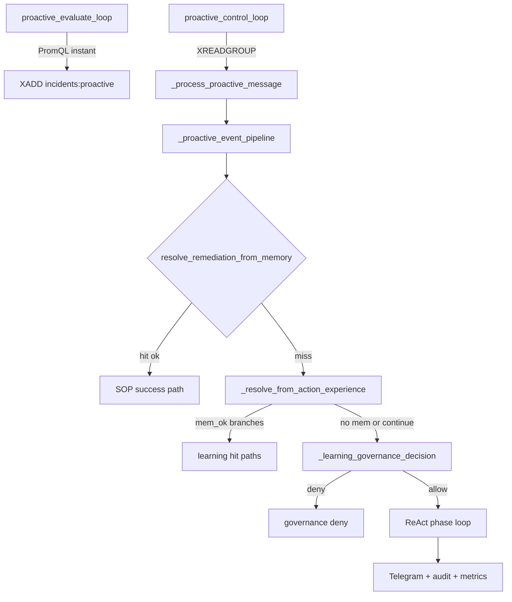

# Proactive state machine (Omni worker)

Single source of truth aligned with [`src/workers/proactive_observer.py`](../src/workers/proactive_observer.py). When code and this doc diverge, treat **code as authoritative** and update this file in the same PR.

## High-level flow

**Early exit (SOP hit):** If `resolve_remediation_from_memory` returns `ok=True`, the pipeline records success, audit, Telegram, metrics, and **returns** without learning lookup, governance, or ReAct.

## Functions and I/O

| Step | Function | Streams / side effects |
|------|----------|-------------------------|
| Scheduler | `proactive_evaluate_loop` | Reads PromQL; may `XADD` `stream_incidents_proactive` (default `incidents:proactive`); `inc_proactive_events`, `inc_anomaly_events`; cooldown key `omni:proactive:cooldown:*` |
| Consumer | `proactive_control_loop` | `XREADGROUP` on incidents stream; `_process_proactive_message`; `XACK` in `finally` |
| Per message | `_process_proactive_message` | Kill-switch short-circuit; parse `AnomalyEvent`; proactive semaphore; `wait_for(_proactive_event_pipeline, timeout=proactive_event_timeout_sec)` |
| Business logic | `_proactive_event_pipeline` | SOP → learning → governance → optional ReAct fallback |

## ReAct phase machine (fallback only)

When `proactive_fallback_enabled` and governance allows:

- **`allowed_tools`:** From `proactive_fallback_allow_tools` (CSV), or **all** `TOOL_REGISTRY` keys if `proactive_fallback_bypass_policy_in_god_mode` and (`god_mode` or `lab_unchained`).
- **Phase sets** (intersected with `allowed_tools` in code; canonical sets in [`proactive_tool_policy.py`](../src/workers/proactive_tool_policy.py) after MP2):

| Phase | Tool set source | Role |
|-------|-----------------|------|
| `diagnose` | `PROACTIVE_DIAGNOSE_TOOLS` | Read-only evidence |
| `prescribe` | `PROACTIVE_MUTATE_TOOLS` | Choose exactly one mutate tool |
| `treat` | Executes `pending_treatment` from prescribe | Run mutate with lease/freeze checks |
| `recheck` | `PROACTIVE_RECHECK_TOOLS` | Post-mutate verification |

- **`treat` path:** Uses `pending_treatment` / `pending_conf` / `pending_reason`; no new LLM parse for tool name until recheck fails back to `prescribe`.
- **`react_resolved` condition:** `phase == "recheck"` and `verified` and `last_treat_verified` and `last_treat_tool in PROACTIVE_MUTATE_TOOLS` (`_quick_verify_output` on treat and recheck outputs).

## Verification

- **`_quick_verify_output(text, proactive_verify_keywords_fail)`:** Keyword and `[STATUS]` heuristics; used for `verified` flags driving metrics and phase transitions.
- **Tool output (evidence contract):** Every proactive ReAct tool execution runs `prepare_tool_return_for_llm` on the raw string **before** `_quick_verify_output`, react_memory lines, and audit `detail` (registered tools included; previously only unregistered paths were normalized). Optional override: `proactive_react_tool_output_max_chars`; otherwise `tool_output_max_chars` ([`tool_observation.py`](../src/workers/tool_observation.py)).

## Prometheus: `omni_proactive_outcome_total`

Pre-registered `outcome` labels ([`metrics_exporter.py`](../src/workers/metrics_exporter.py)):

- `sop_success`
- `learning_resolved`, `learning_observe`, `learning_verify_fail`
- `react_resolved`, `react_escalated`
- `governance_deny`

## Audit stream: `audit:proactive`

`_append_audit` writes JSON in field `data` to `audit_proactive_stream` (default `audit:proactive`), `maxlen=audit_proactive_maxlen`.

Example `outcome` strings (not 1:1 with Prometheus labels):

- `SUCCESS`, `SOP_MISS`, `LEARNING_HIT_*`, `FALLBACK_DENY`, `REACT_ITERATION_OK` / `REACT_ITERATION_FAIL`, `RESOLVED`, `ESCALATED`, `EVENT_TIMEOUT`, `SKIPPED_KILL_SWITCH`, `FAIL` (parse), etc.

## Redis: ReAct memory

- Key: `omni:proactive:react_mem:{trace_id}`
- Append: `RPUSH` lines (capped per line / budget via settings in context-budget work)
- Read: last N lines for prompt construction

## Settings (primary)

| Field | Role |
|-------|------|
| `audit_proactive_stream`, `audit_proactive_maxlen` | Audit retention |
| `stream_incidents_proactive`, `consumer_group_proactive`, `consumer_name_proactive`, `proactive_block_ms` | Consumer |
| `proactive_enabled`, `proactive_kill_switch_key` | Feature flags |
| `proactive_promql`, `proactive_trigger_threshold`, `proactive_cooldown_sec`, `proactive_eval_interval_sec` | Trigger |
| `proactive_sop_collection`, `proactive_sop_score_threshold` | SOP RAG |
| `proactive_fallback_enabled`, `proactive_fallback_allow_tools`, `proactive_fallback_confidence_min`, `proactive_fallback_max_attempts`, `proactive_react_max_turns` | ReAct |
| `proactive_fallback_bypass_policy_in_god_mode` | Lab: full tool registry + bypass confidence/governance |
| `proactive_verify_keywords_fail` | `_quick_verify_output` |
| `proactive_event_timeout_sec`, `proactive_tool_timeout_sec` | Timeouts |
| `proactive_resource_freeze_*`, `proactive_lease_ttl_sec` | Safety |
| `learning_governance_min_samples`, `learning_governance_exec_lb95_min` | Governance |
| `proactive_react_memory_max_chars`, `proactive_llm_prompt_max_chars`, `proactive_react_tool_output_max_chars` | Context / output caps |
| `tool_output_max_chars` | Default for `prepare_tool_return_for_llm` |

## Operational notes

- **`omni_worker_latency_seconds`:** Inbound message handling to `XACK` for the main worker loop — **not** the same as proactive end-to-end incident duration (`omni_proactive_incident_duration_seconds` histogram when enabled).
- **Debug logging:** `_dbg_log` may write structured debug lines; avoid relying on host-specific paths in production (see knownbase / env-gate).
- **Playbook index (pointers only):** See [`docs/omni_playbook_index.md`](omni_playbook_index.md).
