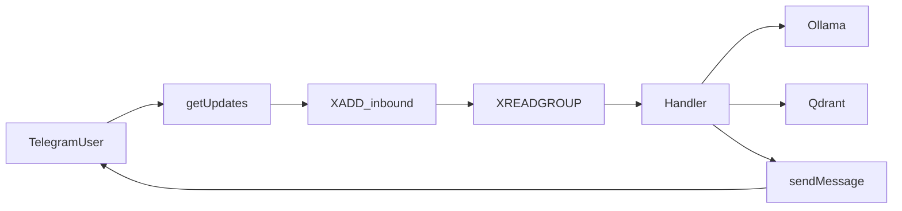

# E2E: Telegram input → output (full luồng)

> **Topology:** Below assumes **legacy** `deployment/omni-worker` (single pod). For **split** MPV3, Telegram/stream handling may live on a different role — confirm `OMNI_WORKER_ROLE` and use logs from the deployment that runs the Telegram loop. Start here: [docs/vendor/OMNI_PROJECT_CANONICAL.md](../docs/vendor/OMNI_PROJECT_CANONICAL.md).

## Luồng dữ liệu



1. **telegram_loop** long-poll `getUpdates` → nhận tin nhắn text.
2. Gắn **`trace_id`** dạng `tg-{chat_id}-{update_id}-{message_id}` → log `telegram_in -> XADD`.
3. **stream_loop** đọc Redis Stream → `stream_read` + `handler_begin` (cùng `trace_id`).
4. Fast-Path (embed + Qdrant) hoặc Slow-Path (semaphore + chat) — log `fast_path_*` / `slow_path_*`.
5. **sendMessage** tới `chat_id` → log `telegram_out`.

## Bật Telegram trên cluster

1. Tạo bot (BotFather), lấy token.
2. **Secret** (ví dụ):

```bash
kubectl create secret generic telegram-bot -n multi-agent \
  --from-literal=bot-token='YOUR_TOKEN_HERE' \
  --dry-run=client -o yaml | kubectl apply -f -
```

3. **Gắn env** vào Deployment `omni-worker` (thêm vào container hoặc `kubectl set env`):

```bash
kubectl set env deployment/omni-worker -n multi-agent \
  OMNI_TELEGRAM_ENABLED=true \
  TELEGRAM_BOT_TOKEN="$(kubectl get secret telegram-bot -n multi-agent -o jsonpath='{.data.bot-token}' | base64 -d)"
```

Hoặc dùng `envFrom`/`valueFrom` trong manifest (không commit token vào repo).

4. **Rollout**:

```bash
kubectl rollout restart deployment/omni-worker -n multi-agent
kubectl rollout status deployment/omni-worker -n multi-agent --timeout=120s
```

5. Gửi **một tin** tới bot trên Telegram (điện thoại / web).

## Theo dõi full luồng (grep trace)

Sau khi gửi tin, lấy `trace_id` từ log (dòng `telegram_in`) hoặc tự build:  
`tg-<chat_id>-<update_id>-<message_id>`.

```bash
# Log realtime (terminal 1)
kubectl logs -n multi-agent -f deployment/omni-worker | grep -E 'tg-|telegram_|handler_|fast_path|slow_path|stream_read'

# Hoặc chỉ một trace (thay TRACE_ID)
kubectl logs -n multi-agent deployment/omni-worker --tail=500 | grep 'tg-123456789-'
```

**Redis** (cùng `trace_id` trong JSON field `data`):

```bash
kubectl exec -n multi-agent deploy/redis -- redis-cli XRANGE events:inbound - + COUNT 5
```

## Kiểm tra output

- Trên Telegram: bot phải trả lời trong cùng chat (nếu handler không lỗi).
- DLQ nếu lỗi: `kubectl exec -n multi-agent deploy/redis -- redis-cli XRANGE events:dlq - + COUNT 3`

## Ghi chú

- **Chỉ tin nhắn text** được đưa vào stream (voice/sticker bỏ qua).
- Lần đầu chat với bot có thể cần `/start` tùy BotFather.
